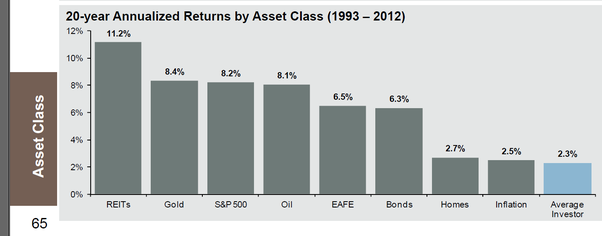

---
tags:
  - Finance
---
Finance
# Getting Started with Investing

*Written on 30/11/20*

In this post, I give a brief introduction to the world of investments. Do check out my [other post on asset allocation](2020-12-02-asset-allocation.md) - i.e. exactly what assets to buy and why.

!!! quote ""
    Some men wrest a living from nature and with their hands; this is called work.  
    Some men wrest a living from those who wrest a living from nature and with their hands; this is called trade.  
    Some men wrest a living from those who wrest a living from those who wrest a living from nature and with their hands; this is called finance. - Old British Epigram 

<figure>
  
  <figcaption>Speculators fan each other into orgiastic heights on r/wallstreetbets</figcaption>
</figure>

The stock market has always been exciting, and now is no exception. At the time of writing, the hottest stocks include Tesla, Nio and Palantir. The markets have just recovered from the [Coronavirus Crash](https://en.wikipedia.org/wiki/2020_stock_market_crash), the most devastating crash since 1929, and both the S&P and NASDAQ are hitting new highs.

*Should you rush in and buy? Or wait for the hype to tide over?*

> "For fools rush in where angels fear to tread." -Alexander Pope, 1711

Over the last few years I've read investment books, discussed the markets with other speculators, and tried my hand at investing from vanilla stocks, to ETFs (both index and exotic), fixed income (think bonds and T-bills), derivatives including options[^options] and futures. I studied technical analysis, from candlestick patterns to resistance/support charting and technical indicators. 

Sadly, nobody teaches you investing in school (unless you're studying finance).

I went the long way round, both chronologically and financially, to learn investing.

**You don't have to**, if you start with the [right books](2020-09-21-finance-book-list.md) and perspectives.

Investors can be classified into one of 4 groups[^4-quadrants]:

1. You believe you can pick winning stocks at the right time
2. You believe you can pick winning stocks, but not timing the market
3. You don't believe you can pick winning stocks, but you believe timing the market as a whole is possible
4. **You don't believe you can pick winning stocks OR time the market**

I'm strongly for 4. And this is because:

- The average investor performs worse than inflation.[^JPM] 
- The professionals don't fare well either. Mutual funds, run by quants on Wall Street, do no better - 7.53% vs the Russell 3000 Index (a broad market index)'s 8.42% return, compared over 20 years.[^random-walk]
- The market is very nearly [***efficient***](https://en.wikipedia.org/wiki/Efficient-market_hypothesis). New information is reflected almost instantaneously in stock prices. If people believe a stock to be worth $100 tomorrow, it will be worth $100 today. There is very little chance you can buy or sell before the whole market beats you to it.
- Commissions and taxes. These may seem small, but for the active trader trying to beat the market it can add up.[^enough]
- The invention of [derivatives](https://www.investopedia.com/terms/d/derivative.asp), a product sensitive to timing and direction, has only served to burn more dollars off investors. In fact, these products were responsible for the 2009 financial crisis.

<figure>
  
  <figcaption>The stock market has always recovered</figcaption>
</figure>

**In short, I believe in buying the entire market, aka broad-based, index investing. And the best time for that is, and has always been, *now*.**

## The Investible Universe

Now, before you even make an account, it's important to know what assets you can invest in. And it's not just stocks.

Broadly speaking, the types of products available for investment are equities, fixed-income products, real estate, commodities and derivatives.

I don't consider insurance products like ILPs or whole life plans as investments[^no-insurance].

### Equities (aka stocks)

<figure>
  
  <figcaption>Cumulative return of the S&P 500, a US market index</figcaption>
</figure>

Stocks represent assets of a company that investors can purchase. Note that in the event of liquidation, bondholders will be paid before shareholders. As a stock-owner, you are entitled to receiving dividends (i.e. when a stock goes ['ex-dividend'](https://en.wikipedia.org/wiki/Ex-dividend_date)).

But what if you want to buy not just a few stocks, but 100? 1000? The entire US market?

This is possible with the advent of the [exchange-traded fund (ETF)](https://www.investopedia.com/terms/e/etf.asp). It is essentially a fund which invests the shareholders' monies into a basket of securities. For example, the [SPY](https://www.ssga.com/us/en/institutional/etfs/funds/spdr-sp-500-etf-trust-spy) tracks the S&P 500, an index tracking the performance of 500 large companies in the US. ETFs not only track indices - you can buy ETFs specializing in [pharmaceutical products](https://www.ssga.com/us/en/institutional/etfs/funds/spdr-sp-pharmaceuticals-etf-xph) or almost anything else as well. As they are listed on an exchange, ETFs are also subject to regulation[^etf-regulation].

### Fixed-Income Securities (aka bonds)
<figure>
  
  <figcaption>Historical Federal Reserve Interest Rates</figcaption>
</figure>

A bond is a loan. By buying a bond, the bearer is obligated to pay you a certain interest rate for the period of the bond (up till the 'maturity date', upon which you receive your initial capital). This is related to the risk of default. Thus, one would expect bonds from governments to pay the least, while those from companies with questionable financial statements to pay more.

Bonds can get complicated - there are the vanilla fixed coupon bonds, discount bonds, inflation-protected securities and convertible bonds to name a few. Nontheless, certain basic principles apply.

The key risks in buying bonds are interest rate risk[^interest-rate-risk] (just look at the chart above[^fed-funds]) and credit risk. Callable bonds have their own risk - call risk[^call-risk].

Historically, during periods of market uncertainty, investors have flocked to bonds as they maintain relative stability compared to equities.

### Real Estate

In the past, the only way to gain exposure to the property sector was to buy physical property in your own name.

Now, you can buy property via several property ETFs, some of which are global[^property-ETFs]. Alternatively, one can buy Real Estate Investment Trusts (REITS), which are companies that own or operate real estate. Local examples include [Mapletree North Asia Commercial Trust](https://www.mapletreenorthasiacommercialtrust.com/) and Ascendas Reit.

### Commodities

<figure>
  
  <figcaption>Oil prices turn negative for the first time ever on 20 Apr 2020</figcaption>
</figure>

These refer to physical goods such as corn, soybean, oil and cattle. You can buy gold and silver too - either in the form of ETFs, futures or the actual physical metal.

Investing purely in commodities is highly speculative and leveraged, as they trade on margin. You can watch James Cordier of Optionsellers.com's [famous apology](https://www.youtube.com/watch?v=LI395YShGRQ) as an example of what not to do with your clients' money.

However, commodities do have a diversification effect when added to a balanced portfolio. For example, gold is known to remain stable or even rise during economic crises.

### Derivatives

<figure>
  
  <figcaption>Payoff for a strangle on crude oil</figcaption>
</figure>

Derivatives include futures and options, as well as structured products e.g. [equity linked notes (ELNs)](https://www.dbs.com.sg/treasures/investments/product-suite/equities/equity-linked-investments). There are more exotic products such as Asian options, digital options, options on futures, interest rate swaps and swaptions. These can be combined in complicated ways, such as the strangle[^strangle] shown above. Fundamentally, they derive their value from the movement of some underlying product (hence the term *derivative*).

*I would recommend staying very far from this category if you are a new investor*. Unlike stocks or bonds, you can lose (and earn) much more than your initial investment (due to leverage).

Now that you know **what** you can buy, let's see **how** you can buy.

## Your Broker

A broker is the intermediary company which does the purchasing of the investments for you on an exchange. By and large, most investors do not own shares in their own name - their broker acts as their **custodian**. This is the only way Singaporeans can buy shares listed in the US or foreign countries. For local shares, you can buy shares in your name with a Central Depository account - which means you get voting rights, invitations to the annual general meetings etc.[^cdp-comparison]

I recommend sticking with a custodian account, because

- Fees are cheaper
- You can invest in overseas markets

Assuming you are more interested in the overseas (i.e. US) market[^why-overseas], here are some brokers you can consider:

- [Interactive Brokers](https://www.interactivebrokers.com)[^ib] (I use this) 
- [Saxobank](https://www.home.saxo/en-sg)
- [TD Ameritrade](https://www.tdameritrade.com/home.page)
- [POEMS](https://www.poems.com.sg/) (local)
- [DBS Vickers](https://www.dbsvonline.com/) (local)[^vickers]

Some factors you may want to consider are:

- Commissions
- Custody fees[^custody-fees]
- Ease of use
- Mobile application
- Products available
- Investment restrictions[^restrictions]

Worried about losing your money if the broker goes bust? Fret not:

- US brokers are protected by the [SIPC](https://www.sipc.org/for-investors/what-sipc-protects), up to $500,000
- Locally, bank deposits are insured for up to $75,000[^local-bank-insurance] by the [SDIC](https://www.sdic.org.sg/faq/di_faq)

## Epilogue

Now that you have your account, it's time to trade!

As you progress, you may want to consider reading deeper. Such topics include

- Asset allocation - how much to invest in stocks/bonds/commodities and why?
- Trade execution - What is a trailing stop loss? Why is the bid/ask spread so big? What is a liquidity crunch?
- Derivatives - although I mentioned to avoid them earlier, they make excellent tools for hedging a large equity position.[^hedging]

If you haven't already, I recommend you look through some of the [investment books](2020-09-21-finance-book-list.md#general-introduction) I've marked as a general introduction. You'll find my other book recommendations there as well.

Finally, if you spot any errors here, do [let me know](mailto:me@nicholaslyz.com)!

[^options]: I love trading options. Iron condors, calendar spreads, ratio spreads, double diagonals, not just on stocks but on futures, heck, even on volatility itself (the VIX) - I've tried them. I mainly use options for hedging now.
[^4-quadrants]: Adapted from Asset Allocation, by Roger Gibson
[^JPM]: JP Morgan's 1Q, 2014 Guide to the Markets
[^random-walk]: A Random Walk Down Wall Street by Burton G. Malkiel
[^enough]: 'Enough' by John C. Bogle puts forth a poignant argument against the entire brokerage and ETF industry's fees and commissions.
[^no-insurance]: I don't consider them investments because insurance is for protection - you shouldn't hope to 'earn' on them. Furthermore, ILPs simply invest in the market but with much higher commissions and caps on profits. You'd be better off just buying the ETFs yourself from a broker.
[^etf-regulation]: The SEC sets limits on the use of leverage and transactions. ETFs are also required to conform to specific reporting requirements as well as oversight by boards of directors. See [here](https://www.sec.gov/investor/alerts/etfs.pdf).
[^interest-rate-risk]: The risk that when interest rates rise after you buy a bond. This will cause the market value of the bond to decrease. Note however, that if you hold the bond to maturity, you will still receive your initial capital plus interest back.
[^fed-funds]: This is the target interest rate set by the Federal Open Market Committee at which commercial banks charge each other on overnight lending. It is a large driver of other interest rates in general, such as the [prime rate](https://www.investopedia.com/terms/p/primerate.asp).
[^call-risk]: The risk that a bond issuer may choose to buy back the bond prior to maturity, ceasing the stream of interest payments.
[^property-ETFs]: E.g. [iShares Developed Markets Property Yield (DPYA)](https://www.ishares.com/uk/individual/en/products/297188/ishares-developed-markets-property-yield-ucits-etf-fund), which invests in real estate companies and REITS from developed countries.
[^strangle]: A type of option strategy where one buys an out-of-the-money call and put. Maximum profit is gained when the underlying moves significantly in one direction.
[^cdp-comparison]: See [here](https://blog.seedly.sg/cdp-vs-custodian-account/) for a comparison between CDP and custodian accounts.
[^why-overseas]: The Straits Times Index has lagged the S&P 500 for decades. See [here](https://www.syfe.com/magazine/3-reasons-why-you-should-look-beyond-the-singapore-stock-market/) for other reasons.
[^ib]: Commissions are miniscule and the platform allows you to buy almost any product under the sun. The interface may appear a bit intimidating initially but you'll learn to appreciate it.
[^vickers]: Note the commissions: [$25 per trade](https://www.dbs.com.sg/vickers/en/pricing/default.page) last I checked.
[^custody-fees]: Aka yearly fees for holding your stock. Not all brokers have this.
[^restrictions]: E.g. IB does not allow Singaporeans to buy SGX listed equities.
[^local-bank-insurance]: It is a tad disappointing that our local banks have lower bank guarantees than the US.
[^hedging]: Personally, I use a 1.1 diagonal put ratio spread (1 year long, 3 months short) for hedging my equities (the *beta-weighted* amount). The Options Edge by Michael C. Khouw provides a great introduction to this hedging strategy.