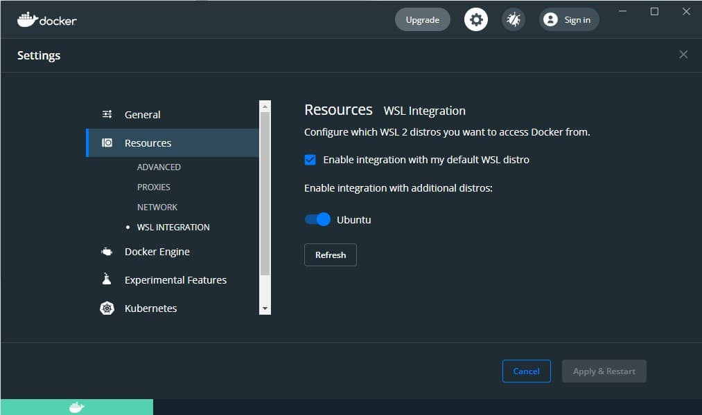

---
tags:
  - Programming
---
# Developing in WSL Containers (Now with GPU support!)

As a programmer there were a lot of version/environment issues I faced while developing with Python, Node and other tools. Some examples:

- Switching between different Python versions on Windows is difficult and requires third-party solutions e.g. [Chocolatey](https://chocolatey.org/)
- Switching between different Node versions also requires a third-party solution ([nvm](https://github.com/nvm-sh/nvm))
- While `pipenv`, `venv` and `poetry` are ways to manage different Python environments, they still depend on the base Python version installed, which is another external dependency
- Maintaining other dependencies such as CUDA drivers, `ffmpeg` etc.

I thought about this issue while deciding on a [Python packagement system for Windows](2021-04-15-python-package-management-windows.md), and here is my solution.

## Docker Containers, in WSL2, in VSCode

In a nutshell, my solution is to use VSCode's [Remote - Containers]() extension, to open a folder in WSL2, and then mount that folder in a [Docker]() container.

This has several benefits:

- Ability to **lock environments** for a project, such as Python, Node, or even Java versions
- **Repeatable builds**, irregardless of the host OS/drivers
- Host filesystem only contains source code and nothing else
- [Containers on the host can be accessed remotely over SSH][vscode-remote-containers] - the only tools required on the remote computer are [SSH][ssh] and VSCode

Some notes:

- Source code is stored in the WSL distro, and can be viewed natively in Windows Explorer via the network share `\\wsl$`.
- [**GPU passthrough**][gpu-passthrough] is supported since Windows 10 version 21H2.

The reason why I use the WSL filesystem, and not a [bind mount](https://docs.docker.com/storage/bind-mounts/) on the Windows filesystem, is for [performance](https://github.com/microsoft/WSL/issues/4197).

## What is WSL?

[WSL](https://docs.microsoft.com/en-us/windows/wsl/about) is a compatibility layer which allows Linux binaries to run natively on Windows systems. WSL2 takes this further, and includes a real Linux kernel with full system call capabilities.

Installing WSL will allow you to run a complete Linux distribution on your Windows PC (with the `wsl` command).

## Getting Started

### Installing WSL2 and a default distro:

- Follow the instructions [here](https://docs.microsoft.com/en-us/windows/wsl/install) to install WSL2 and the default Linux distribution (Ubuntu)
- Next, check that the Ubuntu distribution is set as default, and is on WSL2:
    - `wsl -l -v` should show:
    ```
      NAME                   STATE           VERSION
    * Ubuntu                 Running         2
      Legacy                 Stopped         1
      docker-desktop         Running         2
      docker-desktop-data    Running         2
    ```
    - If Ubuntu is missing, install it from the [Microsoft Store](https://www.microsoft.com/en-sg/p/ubuntu/9nblggh4msv6) (you need to run `ubuntu` from the command prompt after)
    - If Ubuntu is **not** the default distro (marked with a *), run `wsl --set-default Ubuntu`.
    - If the `VERSION` for Ubuntu is not `2`, run `wsl --set-version Ubuntu 2`.
    - (Advanced) If you want to move the WSL installation to another folder of your choice, you can use the `--export` followed by the `--import` commands.

### Installing Docker and configuring it to use the WSL2 backend:

- Follow the instructions [here](https://code.visualstudio.com/docs/remote/containers#_getting-started)
- Ensure that `Enable integration with my default WSL distro`, and integration for your distro are both checked. 
- Check that Docker is working: `docker ps`

### Setup `git` in WSL2

VSCode adopts the following behaviors with regards to `.gitconfig`:

- If a **repository is cloned and opened** in a container, the `.gitconfig` from **Windows** (`C:\Users\<USER>\.gitconfig`) is copied and used
- If a **WSL2 folder** is opened in a container, the `.gitconfig` from **WSL** (`~/.gitconfig`) is copied and used in the container

Therefore, since we are opening WSL2 folders in containers, we need to setup `git` on WSL2 (it's not setup by default).

- Open up a WSL2 terminal: `wsl`
- Set your username: `git config --global user.name <USERNAME>`
- Set your email: `git config --global user.email <EMAIL>` (note, if you have setup email privacy on Github, you will find your email at [https://github.com/settings/emails](https://github.com/settings/emails))
- If you want to use VSCode as the editor in `git`, do: `git config --global core.editor "code --wait"`
- Verify your settings with `git config --list`

That's it. VSCode configures the credential helper automatically for you (by setting up some sort of [SSH/GPG agent forwarding](https://github.com/microsoft/vscode-remote-release/issues/2925)).

### Opening a WSL2 Folder in a container

- Follow this [guide](https://code.visualstudio.com/docs/remote/wsl#_advanced-opening-a-wsl-2-folder-in-a-container).
- Notes:
    - You can modify the `.devcontainer/Dockerfile` to your liking - e.g. if you want to add Java to a Python image, install package dependencies during build, etc
    - If you want to install requirements automatically e.g. with `pip`, you can either uncomment that particular line in the `Dockerfile` (if it exists) or write your own e.g.:
        ```dockerfile
        COPY requirements.txt /tmp/requirements.txt
        RUN pip --no-cache-dir  install -r requirements.txt
        ```

And that's it! Start up, rebuild and stop your containers as you like.

<figure>
  
  <figcaption>Source code for this blog post in a container in WSL2</figcaption>
</figure>

Finally, you can even use [multiple containers with `docker-compose.yml`](https://code.visualstudio.com/remote/advancedcontainers/connect-multiple-containers) (although for development you'd be likely to be use just one).

[gpu-passthrough]: https://docs.microsoft.com/en-us/windows/whats-new/whats-new-windows-10-version-21h2#gpu-compute-support-for-the-windows-subsystem-for-linux
[ssh]: https://www.ssh.com/academy/ssh/protocol
[vscode-remote-containers]: 2022-02-07-vscode-remote-containers-over-ssh.md