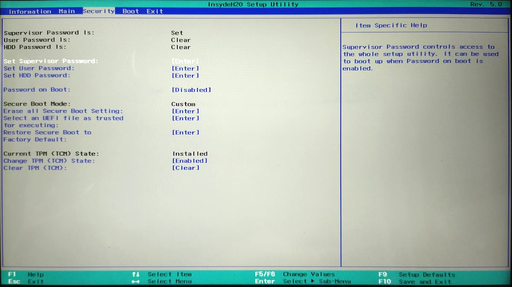
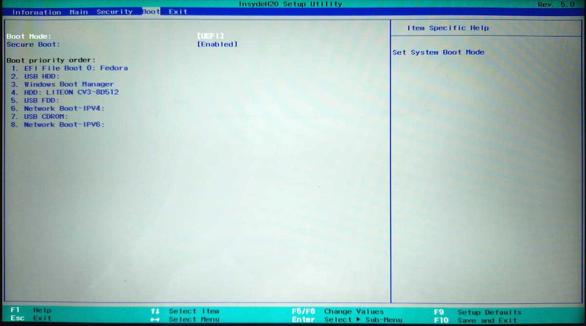

---
tags:
  - Programming
---
# Dualbooting Fedora 35 with Windows 11

Recently I was trying to set up dual-booting on my laptop, with Fedora 35 and Windows 11. 

I followed best practices, installing [Windows before Fedora][windows-before-linux]. However, on rebooting Fedora, the laptop booted straight away to Windows 11 without prompting.

On closer look at the BIOS boot menu, I noticed Fedora did not appear as an option, despite `efibootmgr`[^efibootmgr] showing otherwise:

```
[nicholas@fedora ~]$ efibootmgr
BootCurrent: 0000
Timeout: 0 seconds
BootOrder: 0000,0004,2001,2002,2003
Boot0000* Fedora
Boot0001* Unknown Device: 
Boot0002* Unknown Device: 
Boot0004* Windows Boot Manager
Boot2001* EFI USB Device
Boot2002* EFI DVD/CDROM
Boot2003* EFI Network
```

After doing some research, I found out that the laptop was [ignoring][efibootmgr-ignored] the settings set by `efibootmgr`.

I found a solution after research.

First, a BIOS supervisor password must be set. Make it something simple so you don't forget.

Next, **add the `shimx64.efi`[^shimx64] file as trusted for executing** (it's the `Select an UEFI file as trusted for executing` option in the screenshot below). You can find this file under `HDD0/EFI/fedora/shimx64.efi`.



Now, Fedora will appear as an option in the boot menu, and this setting will overwrite that of `efibootmgr`.



[^efibootmgr]: A utility to [manipulate the EFI boot manager](https://linux.die.net/man/8/efibootmgr)
[^shimx64]: The reason for choosing `shimx64.efi` over `grubx64.efi` is that the former [allows booting](https://askubuntu.com/questions/342365/what-is-the-difference-between-grubx64-and-shimx64) on computers with Secure Boot active.

[windows-before-linux]: https://wiki.archlinux.org/title/Dual_boot_with_Windows#Installation
[efibootmgr-ignored]: https://github.com/rhboot/efibootmgr/issues/19