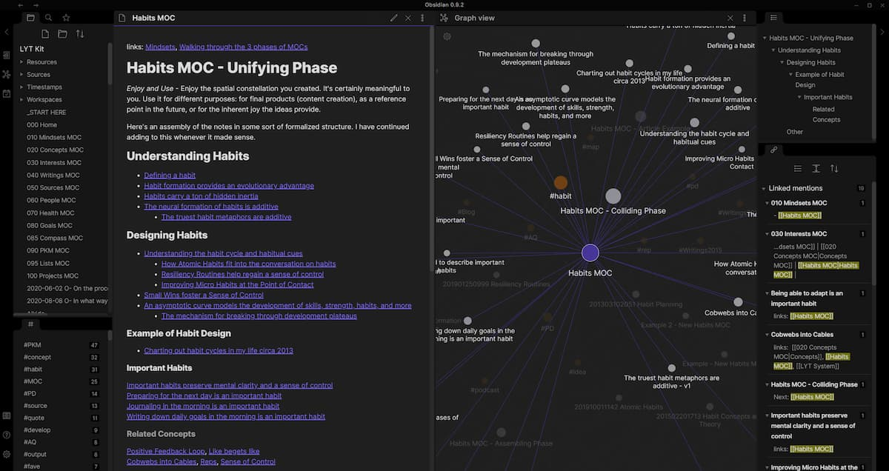

# Note-Taking

Few of us could live life without jotting down our thoughts somewhere. Throughout the years we have developed some sort of note-taking system, either cobbled together slowly by ourselves, or something off the shelf.

I use electronic notes primarily as they are more accessible compared to paper notes and can be backed up easily.

Previously I used a Word document synced on Google Drive. However, this came with several limitations:

- Formatting issues
- Not editable over command-line e.g. with Vim
- Not searchable unless opened
- Inability to see backlinks (other notes which link to this note)
- Limited categorization ability (only headings/subheadings possible)

I have since decided to move to **Markdown**, the main reasons being:

- Open, widely adopted format (important for the future)
- Can be edited in almost any application
- Can be searched easily (e.g. with `grep`)
- Can be linked to/from each other

The choice of editor I am currently using at present is [Obsidian][obsidian]. In comparison with VSCode, [Obsidian][obsidian]:

- Supports viewing backlinks natively
- Updates links when notes are moved
- Supports image/video drag and drop[^vscode-drag]

## Backup and Access

The folder with my notes is stored on my [server](2022-05-22-my-self-hosting-journey.md), which is itself in a RAID-1 configuration with backup.

Remote access is through SFTP with SSH certificates (e.g. via Filesync on Android, or the respective client on the OS).

Local access is over [nfs](2022-05-22-my-self-hosting-journey.md#storage-and-backup).

[obsidian]: https://obsidian.md/

[^vscode-drag]: VSCode generates incorrect links for images when connected to a remote host (all the generated links start with `remote://`)