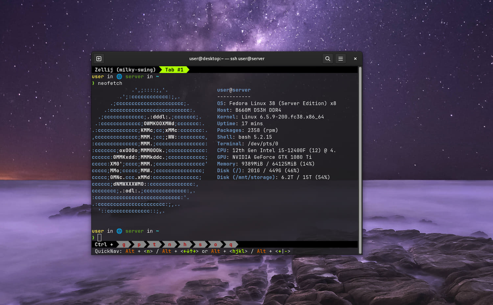

---
tags:
  - Programming
---

# My Self-Hosting Journey

<figure>
  
  <figcaption>My server's <a href="https://home.nicholaslyz.com">homepage</a></figcaption>
</figure>

Self-hosting your own services has been catching up in popularity: the [selfhosted subreddit][selfhosted] has over 180K members as of 21/5/22, and the number of self-hosted solutions has been growing exponentially (see a huge [list][awesome-selfhosted] here).

Self-hosting frees you from vendor lock-in. By using open-source alternatives, you gain portability for your data, and you are free to change to another solution anytime. In addition, there is the benefit of learning about server management and the command-line, which in my opinion are portable skills which can be used in any environment, unlike GUIs which are specific for an application.

In addition, I have been getting increasingly frustrated with Windows due to various [issues](2022-02-27-my-computing-philosophy.md#stable-open-source-environment), and switching to Linux offers one a much needed breath of freedom, customizability and fresh air. Finally, I wanted something which I could keep running 24/7 and not have to pay recurring subscriptions.

It was with those considerations in mind that I decided to go ahead with self hosting.

## Specifications



- **CPU**: Intel i5-12400F (6 cores, 12 threads, 18M Cache, up to 4.40Ghz)
- **Memory**: Crucial 32GB DDR4 3200Mhz
- **Motherboard**: Gigabyte B660M DS3H DDR4
- **Boot Drive**: Samsung 500GB 980 NVME M.2
- **OS**: Fedora Linux (Server Edition)

Total cost of the above was SGD $830.

In addition, I have ~ [30TB of storage](#storage-and-backup) in a RAID1 configuration assembled from various drives.

## Hosted Services


I use [Dashy][dashy] to display all the hosted web services on [my site](https://home.nicholaslyz.com). Authentication is via `nginx`'s [`auth_request`][nginx-auth-request] to a Django backend.

All hosted services are in Docker containers with limited permissions to reduce the possible attack surface, with logs all redirected to the `systemd` journal, with the [`journald` driver](https://docs.docker.com/config/containers/logging/journald/).

## Uptime Monitoring

Uptime monitoring is hosted on an offsite VPS with [Uptime Kuma][uptime-kuma], on a separate [site](https://uptime.icybat.com), with notifications via Telegram. This is to allow for redundancy in case my server goes down.

## Storage and Backup

There is 12TB of file storage available, consisting of 2x WDC WD120EMFZ-11A6JA0 12TB drives plus a 6TB ATA TOSHIBA HDWR160 in a (software) RAID-1 configuration under BtrFS.

I chose BtrFS over `dmraid` + ext4 as BtrFS:

- allows for online subvolume resizing/deletion/modification
- supports file checksums in RAID modes[^bit-rot]
- allows for arbitrary drives to be added/removed from the RAID configuration, and [balance the resulting filesystem automatically][btrfs-adding-new-devices]
- supports lightweight snapshots and sending these snapshots to other devices for backup

One of the more interesting features of BtrFS is that it allows for RAID-1 with any number of devices, of all different sizes. The resulting available storage is usually [half the total storage available][btrfs-storage]. This is made possible as the filesystem [allocates data in chunks][btrfs-data-allocation], with each chunk on a RAID-1 setup being duplicated to 2 different drives.

Backup is done with the following series of commands:

??? note "Backup Commands"

    ```bash
    # Create a subvolume snapshot of /mnt/storage
    # Note: 'snapshots' and 'subvolumes' are synonymous in BtrFS: A snapshot is a copy of a subvolume
    btrfs subvolume snapshot -r /mnt/storage/ /mnt/storage/snapshot.$(date +%Y-%m-%d)

    # Send that snapshot to the backup device /mnt/sdc1
    btrfs send /mnt/storage/snapshot.2022-05-18/ | btrfs receive /mnt/sdc1

    # To instead send an incremental snapshot:
    # Note: the parent snapshot must exist on the receiving drive
    btrfs send -p <path to parent snapshot on sending drive> <subvol> | btrfs receive /mnt/sdc1
    ```


    The UUID of the parent subvolume (in the sending drive) must be in one of the receiving drive subvolume's 'Received UUID', in order for the incremental `send` operation to work. See below for an example:

    Target volume with 2 snapshots, `server-2022-05-18` followed by `snapshot.test`:

    ```hl_lines="3"
    [root@server sdc1]# btrfs su show /mnt/system-root/server-2022-05-18/server-2022-05-18
        Name:                   server-2022-05-18
        UUID:                   2b33e415-046b-a746-a35f-50cdef411a9f
        Parent UUID:            c8a82094-4270-274b-bd08-77aea3dc0896
        Received UUID:          -

    [root@server sdc1]# btrfs su show /mnt/system-root/snapshot.test/snapshot.test
        Name:                   snapshot.test
        UUID:                   8a42b8d1-d145-9249-9e76-e7748dc4aeb5
        Parent UUID:            c8a82094-4270-274b-bd08-77aea3dc0896
        Received UUID:          -
    ```

    Note on the backup drive that the `Received UUID` of the original snapshot is the same as the target volume's original snapshot `server-2022-05-18`.

    ```hl_lines="5"
    [root@server sdc1]# btrfs su show /mnt/sdc1/server-2022-05-18/server-2022-05-18
        Name:                   server-2022-05-18
        UUID:                   5ed89436-7a3b-5744-9460-cf79ced43e2c
        Parent UUID:            -
        Received UUID:          2b33e415-046b-a746-a35f-50cdef411a9f

    [root@server sdc1]# btrfs su show /mnt/sdc1/snapshot.test/snapshot.test
        Name:                   snapshot.test
        UUID:                   7fcd7d87-b2a2-eb46-a636-ca62dfd4029f
        Parent UUID:            5ed89436-7a3b-5744-9460-cf79ced43e2c
        Received UUID:          8a42b8d1-d145-9249-9e76-e7748dc4aeb5
    ```
    
    Note: The `Received UUID` **does not change** when a snapshot is snapshot-ed again.

The backup drive contains a BtrFS volume on top of a partition[^cryptsetup-partition] encrypted with[`cryptsetup`][cryptsetup].

This storage is accessible locally in my LAN via [NFS][nfs], which Windows also supports[^nfs-issues].

I use SSHFS to access my storage remotely.

## SSH Access

SSH access to my server is available via public keys, password access with 2FA (provided via [Google Authenticator PAM][google-authenticator-pam][^pam-issues]) and Web terminal access via [Apache Guacamole](./2022-07-10-win11-vm-gpu-passthrough.md#5-setup-apache-guacamole).

I previously used [SSH with certificates](./2022-02-07-ssh-with-certificates.md), however it does not allow me to revoke access as easily as public keys.

### Mobile

Mobile SSH access is via [Termux][termux], a terminal emulator for Android which features [Mosh][mosh][^mosh] pre-installed.

### Terminal UI

I use [tmux][tmux], a terminal multiplexer, which allows me to keep terminal sessions running on the server on connection close (even if by accident), and resume them from another computer. I use a `.bashrc` config to load [tmux][tmux] on interactive logins.

??? note "`.bashrc` Configuration"

    ```bash
    # Since tmux also runs .bashrc, we need to check we are not in tmux
    # Other checks are to make sure these commands only run in interactive shells
    if [[ $- == *i* ]] && [[ -n $SSH_CONNECTION ]] && [[ -z "$TMUX" ]]; then
        tmux new-session -A
    fi
    ```

Finally, I use [Powerline][powerline], a great status plugin showing CPU/memory/uptime stats, on `bash` and [tmux][tmux].

[awesome-selfhosted]: https://github.com/awesome-selfhosted/awesome-selfhosted
[btrfs-adding-new-devices]: https://btrfs.wiki.kernel.org/index.php/Using_Btrfs_with_Multiple_Devices#Adding_new_devices
[btrfs-data-allocation]: https://btrfs.wiki.kernel.org/index.php/SysadminGuide#Data_usage_and_allocation
[btrfs-storage]: https://btrfs.wiki.kernel.org/index.php/FAQ#How_much_space_do_I_get_with_unequal_devices_in_RAID-1_mode.3F
[cryptsetup]: https://gitlab.com/cryptsetup/cryptsetup/-/wikis/FrequentlyAskedQuestions
[google-authenticator-pam]: https://github.com/google/google-authenticator-libpam
[dashy]: https://github.com/Lissy93/dashy
[mosh]: https://mosh.org/
[nfs]: https://en.wikipedia.org/wiki/Network_File_System
[nginx-auth-request]: http://nginx.org/en/docs/http/ngx_http_auth_request_module.html
[powerline]: https://github.com/powerline/powerline
[selfhosted]: https://www.reddit.com/r/selfhosted/
[termux]: https://termux.com/
[tmux]: https://github.com/tmux/tmux/wiki
[uptime-kuma]: https://github.com/louislam/uptime-kuma

[^bit-rot]: If some bits in one of the drives were to fail (e.g. due to [bit rot](https://en.wikipedia.org/wiki/Bit_rot)), `dmraid` would not know which drive contains the correct data as it operates below the filesystem layer.
[^cryptsetup-partition]: The reason I do not use `cryptsetup` (or `dmcrypt`) directly on the disk is that Windows/other software might accidentally wipe the partition table (and the LUKS header), rendering the disk unlockable.
[^nfs-issues]: Windows sets the UID/GID to -2 for some reason, preventing you from writing to files by default. This is the [fix](https://unix.stackexchange.com/questions/276292/need-permission-for-windows-client-to-access-linux-nfs).
[^pam-issues]: On Fedora, Google Authenticator PAM has some [issues](https://github.com/google/google-authenticator-libpam/issues/101) with SELinux security configurations and so I use a [workaround](https://github.com/google/google-authenticator-libpam/issues/101#issuecomment-997533681).
[^mosh]: Mosh allows for SSH access over unreliable/mobile connections, including scenarios like changing IP addresses (which can happen as the mobile device moves out of Wifi range).
