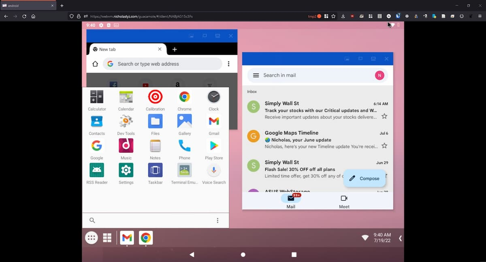

---
tags:
  - Programming
---

# Android VM in a Browser (via Apache Guacamole)



Running an Android VM in a web browser lets you run Android applications from any computer. This lets you test out apps, or even suspicious programs without compromising your actual device.

The setup:

-   [Android-x86][android-x86], an x86 port of Android
-   [`virt-manager` in Docker][virt-manager-docker], which exposes `virt-manager` in a browser window, and also acts as the VNC server for the Android VM
-   [Apache Guacamole][apache-guacamole], which acts as the VNC <-> browser bridge

## Getting Started

To begin, first setup `virt-manager` in Docker, as well as Apache Guacamole, with the instructions [here](2022-07-10-win11-vm-gpu-passthrough.md).

Once you have `virt-manager` in Docker running, [download][android-x86-dl] and install the Android-x86 image on the VM.

Then, enable the 'Display VNC' device in QEMU, choosing an appropriate unused port.

Finally, in Apache Guacamole, setup a VNC connection to the server (via `host.docker.internal`) on the port you chose earlier.

Note that you will need to add the following to your `docker-compose.yml` in order for the host to be accessible via `host.docker.internal`:

```yaml hl_lines="4 5"
services:
    guacd:
        image: guacamole/guacd
        extra_hosts:
            - "host.docker.internal:host-gataeway"
```

## Notes

-   Android-x86 does not support the `MediaProjection API`, so other VNC servers like droidVNC [will not work][droid-vnc].

    -   This is why I use the VNC server from QEMU instead. Note that if you open the embedded viewer in `virt-manager`, it will disconnect other listening VNC viewers.

-   For full desktop support (free-form window resizing etc), use 'Taskbar' as the default home app.
-   When formatting the disk partitions, use `MBR` instead of `GPT`, otherwise `grub` will not work.
-   To get internet access on the Android VM, connect to `VirtWifi`.

[apache-guacamole]: https://guacamole.apache.org/
[android-x86]: https://www.android-x86.org/
[android-x86-dl]: https://www.fosshub.com/Android-x86.htmlhttps://www.android-x86.org/download.html
[virt-manager-docker]: https://github.com/m-bers/docker-virt-manager
[droid-vnc]: https://github.com/bk138/droidVNC-NG#notes
