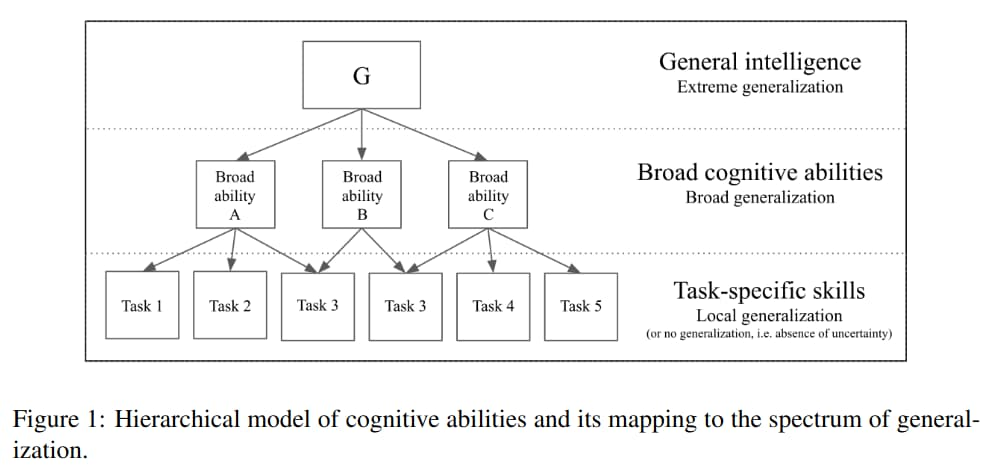

---
tags:
  - Philosophy
---

# On The Measure Of Intelligence

<figure>
  

  <figcaption>ChatGPT solving a math problem</figcaption>
</figure>

[ChatGPT][chatgpt] was recently released and has been taking the world by storm. In the online space, there is much discussion about whether we are close to general purpose AI. There is no doubt that better and more capable models (e.g. GPT-4) will soon be released, which will overcome the flaws of its predecessors.

In that light, I thought it prudent to revisit the definition of intelligence, as well as ways to measure intelligence across human and machine systems.

One of the most pertinent papers on this topic I have come across is [On The Measure of Intelligence][paper], published in 2019 by Francois Chollet (the author of [Deep Learning with Python][keras-book]). Many of its ideas are still relevant, especially regarding what really constitutes intelligence. In this blog post, I summarize the key ideas in the paper:

- [The intelligence of a system is a measure of its skill-acquisition efficiency over a scope of tasks, with respect to priors, experience and generalization difficulty.](#defining-intelligence)
- [Skill is the output of intelligence.](#the-ai-effect)

## Part 1: Context and History

Current intelligence systems are brittle, data-intensive and fail to generalize across tasks. This is because [we do not have a clear goal definition and/or benchmark for intelligence](#problems-with-current-benchmarks) of which to guide research against. Common-sense definitions such as the [Turing Test][turing-test] are not objective (in fact, the Turing Test was meant as an argumentative device in a philosophical discussion, not as a literal measure of intelligence), and cannot serve as a reliable benchmark in measuring our progress toward AI. In order to progress further, we need to develop measures of intelligence that are precise, quantitative and in particular, human-like. 

### The AI Effect

<figure>
  
  <figcaption>OpenAI Five</figcaption>
</figure>

Every time progress toward AI is made, we shift goalposts. Whenever a machine is made which can beat humans at checkers, chess, or DotA 2, there are no shortage of critics who argue that what is being shown is not intelligence. Similarly, when we understand how a machine does something intelligent, it ceases to be regarded as intelligent. However, if a human were to become exceptionally good at say, chess or [DotA 2][openai5], we would safely assume they are intelligent. This has been dubbed the _AI Effect_.

> _Even though such machines might do some things as well as we do them, or perhaps even better, they would inevitably fail in others, which would reveal they were acting not through understanding, but only from the disposition of their organs._ Rene Descartes, 1637

Francois suggests that there is an anthropocentric assumption at play here. As humans, we are only able to display high skill at a task if we able to _acquire skills efficiently in general_, which is actually what intelligence is. The AI Effect is therefore the result of conflating _skill_ (the artifact, or crystallized form of intelligence, in the form of a program), with _intelligence_ (the property displayed by the researchers in creating such a program, and what people are really looking for).

### Psychometric Testing

<figure>
  
  <figcaption>Raven's Progressive Matrices, used in psychometric testing</figcaption>
</figure>

The field of [psychometric testing][psychometric-testing] has provided several principles regarding measuring intelligence. One of them is that _abilities_ are measured, rather than task-specific skills. An ability is an abstract construct as opposed to a directly measurable, objective property of an individual mind, such as a score on a specific test. Such abilities may include reading, writing, or mathematics. Abilities form the basis of skill across a wide range of tasks, including tasks which were previously unknown to both the system and developer. Such abilities are measured using broad batteries of test tak rather than any single task, and the tasks are previously unknown to the test-taker. This approach is highly relevant to AI evaluation.

However, certain aspects of psychometric testing, having been designed with an anthropocentric bias, should be discarded. For example, the exact number and taxonomy of human cognitive abilities, being unknown, should not be used as a template for artificial cognitive architectures (at most, as a guide). Additionally, certain abilities measured by psychometric tests, such as reading and writing, are in reality multi-purpose skills acquired from experience, and should not be tested.

### Problems with current benchmarks

<figure>
  
  <figcaption>Obstacle Tower. Deep RL methods fail to produce agents capable of performing near human level.</figcaption>
</figure>

Most benchmarks, in particular for deep learning, do not formally assess robustness and/or quantify generalization, and can be solved via 'shortcuts' (such as surface textures in the case of computer vision, rather than semantic content as is desired) which result in poor generalizability and brittleness. Even attempts at broadening task-specific benchmarks by including multiple tasks, such as testing Reinforcement Learning (RL) systems on previously unseen game levels (e.g. [CoinRun][coinrun], [Obstacle Tower][obstacle-tower]), are still only looking at task-specific local generalization, as these are samples from the same distribution the system was trained on, rather than a completely new task.

## Part 2: A New Perspective

In the 1970s, it was believed that solving the game of chess would require _"forms of reasoning and search and complex perceptual and memorial processes. \[...\] it also involves planning, evaluation, means-ends analysis and redifinition of the situation, as well as several varieties of learning \[...\]"._ Two decades later, when IBM's DeepBlue beat Garry Kasparov, researchers realized that building an artificial chess champion had not actually taught them anything about human cognition. The knowledge of chess-playing, believed to require so many of the abilities above, could not generalize to anything other than chess.

While it is true that those general abilities make it possible to solve chess, by going from the general to the specific, there is no clear path from the specific to the general. Chess does not _require_ any of these abilities, and can be solved by taking shortcuts orthogonal to human cognition (minimax and tree search).

Therefore, if one wishes to build general-purpose AI, that can be applied to a wide variety of problems, they must optimize directly for _flexibility and generality_, rather than task-specific performance, as is the case now with "solving" modern video games now.

### Local vs Broad Generalization

Intelligence is not demonstrated by the performance of the output program (a skill), but by the fact that the same process can be applied to a vast range of previously unknown problems (a general-purpose ability).

This is clear when we take as an example a static program which hard-codes a human-designed solution, such as a chatbot designed to answer each possible query via if/else statements. We do not expect this program to be intelligent, or generalize to other tasks beyond the specifications.

<figure>
  

  <figcaption>Chatbot fails to understand user intent</figcaption>
</figure>

Even being programmed through exposure to data (such as deep learing models now) is no guarantee of generalization or intelligence. Hard-coding prior knowledge into an AI is not the only way to artificially "buy" performance on the target task without inducing any generalization power. There is another way: adding more training data, which can augment skill in a specific vertical or task without afecting generalization whatsoever.

The author provides the following example of a hashtable, showing that a system with little generalization power can nevertheless be trained to become performant on a task:

> Consider a hashtable that uses a locality-sensitive hash function (e.g. nearest neighbor) to map new inputs to previously seen inputs. Such a system implements a learning algorithm capable of local generalization, the extent of which is fixed, and determined only by the abstraction capabilities of the hash function. The system, despite only featuring trace amounts of generalization power, is already sufficient to "solve" any task for which unlimited training data can be generated, such as any video game. All that one has to do is to obtain a dense sampling of the space of situations that needs to be covered, and associate each situation with an appropriate action vector.

"Solving” any given task with beyond-human level performance by leveraging either unlimited priors or unlimited data does not bring us any closer to broad AI or general AI, whether the task is chess, football, or any e-sport.

Current evidence points to the fact that contemporary Deep Learning models are local-generalization systems, conceptually similar to a locality-sensitive hashtable – they may be trained to achieve arbitrary levels of skill at any task, but doing so requires a dense sampling of the input-cross-target space considered, which is impractical to obtain for high-value real-world applications, such as L5 self-driving.

### The Generality of Human Intelligence

The [No Free Lunch theorem][nfl-theorem] posits that any two optimization algorithms, including human intelligence, are equivalent when their performance is averaged across _every possible problem_. This suggests that algorithms should be tailored to their target problem in order to achieve better-than-random performance, and that no algorithm exists which has better performance than another across all possible problems.

At first glance, it looks like our quest toward AI is doomed - according to the theorem, all algorithms are the same, averaged across every possible problem.

However, we do not have to average performance across "every possible problem". Due to the choice of our universe's laws of physics, we are only interested in those problems that are possible in our universe. The question then, is _whether human intelligence is universal, and if it would generalize to every possible task in **this** universe_.

This question is important, because if universal intelligence exists, and human intelligence is an implementation of it, then our end goal should be to replicate human intelligence, possibly by reverse engineering the brain. If, however, human intelligence is not universal but instead a broad cognitive ability which generalizes to human-relevant tasks but not much else, then this implies that AI is a fundamentally anthropocentric pursuit, tied to a specific scope of applicability (human-relevant tasks).

Humans have historically had a poor track record when attributing intelligence to complex information-processing agents, such as humans from other cultures, animals (dolphins, great apes, etc.) or collective entities such as markets and companies. We only reluctantly open up the possibility that systems different from ourselves may be "intelligent" if they display relatable human-like behaviors that we associate with intelligent, such as tool or language use; behaviors that have high intrinsic complexity and high adaptability but that are not directly relatable (such as octopus camouflage) are not perceived as intelligent.

While human intelligence may appear broad, it is still highly specialized, for there are many tasks which our intellect is not adapted for. One example of that of tasks requiring large working memory, such as multiplying 10-digit numbers. Another example is that of inverting certain NP-hard problems, such as finding the longest path in the Euclidean Traveling Salesman Problem. We are also (generally) unable to handle shape-packing puzzles in 4D or higher.

<figure>
  
  <figcaption>A rotating tessaract (a 4-dimensional cube)</figcaption>
</figure>

General intelligence is therefore not a binary property, but a spectrum, tied to the scope of application, the degree of efficiency with which the system translates its priors and experience into new skils over the scope considered, and the degree of generalization difficulty represented by different points in the scope considered.

The value of one scope of application over another is entirely subjective; we would not be interested in a system whose scope of application had no intersection with our own.

Therefore, it is conceptually unsound to set "artificial general intelligence" in an absolute sense (i.e. "universal intelligence") as a goal. One must start from a target scope (e.g. human-like), and seek to achieve a well-defined intelligence threshold within this scope. There still exists the possibility of building systems with higher generalization power than humans.

Research on AI should focus on _defining, measuring and developing a specifically human-like form of intelligence, and should benchmark progress specifically against human intelligence_. Characterizing and measuring intelligence is a process that must be tied to a well-defined scope of application, and at this time, the space of human-relevant tasks is the only scope we can meaningfully approach and assess.

### Priors in Humans

The central message of the [No Free Lunch theorem][nfl-theorem] is that to learn from data, one must make assumptions about it. The nature and structure of the innane assumptions made by the human mind are precisely what confers to it its powerful learning abilities.

Human cognitive priors come in multiple forms, in particular:

-   Low level priors about the structure of our own sensorimotor space (e.g. reflexes)
-   Meta-learning priors governing our learning strategies and capabilities for knowledge acquisition. This includes assumptions regarding causality, spatio-temporal continuity, and the assumption that information in the universe follows a modular-hierarchical structure.
-   High-level knowledge priors regarding objects and phenomena in our external environment, which includes priors about what defines an object, orientation and navigation in 2D/3D Euclidean spaces, goal-directedness (expectation that our environment includes agents that behave according to goals), innate notions about natural numbers, etc.

Meta-learning priors are effectively what constitute intelligence. It is the high-level knowledge priors which should be accounted for when measuring a human-like form of intelligence, since systems which do not possess this will be at a critical disadvantage compared to humans when it comes to turning an experience curriculum into skill, and vice versa.

A test of human-like general intelligence should therefore be founded on innate human knowledge priors:

-   these priors should be made as close as possible to innate human knowledge priors
-   the test should assume that the system being measured possesses a specific set of priors
-   priors should be explicitly and exhaustively described
-   **the test tasks should not rey on any acquired human knowledge (i.e. any knowledge beyond innate prior knowledge). For example, it should not rely on language or acquired concepts (e.g. chess)**

With regards to the list of knowledge priors that humans are born with, the developmental science theory of [Core Knowledge][core-knowledge] suggests four broad categories:

-   Objectness and elementary physics
-   Agentness and goal-directedness
-   Natural numbers and elementary arthmetic
-   Elementary geometry and topology

General AI systems should hard-code as fundamental priors these core knowledge principles, and tests of general intelligence should only feature tasks that assume the four core knowledge systems listed above.

### Defining Intelligence

> _The intelligence of a system is a measure of its skill-acquisition efficiency over a scope of tasks, with respect to priors, experience and generalization difficulty._

If you consider two systems that start from a similar set of knowledge priors, and that go through a similar amount of experience, the system with higher intelligence is the one that ends up with greater skills. Intelligence is distinct from skill - _skill is merely the output of the process of intelligence._

The paper then considers a setup, in which an intelligent system generates a skill program to interact with a task. The system receives a learning curriculum and receives feedback during the training phase.

Algorithmic Information Theory, in particular the notion of Algorithmic Complexity ([Kolmogorov Complexity][kolmogorov-complexity]), is used to define and quantify the Generalization Difficulty of a task. The Generalization Difficulty of a task is the one in which the evaluation-time behavior needs to differ significantly from the simplest possible optimal training-time behavior, in order to achieve sufficient skill. Put another way, generalization requires to reinterpret the task when new data arrives (e.g. at evaluation time). This implies the need to store representations of past data that would be seemingly useless from the perspective of the past, but which may prove useful in the future.

The experience gained by the system is defined as the difference in the shortest possible string describing the system, when it is given data (containing the situation, response and feedback) versus when it is not.

Putting the above together, intelligence can be defined as the rate at which a learner turns its experience and priors into new skills at valuable tasks that involve uncertainty and adaptation (as measured by generalization difficulty).

There are some observations which result from the above formalism:

- A high intelligence system is one that can generate high-skill solution programs for high generalization difficulty tasks using little experience and priors.
- The measure of intelligence is tied to a choice of scope.
- Skill is not possessed by an intelligent system, it is a property of the output artifact of the process of intelligence (a skill program).
- A better curriculum space will lead to greater realized skill (on average) and to greater expressed intelligence (greater skill-acquisition efficiency).

### Practical Implications

This framework clearly separates the part of the system that possess intelligence ('intelligent system', a program-synthesis engine), from the part that achieves skill or implements behavior ('skill program', the non-intelligent output artifact of the process of intelligence), and places focus to the former.

It also encourages interest in curriculum development, drawing attention to the fact that a better curriculum increases the intelligence manifested by a learning system.

It suggests that in comparing AI and human-intelligence, we should seek to compare experience-efficiency in achieving specific levels of skill, controlling for the same scope of tasks and shared priors. Comparing maximum realized skill does not constitute an intelligence comparison.

Finally, it shows the importance of taking into account generalization difficulty when developing a test set to evaluate a task, which should hopefully lead us to evaluation metrics that are able to discard solutions that rely on shortcuts that do not generalize (e.g. reliance on local textures as opposed to global semantics in computer vision).

### What to expect of an ideal intelligence benchmark:

- It should describe its [scope of application](#the-generality-of-human-intelligence) (validity)
- It should be reliable (reproducible)
- It should not be [solely measuring skill or potential](#the-ai-effect) (maximum achievable skill)
- It should not feature in its evaluation set any tasks that are known in advance
- It should seek to quantify the generalization difficulty it measures
- It should control for the amount of experience leveraged by test-taking systems during training
- It should explicitly and exhaustively describe the set of priors it assumes
- It should work for humans and machines, fairly, by only assuming the same priors as possessed by humans (e.g. [Core Knowledge](#priors-in-humans)), and only requiring a human-sized amount of practice time or training data.

## Part 3: A benchmark proposal: the ARC dataset

Here, the [Abstraction and Reasoning Corpus (ARC)][arc], resembling Raven's Progressive Matrices, is introduced, with the following goals:

- Stay close in format to psychometric intelligence tests so as to be approachable by both humans and machines; in particular it should be solvable by
humans without any specific practice or training.
- Only featuring novel tasks in the evaluation set (assumed unknown to the developer of a test-taker).
- Focus on measuring a qualitatively “broad” form of generalization, by featuring highly abstract tasks that must be understood by a test-taker using very few examples.
- Quantitatively control for experience by only providing a fixed amount of training data for each task and only featuring tasks that do not lend themselves well to artificially generating new data.
- Explicitly describe the complete set of priors it assumes, and enable a fair general intelligence comparison between humans and machines by only requiring priors close to innate human prior knowledge.

The test-taker has access to the training examples for the task (both input and output grids), as well as the input grid of the test examples for the task. The test-taker must construct on its own the output grid corresponding to the input grid of each test example. For each task, 3 trials are allowed. The only feedback received after a trial is binary (correct or incorrect).

All tasks are unique, and the set of test tasks and the set of training tasks are disjoint. It is not expected that practice on the training set would increase human performance on the test set.

The priors assumed by ARC are as follows:

- Objectness priors

- Goal-directedness

- Numbers and counting

- Basic geometry and topology

ARC is best perhaps understood as a Program Synthesis benchmark, a subfield of AI interested in the generation of programs that satisfy a high-level specification, often provided in the form of pairs of example inputs and outputs for the program.

## Conclusion

The rate of progress in the field of AI continues to accelerate, and it is certain we will need clear definitions of intelligence, in order to be able to quantify our progress.

[arc]: https://github.com/fchollet/ARC
[chatgpt]: https://openai.com/blog/chatgpt/
[coinrun]: https://arxiv.org/abs/1812.02341
[core-knowledge]: http://harvardlds.org/wp-content/uploads/2017/01/SpelkeKinzler07-1.pdf
[keras-book]: https://www.manning.com/books/deep-learning-with-python-second-edition
[kolmogorov-complexity]: https://en.wikipedia.org/wiki/Kolmogorov_complexity
[nfl-theorem]: https://machinelearningmastery.com/no-free-lunch-theorem-for-machine-learning/
[obstacle-tower]: https://arxiv.org/abs/1902.01378
[paper]: https://arxiv.org/abs/1911.01547
[psychometric-testing]: https://en.wikipedia.org/wiki/Intelligence_quotient
[turing-test]: https://en.wikipedia.org/wiki/Turing_test
[openai5]: https://openai.com/five/