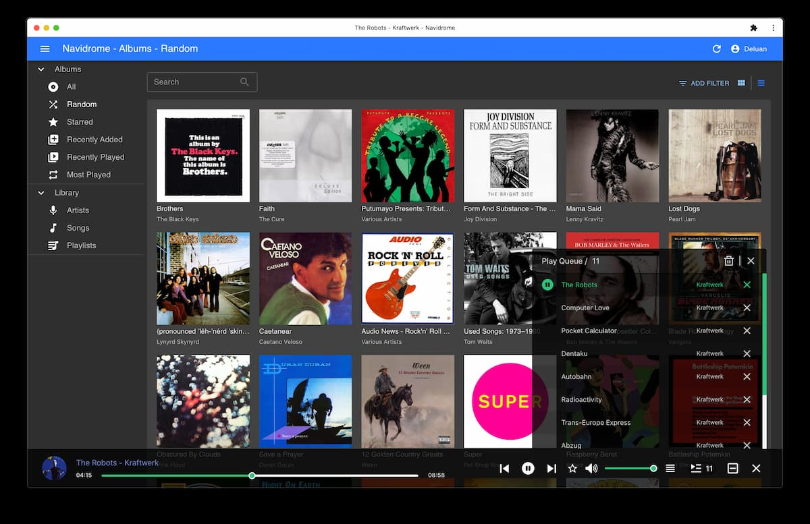

# Music Management with Navidrome, DSub and Beets

Previously on Windows, I was using [MediaMonkey][mediamonkey] to manage my music. It offered wireless syncing (over LAN) for the associated Android client, and worked well.

When I [switched to Linux][computing-philosophy], I had to look for a replacement. I wanted a solution that was free and open-source, could be self-hosted on a server, and supported features such as bookmarks, playlists and transcoding (for clients not supporting certain formats).

After considering [Airsonic][airsonic-advanced], [Funkwhale][funkwhale] and [Jellyfin][jellyfin], I settled upon [Navidrome][navidrome].

## [Navidrome][navidrome]



Navidrome is "an open source web-based music collection server and streamer", with support for on-the-fly transcoding[^issue] for devices which cannot play certain formats (e.g. FLAC). It is accessible via the web. It also has [Subsonic][subsonic] API support, which lets it work with the [large variety][subsonic-clients] of Subsonic clients available across platforms.

It also comes with a responsive, HTML5 web UI written as a progressive web app. Navidrome also keeps a record of play counts, recently played songs and also supports bookmarks, which is useful for audiobooks.

Additionally, multiple users can share a single server and maintain their own playlists.

## [DSub][dsub]

<figure>
  <div style="max-width: 300px"></div>
</figure>

DSub ([available on the F-Droid store][dsub]) is the best Subsonic Android client in my opinion. It is the only client I have found which supports all of:

- Playlist managment
- Caching of audio files for offline playback
- Bookmarks

I cache songs in my playlists, which lets me listen to them when I don't have internet access.

## [Beets][beets]

I use the [Beets][beets] CLI tool for tagging music and organizing. It supports fingerprinting audio files and looking up tag information from multiple sources.

I currently run Beets with several plugins in Docker.

## Notes regarding playlist sync

At present, files which are renamed are removed from their playlists in Navidrome. This makes renaming/editing files with `beets` tricky, since there is nothing Navidrome can track to identify a file throughout renames/tag changes.

Initially I thought of using flexible attributes (non-standard tags), however they are [not written][flexible-attributes] into file metadata (they are only stored in `beets`' library), and are therefore not visible in Navidrome.

After exploring various options, here is a comparison between using different sources of truth for playlists:

| Task                           | Navidrome                                                                     | .m3u playlist files                                                                                | Tags + Smart Playlists (either Navidrome or in `beets`) |
|--------------------------------|-------------------------------------------------------------------------------|----------------------------------------------------------------------------------------------------|---------------------------------------------------------|
| File rename/metadata change    | Need to re-add those files to Navidrome's playlists if they were in any       | Navidrome should automatically sync updates to playlist files                                      | Navidrome updates automatically                         |
| Adding/removing playlist items | Can be done in Navidrome/clients                                              | Manually edit playlist file, cannot be done from Navidrome/clients                                 | Tags must be manually updated (via `beets`)             |
| Advantages                     | Can use `ffmpeg -i <filename> hash -` to hash audio data (excluding metadata) | `beets` can automatically update playlist files on library change<br><br>Can be version controlled | Simple                                                  |

I rejected the first option (using Navidrome as the source of truth) as identifying which of the modified files are in Navidrome's playlists is a time-consuming task.

The decision between the second option (using playlist files) and the third option (using tags in files) came down to which method I preferred using to update playlist items: editing the playlist file, or editing file tags.

I decided on the third option, using tags in files with Navidrome [Smart Playlists][navidrome-smart-playlists] for the following reasons:

- Smart Playlists in Navidrome are read-only, so there is no danger of accidentally editing the playlist in Navidrome, versus importing a playlist file
- Editing tags is more convenient, and allows querying all playlists a song is in/vice versa, versus maintaining a playlist file

I use `beets`[^beet-info] to modify the ID3 field `comments`[^beet-naming] to store the names of playlists the file is in: e.g.:

```
comments: toprated relaxing
```

Subsequently in Navidrome, I have a [smart playlist][navidrome-smart-playlists] for each playlist, e.g. for `Top Rated.nsp`:

```json
{
  "all": [
    {"contains": {"comment": "toprated"}}
  ]
}
```

The playlists are then visible in Navidrome and automatically updated as new files are added.


[airsonic-advanced]: https://github.com/airsonic-advanced/airsonic-advanced
[issue]: https://github.com/navidrome/navidrome/issues/351
[mediamonkey]: https://www.mediamonkey.com/
[computing-philosophy]: 2022-02-27-my-computing-philosophy.md#stable-open-source-environment
[funkwhale]: https://funkwhale.audio/
[jellyfin]: https://jellyfin.org/
[navidrome]: https://www.navidrome.org/
[subsonic]: http://www.subsonic.org/pages/api.jsp
[subsonic-clients]: https://www.navidrome.org/docs/overview/#apps
[dsub]: https://f-droid.org/en/packages/github.daneren2005.dsub/
[beets]: https://beets.io/
[flexible-attributes]: https://github.com/beetbox/beets/issues/565#issuecomment-36511576
[navidrome-smart-playlists]: https://github.com/navidrome/navidrome/issues/1417

[^issue]: Navidrome does not yet support per-format transcoding options (i.e. if you turn on transcoding for a client, Navidrome will transcode all files, irregardless of format, to the specified format. See this [issue][issue].
[^beet-info]: You can use `beet info <query>` to output metadata which is stored **in the file** (as opposed to [flexible attributes][flexible-attributes], which are stored in `beets`' database and not visible to Navidrome).
[^beet-naming]: Strangely, `beets` uses the field name `comments` to refer to the actual `comment` field (which is a canonical fieldname and which Navidrome uses). I haven't yet figured out the reason why.