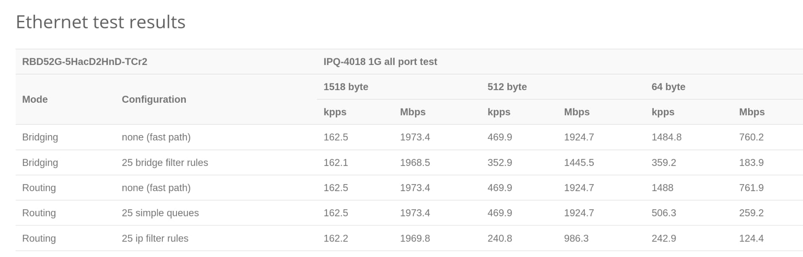

---
tags:
  - Programming
---

# Setting up the Mikrotik hAP ac² with Singel Fibre


The [Mikrotik][mikrotik] family of routers are known for their extensive configurability, offering enterprise level features such as PoE, custom routes, VLANs and more. It runs a custom Linux distribution known as [RouterOS][router-os] which offers a WebGUI and terminal interface, as well as SSH.

I wanted to replace my old [Singtel WiFi Gigabit Router AC Elite][singtel-router], after it started intermittently dying.

## Hardware Setup

I got the Mikrotik [hAP ac2][hap-ac2] secondhand for $50. It runs the 4-core IPQ-4018 chip, and comes with 128MB of RAM. It also has dual-band WiFi, with the 5GHz band supporting a maximum transfer rate of 867 Mbit/s. The all-port [benchmark][benchmark] for this router has it routing 1518-byte packets at 1973.4 Mbps, which is more than sufficient for my current Singtel 1Gbps plan.



For the Optical Network Terminal (ONT), I have an [Alcatel-Lucent G-240G-C][alcatel-ont].

## Singtel VLAN Tagging

Router setup is not so straightforward with Singtel Fibre, however, due to a 'feature' present called [VLAN Tagging][vlan][^singtel-fibre].

In short, packets exiting the ONT have a VLAN tag on them. In order to access the internet, the router connected to the ONT needs to remove or strip the VLAN tag. For that reason, a non-VLAN aware router connected to the ONT will not have internet access.

## Setup

### 1. Connect hardware

Begin by connecting port 1 of the Mikrotik router (interface `ether1`) to the **LAN 2**[^ont-lan-port] of the ONT. Then, connect the rest of your PCs/switches to the other LAN ports on the Mikrotik router (interface `ether2` to `ether5`).

Power on the ONT and Mikrotik router. Now, either connect your PC to the LAN, or the SSID emitted by the Mikrotik router (the name should be obvious).

### 2. Access Console

From here, you have 2 ways of accessing the terminal interface.

    - Option 1: Browse to `192.168.88.1`, click 'Ok' and then click on the 'Terminal' button.
    - Option 2: `ssh` to `admin@192.168.88.1`.

    You can read more about the terminal commands [here][console].

Once you can access the terminal, run the following command:

```
[admin@MikroTik] > interface/bridge/port print
```

We see that a [bridge][bridge] has been created between all the interfaces except `ether1`.

```
Flags: I - INACTIVE; H - HW-OFFLOAD

#    INTERFACE  BRIDGE  HW   PVID  PRIORITY  PATH-COST  INTERNAL-PATH-COST  HORIZON
;;; defconf
0  H ether2     bridge  yes     1  0x80             10                  10  none
;;; defconf
1  H ether3     bridge  yes     1  0x80             10                  10  none
;;; defconf
2  H ether4     bridge  yes     1  0x80             10                  10  none
;;; defconf
3 IH ether5     bridge  yes     1  0x80             10                  10  none
;;; defconf
4 I  wlan1      bridge          1  0x80             10                  10  none
;;; defconf
5 I  wlan2      bridge          1  0x80             10                  10  none

```

### 3. Setup VLAN

At this point, we do not have internet access yet. We will need to 'untag' the packets coming from the ONT.

In order to tell the router to untag incoming packets from `ether1` (and automatically re-tag packets outgoing from `ether1`), we will need to create a [VLAN][mikrotik-vlan] on that interface. The VLAN ID for Singtel internet is `10`.

Run the following command:

```
> interface vlan add interface=ether1 vlan-id=10
```

### 4. Setup DHCP Client on router

Then, we need to tell our router to obtain its IP address from this VLAN, instead of directly from `ether1`:

```
> ip dhcp-client set 0 interface=vlan1
```

We should now have an IP address assigned to us by the ONT:

```
> ip dhcp-client print

# INTERFACE  USE-PEER-DNS  ADD-DEFAULT-ROUTE  STATUS  ADDRESS
0 vlan1      no            yes                bound   <YOUR-IP-ADDRESS>/24
```

At this point, the router itself has internet access (over `vlan1`).

### 5. Setup NAT

Next, we need to tell the router to change the **source** IPs of outgoing packets to the router's own IP, so that the ONT and subsequent servers will be able to route the packet back to us (these servers can't see our internal addresses on the network, e.g. 192.168.x.x - they can only see our router's external address as above). This translation is known as [Network Address Translation][nat], of which there are 2 types - source (`srcnat`) and destination (`dstnat`), which apply to outgoing and incoming packets respectively.

```
> ip firewall nat print

0   chain=srcnat action=masquerade out-interface-list=WAN log=no log-prefix="" ipsec-policy=out,none
```

The `masquerade` action is a [special type][masquerade] of `srcnat` which sets the source IP to whatever the router's own IP happens to be at that point in time. This is useful when our router gets assigned IP addresses dynamically (most ISPs do this).

We now tell the router to perform NAT on packets headed for the internet, by modifying the existing entry:

```
> ip firewall nat set 0 out-interface=vlan1
> ip firewall nat unset 0 out-interface-list
```

To complete the NAT hairpin setup and maintain SSH access internally on the LAN, run the following:

```
# This enables hairpinning
> ip firewall nat add chain=srcnat action=masquerade src-address=192.168.88.0/24 dst-address=192.168.88.0/24

# This allows clients on the LAN to still be able to SSH to the router
> ip firewall nat add chain=dstnat to-addresses=192.168.88.1 to-ports=22 protocol=tcp dst-address=192.168.88.1 dst-port=22
```

At this juncture, your device should have internet access.

## Advanced Configuration

### Changing default gateway address

```
> ip address add address=192.168.1.1/24 interface=bridge
> ip dhcp-server remove 0
> ip dhcp-server setup
```

### Setup Static DHCP Leases

This can be done conveniently via the WebGUI, or the [terminal][dhcp].

### Setup Port Forwarding

This can be done with `dstnat` rules, as follows:

```
> ip firewall nat add chain=dstnat action=dst-nat to-addresses=<LOCAL-ADDRESS> to-ports=<LOCAL-PORT> protocol=tcp dst-address-type=local dst-port=<PUBLIC-PORT>
```

This rule will forward packets incoming on `PUBLIC-PORT` and send them to `LOCAL-ADDRESS:LOCAL-PORT`.

Additionally, the inclusion of [`dst-address-type=local`][nat-properties] allows devices within the LAN to access the public URL of a port-forwarded device on the same LAN (also known as [hairpin NAT][hairpin-nat]).

Either `dst-address-type` or `dst-address` must be set, otherwise all traffic bound for `PUBLIC-PORT`, even locally, will be routed to `LOCAL-ADDRESS`.

### Setup DNS-over-HTTP (DoH)

DoH is a more secure form of DNS, which cryptographically verifies responses from the server. You can set it up on the router by following this [guide][doh] for Cloudflare's 1.1.1.1 service.

After you have set it up, you can test whether it is working [here][cloudflare-check-doh].

Note: if you receive `certificate is not yet valid` errors after configuring DoH, you may need to setup the [NTP][ntp] client on the router to fetch the correct time as follows:

```
> system ntp client set enabled=yes
> system ntp client servers add address=pool.ntp.org
```

[^singtel-fibre]: Singtel used to have a 'Unlimited Fibre Plan'. [That plan did **not** use VLAN tagging](https://forums.hardwarezone.com.sg/threads/your-isps-dhcp-does-not-function-properly-singtel-asus-rt-ax86u.6564040/#post-135518324), and you could connect any router to the ONT. However, subsequent plans, such as the '1Gbps Fibre Home Bundle with Telephone Line', have [reverted back to using VLAN tagging](https://forums.hardwarezone.com.sg/threads/your-isps-dhcp-does-not-function-properly-singtel-asus-rt-ax86u.6564040/#post-135519349).
[^ont-lan-port]: LAN 1 may also work.

[mikrotik]: https://mikrotik.com/products
[router-os]: https://mikrotik.com/software
[singtel-router]: https://www.singtel.com/personal/support/broadband/routers-ont/arcadyan-ac-elite-guide
[hap-ac2]: https://mikrotik.com/product/hap_ac2
[benchmark]: https://mikrotik.com/product/hap_ac2#fndtn-testresults
[vlan]: https://en.wikipedia.org/wiki/IEEE_802.1Q
[alcatel-ont]: https://www.singtel.com/personal/support/broadband/routers-ont/alu-ont-led-troubleshoot
[console]: https://help.mikrotik.com/docs/display/ROS/Command+Line+Interface
[bridge]: https://wiki.mikrotik.com/wiki/Manual:Interface/Bridge#Summary
[mikrotik-vlan]: https://help.mikrotik.com/docs/display/ROS/VLAN
[nat]: https://help.mikrotik.com/docs/display/ROS/NAT
[masquerade]: https://help.mikrotik.com/docs/display/ROS/NAT#NAT-Masquerade
[dhcp]: https://help.mikrotik.com/docs/display/ROS/DHCP#DHCP-Leases
[hairpin-nat]: https://help.mikrotik.com/docs/display/ROS/NAT#NAT-HairpinNAT
[nat-properties]: https://wiki.mikrotik.com/wiki/Manual:IP/Firewall/NAT#Properties
[doh]: https://gist.github.com/M0r13n/4142018edb10f927cf4f19c6de31614c
[cloudflare-check-doh]: https://one.one.one.one/help/
[ntp]: https://en.wikipedia.org/wiki/Network_Time_Protocol
