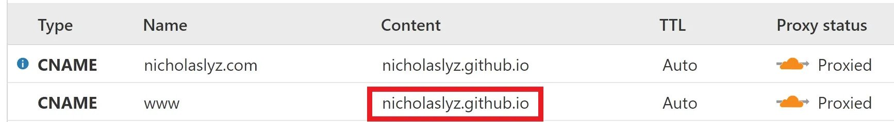

---
categories:
    - Programming
date: 2020-09-24
---

# DNS settings for serving Github Pages over Cloudflare

_Written on 24/9/20_

## Update (20/12/20) - Cloudflare proxying prevents SSL Certificate renewal

When the SSL certificate (provisioned by Github automatically for the custom domain you specified, via Let's Encrypt) expired on 18/12/20, I started getting errors from Cloudflare.

Looking deeper, I realized Github was having trouble provisioning the SSL certificate.

**The solution was to disable Cloudflare proxying**. Upon doing so, I was able to get an SSL certificate provisioned for the root domain, `nicholaslyz.com`.

## The Problem


[Cloudflare](https://www.cloudflare.com) is one of the largest CDNs, and the Free plan offers unlimited bandwidth to your site. I use it for this site. However, the configuration can be tricky...

 <figure>
  
  <figcaption>I kept getting this error for ```www.nicholaslyz.com```, but not ```nicholaslyz.com```</figcaption>
</figure>

Here was my initial configuration:

{: loading=lazy }

I use Github Pages with [custom domains](https://docs.github.com/en/github/working-with-github-pages/managing-a-custom-domain-for-your-github-pages-site#configuring-a-subdomain) and 'Enforce HTTPS' enabled, and Cloudflare with [SSL Full (Strict)](https://support.cloudflare.com/hc/en-us/articles/200170416-End-to-end-HTTPS-with-Cloudflare-Part-3-SSL-options#h_8afd8a8d-382d-4694-a2b2-44cbc9f637ef).

When a visitor visits `www.your-site.com`, Github issues a HTTPS 301 redirect from the `www` subdomain to the registered custom domain/subdomain (in this case `your-site.com`), presenting a certificate valid for `www.github.com, *.github.com, github.com, *.github.io, github.io, *.githubusercontent.com, githubusercontent.com`. This happens because Github [only provisions certificates for the registered (sub)domain](https://github.community/t/does-github-pages-support-https-for-www-and-subdomains/10360/2) (in my case, `nicholaslyz.com`) and not the other subdomains.

 <figure>
  
  <figcaption>Github redirects users automatically to the correct version of your page, using their Github certificate</figcaption>
</figure>

With Cloudflare proxying switched off - Firefox displays ['Warning: Potential Security Risk Ahead'](https://support.mozilla.org/en-US/kb/what-does-your-connection-is-not-secure-mean) for the `www` version of the site, because the Github certificate is not valid for the `www` subdomain. This is the same error Cloudflare is getting. Chrome and Edge however, [ignore the certificate error](https://www.thesslstore.com/blog/chrome-fix-common-name-mismatch-error/), so they follow the redirect and work fine.

This configuration (without cloudflare proxying) will still result in an error when the user tries to visit the `www` subdomain:

<figure>
  
  <figcaption>If Cloudflare proxying is turned off, the error recurs</figcaption>
</figure>

This is because Github is trying to redirect the user to the non-`www` version of the site while presenting the Github certificate.

## Solution

The following DNS settings worked (changes in red):

{: loading=lazy }

**I believe CF allows requests from the origin with mismatched certificates to pass through if**

1. **The CNAME entry closest to the origin is being queried or**
2. **The certificate issued by the origin is valid for the requested hostname, regardless of the intermediate CNAME domains.**

Here are some examples of this hypothesis.

### Example 1 - Cloudflare ON

| Type  | Name            | Content     | Proxy Status |
| ----- | --------------- | ----------- | ------------ |
| CNAME | www.example.com | example.com | Proxied      |
| CNAME | example.com     | google.com  | Proxied      |

-   `www.example.com` gives the 526 error (google.com does not have a valid certificate for ``www.example.com`)
-   `example.com` loads `google.com` (Point 1 above)

### Example 2 - Cloudflare OFF

| Type  | Name            | Content     | Proxy Status |
| ----- | --------------- | ----------- | ------------ |
| CNAME | www.example.com | example.com | DNS Only     |
| CNAME | example.com     | google.com  | DNS Only     |

-   `www.example.com` gives certificate error on browsers
-   `example.com` gives certificate error on browsers

This is expected browser behavior as the certificates presented by `example.com` and `google.com` do not match `www.example.com` and `example.com` respectively.

### Example 3 - Without CNAME flattening

| Type  | Name                  | Content               | Proxy Status |
| ----- | --------------------- | --------------------- | ------------ |
| CNAME | www.example.com       | subdomain.example.com | Proxied      |
| CNAME | subdomain.example.com | google.com            | Proxied      |

-   `www.example.com` gives the 526 error
-   `subdomain.example.com` loads google.com (Point 1 above)

So CNAME flattening is not the cause.

### Example 4 - Origin presents valid certificate for requested hostname

Assume `example.github.io` has the certificate for ONLY `example.com` (not its subdomains)

| Type  | Name                  | Content               | Proxy Status |
| ----- | --------------------- | --------------------- | ------------ |
| CNAME | example.com           | subdomain.example.com | Proxied      |
| CNAME | subdomain.example.com | example.github.io     | Proxied      |

-   `example.com` loads properly (Point 2 above)
-   `subdomain.example.com` gives a Github Page not found error
    -   This is because Github is receiving a request for the hostname `subdomain.example.com` which does not have a Github page setup. Cloudflare however, accepts Github's mismatched certificate just fine during the processing of this request.

### Example 5 - Origin presents invalid certificate for requested hostname

| Type  | Name                  | Content               | Proxy Status |
| ----- | --------------------- | --------------------- | ------------ |
| CNAME | www.example.com       | subdomain.example.com | Proxied      |
| CNAME | subdomain.example.com | example.github.io     | Proxied      |

-   `www.example.com `gives the 526 error (Github does not have the certificate for `www.example.com`)
-   `subdomain.example.com` gives a Github Page not found error (same as above)

Many people have had this problem, in fact there is a [list of pages](https://github.community/t/does-github-pages-support-https-for-www-and-subdomains/10360/39#M2417) affected by the certificate mismatch error.

There is also a [temporary hack](https://github.community/t/does-github-pages-support-https-for-www-and-subdomains/10360/29) to get Github to provision certificates for both the `www` and `root` domains.
