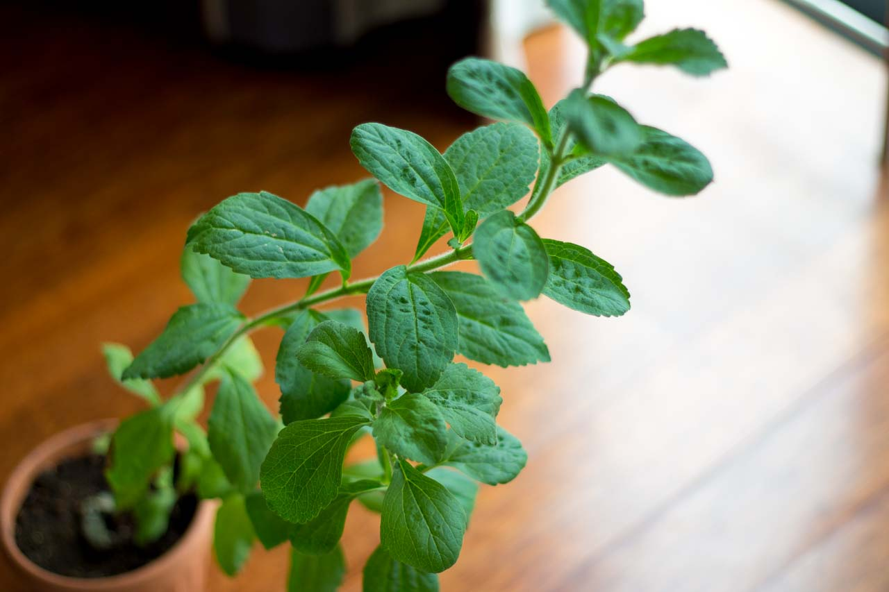
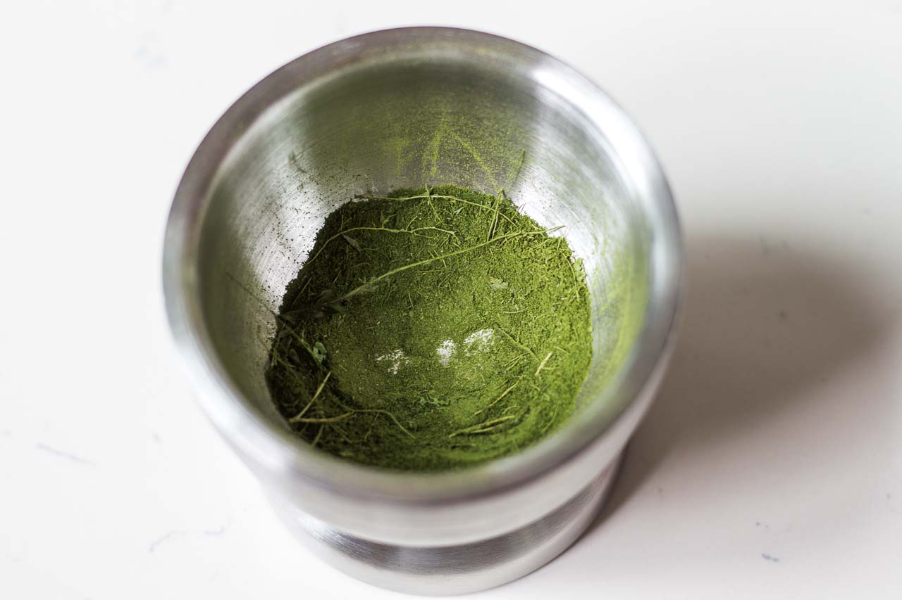
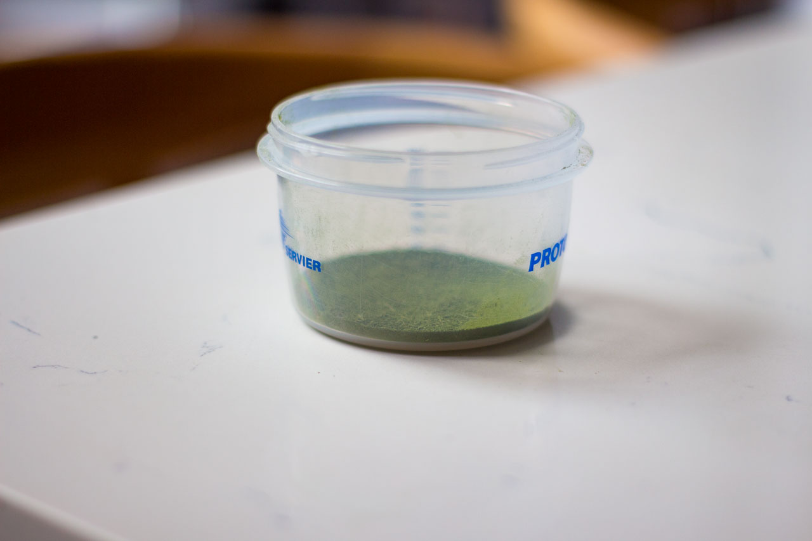
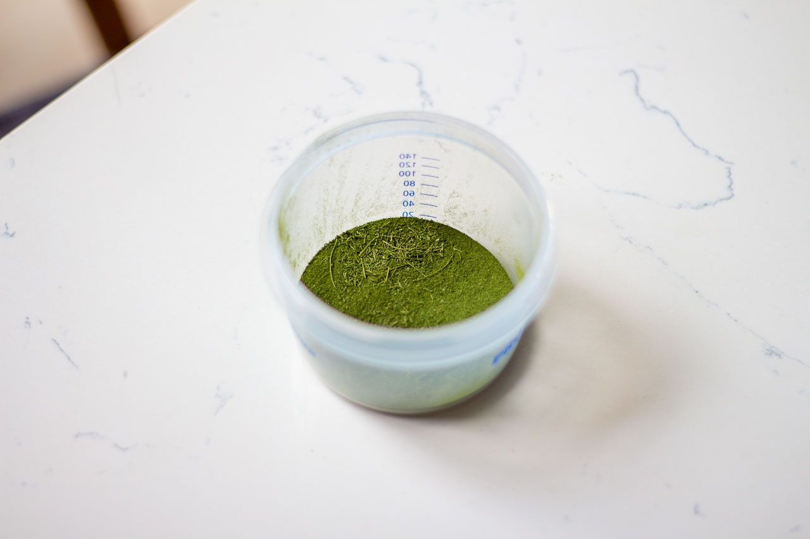

---
categories:
    - Cooking
date: 2020-11-28
---

# Making Stevia Powder: From the Beginnnig

<figure>
  
</figure>

I'm a big fan of non-nutritive sweeteners, aka zero calorie sweeteners. Sugar has been getting a very bad rep, especially among the medical community. It [increase the risk of dying from heart disease by up to 38%][healthline-sugar], [causes cancer][ncbi-cancer] and tooth decay (we've all been told that from young!). So when I heard about alternatives to sugar, I began researching.

<!-- more -->

Broadly speaking, the universe of sweeteners can be divided into low- and zero-calorie sweeteners. These are:

Low-calorie sweeteners.

-   [Agave syrup](https://www.healthline.com/nutrition/agave-nectar-is-even-worse-than-sugar) (marketed as low GI, but full of fructose!)
-   [Sugar Alcohols](https://en.wikipedia.org/wiki/Sugar_alcohol#Sugar_alcohols_as_food_additives). These include:
    -   Xylitol (100% sweetness of sucrose, and [prevents dental caries](https://www.ncbi.nlm.nih.gov/pmc/articles/PMC2836749/))
    -   Sorbitol (40-70% sweetness of sucrose)
    -   Erythritol (60-80% sweetness of sucrose)

Zero-calorie sweeteners. These have zero nutritional value to the body.

-   Natural
    -   Stevia
    -   Monkfruit
-   Artificial a.k.a. synthetic
    -   [Sucralose](https://en.wikipedia.org/wiki/Sucralose)
    -   [Acesulfame-K](https://en.wikipedia.org/wiki/Acesulfame_potassium)
    -   Saccharin

I settled for the zero-calorie sweeteners in the end. Sugar alcohols can cause gastrointestinal distress in certain individuals. As for the zero-calorie sweeteners (both natural and artificial), there has been some research on mice suggesting that the [gut microbiome might be affected](https://journals.plos.org/plosone/article?id=10.1371/journal.pone.0199080). Research done on [stevia](https://pubmed.ncbi.nlm.nih.gov/29982648/) however, including on humans, has generally concluded that there is little or no harm as of present. Finally, monkfruit is more expensive than stevia.

So enough justification! Time for pictures!

## Planting

<figure>
  
</figure>

I got the seeds from [Horti](https://horti.sg/product/stevia/) at $4.80.

I planted them in a pot, and after about 1 month I got a big, healthy green plant:

I didn't edit the photo - the leaves are really quite green. I ate some leaves raw and they really do taste sweet, with a slight earthy/bitter aftertaste (I mean, it's a leaf after all, not a block of sugar...)

## Drying

Now to make the powder, the leaves have to be dried. A quick google search suggested the optimum drying temperature to be 35 degrees Celsius. After leaving the leaves for 24 hours in a food dehydrator, the end result was a crumbly, shrunken mass of leaves.

## Grinding

The next step was to grind the leaves into a powder! I used a metal mortar and pestle, although research suggests that a coffee grinder is better (I don't have one). While grinding I discarded some stems away since they didn't grind well.

## End Result

The final product! This is the result of about ~30 leaves from 3 separate plants in total.

The taste can be described as rather sweet, with some earthy undertones. It is much less bitter compared to the raw, fresh leaf.

There is another way to extract the stevia using alcohol, but I'll leave that to another day (or just buy it off iHerb).

So that's it! For just $4.80 and a month of watering a pot you can get a pure, natural, non-nutritive sweetener, that you can add to coffee, tea, baking or just about anything under the sun.

[healthline-sugar]: https://www.healthline.com/nutrition/too-much-sugar
[ncbi-cancer]: https://www.ncbi.nlm.nih.gov/pmc/articles/PMC3494407/
