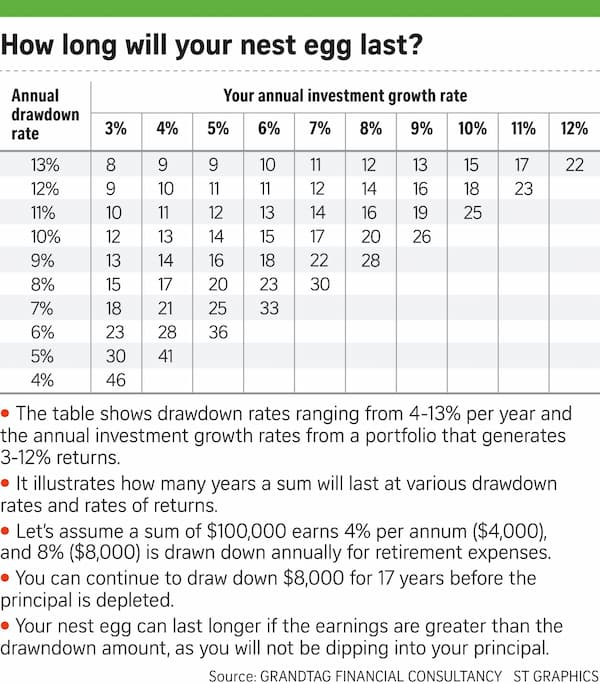

---
categories:
    - Finance
date: 2021-01-16
---

# My Investment Portfolio

This is my current portfolio allocation as of 2/6/21.

<!-- more -->

| %   | Product[^ishares] (Ticker on LSE)                                                                                                                                             |
| --- | ----------------------------------------------------------------------------------------------------------------------------------------------------------------------------- |
| 50% | [iShares MSCI ACWI UCITS ETF (ISAC)](https://www.ishares.com/uk/individual/en/products/251850/ishares-msci-acwi-ucits-etf)                                                    |
| 30% | [iShares MSCI World Small Cap UCITS ETF (WSML)](<https://www.ishares.com/uk/individual/en/products/296576/ishares-msci-world-small-cap-ucits-etf-usd-(acc)-fund>)             |
| 10% | [iShares Developed Markets Property Yield UCITS ETF (DPYA)](https://www.ishares.com/uk/individual/en/products/297188/ishares-developed-markets-property-yield-ucits-etf-fund) |
| 10% | [iShares Core Global Aggregate Bond UCITS ETF (AGGU)](https://www.ishares.com/uk/individual/en/products/291772/ishares-core-global-aggregate-bond-ucits-etf-fund)             |

!!! note ""

    _As I've emphasized throughout this site, I don't pick individual stocks, nor actively trade. Such activity, to me, is [likely to lead to loss](2020-11-30-getting-started-with-investing.md)._

These are the reasons for my own portfolio allocation [above](2020-12-02-asset-allocation.md#asset-allocation1).

-   As I am still working, the bulk return of my portfolio comes from equities. I am comfortable bearing the drawdown risk.
-   For equities, I buy both an ETF investing in large and mid-cap companies globally across both emerging and developed markets (ISAC), and another in small-cap companies, also globally (WSML).
-   I buy some bonds for the diversification effect. As interest rates are low now (2020), I have reduced the allocation to bond ETFs. I plan to increase this as I grow older.
-   I am planning to buy a commodity ETF e.g. one tracking the [GSCI](https://en.wikipedia.org/wiki/S&P_GSCI).
-   For the portfolio detailed at the start of this post, my risk exposures are
    -   80% equities (of which 50% are large- and mid-cap companies globally, and 30% small-cap)
    -   10% global property (in the form of real estate investment trust ETFs)
    -   10% bonds (international denominated bonds)

### FAQ

#### Why are all your ETFs dormiciled in Ireland? What does UCITS mean?

The main reasons are to save on witholding tax on dividends (15% vs 30%), and estate duty. [Bogleheads](https://www.bogleheads.org/wiki/Nonresident_alien_investors_and_Ireland_domiciled_ETFs) has a great explanation. Note: this only applies if you're not a US investor.

#### Why not consider high yield, short duration bonds e.g. [SDHA](https://www.ishares.com/ch/individual/en/products/297889/ishares-short-duration-high-yield-corp-bond-ucits-etf-fund)?

High yield, short duration bonds perform remarkably similar to equities (they lack the traditional stability associated with bonds). I would rather invest more in equities than in these or junk bonds.

#### Why [ISAC](https://www.ishares.com/uk/individual/en/products/251850/ishares-msci-acwi-ucits-etf) + [WSML](<https://www.ishares.com/uk/individual/en/products/296576/ishares-msci-world-small-cap-ucits-etf-usd-(acc)-fund>) and not [IWDA](https://www.ishares.com/uk/individual/en/products/251882/) + [CSPX](https://www.ishares.com/uk/individual/en/products/253743/) or [VWRA](https://www.vanguardinvestments.dk/portal/instl/dk/en/product.html#/fundDetail/etf/portId=9679/assetCode=equity/?overview)?

See this [post](2021-06-08-which-is-the-best-index-fund-etf.md).

#### Why ISAC over VWRA?

See this [post](2021-06-08-which-is-the-best-index-fund-etf.md#why-isac-over-vwra).

#### Why not [IMID](https://markets.ft.com/data/etfs/tearsheet/summary?s=IMID:LSE:USD)? This includes small to large-cap stocks across developing AND developed markets!

See this [post](2021-06-08-which-is-the-best-index-fund-etf.md#why-not-imidhttpsmarketsftcomdataetfstearsheetsummarysimidlseusd-this-includes-small-to-large-cap-stocks-across-developing-and-developed-markets).

#### How often to rebalance the portfolio?

A very good, mathematically accurate answer I read[^rebalancing] suggests that you should rebalance at most once a year. That is what I do. In terms of adding cash into the portfolio however, I add once I have a suitable amount, to make the cost of transaction fees minimal.

#### How much can I withdraw a year, without losing all of my principal?

4% of the total portfolio value per annum, assuming a portfolio invested in stocks and bonds[^withdrawal]. Withdrawing more than 4% p.a. will make the portfolio go to $0 eventually.

#### Should I hedge against foreign currency risk?

This is controversial, but essentially if you are looking at the long term, currency hedging has little to no impact on your portfolio.[^hedging]

#### Why not put more into CPF instead? E.g. SA (SA shielding)?

The main idea behind using CPF as an investment vehicle ([1M65](https://blog.seedly.sg/1m65-1-million-by-65-cpf/) etc) is to reap the 4% p.a. guaranteed return from the SA account. I firmly believe that over the course of a long investment horizon, such as 20 years, investment into the global markets can and will yield much better results than 4% p.a. (about 10% p.a. in fact). $1000 invested at 4% p.a. is worth $2191 in 20 years. But with an interest rate of 10% p.a. compounded, you'd have $6727 instead. - That being said, if you have a shorter investment horizon and plan to use your funds soon, investing in the SA (or the RA) could be part of your portfolio.

#### Why is insurance (e.g. whole-life insurance) not part of the portfolio?

[Insurance is not investment.](https://web.archive.org/web/20230321104802/https://www.valueresearchonline.com/stories/9261/do-not-mix-insurance-and-investment/). The returns from a whole life policy are much lower than even CPF (SA account earns 4% guaranteed interest, while most whole-life plans have a floor interest rate of 2% p.a.). Rather, one buys insurance as a hedge against adverse events which may cause you to need the money earlier, such as disability or illness. For most working adults with dependents, term life insurance is sufficient.

[^ishares]: If you're wondering why I buy so many ETFs from iShares, it's because they boast one of the lowest expense ratios (an annual fee charged by the ETF managers). Alternative ETF providers include [SSGA](https://www.ssga.com/us/en/institutional/etfs) and [Vanguard](https://investor.vanguard.com/etf/list#/etf/asset-class/month-end-returns).
[^rebalancing]: From 'The Intelligent Asset Allocator'. Stock returns exhibit autocorrelation (that is, future returns are affected by past returns) over short time periods (e.g. days to months). If you were to rebalance during such a period where the autocorrelation is positive, you would lose money as you would be selling the rising asset too soon.
[^withdrawal]: From 'The Intelligent Asset Allocator'. While the real, inflation-adjusted return of your portfolio may be more than 4% p.a., there are years where your portfolio may earn less than this and vice versa. Based on historical data, a withdrawal rate of more than 4% p.a. has quite a high probability of draining the entire portfolio during a string of years with poor returns. With a 4% or lower withdrawal rate, the portfolio theoretically can be sustained nearly indefinitely. Contrast this to CPF ;)
[^hedging]: The Intelligent Asset Allocator, pg 142.
