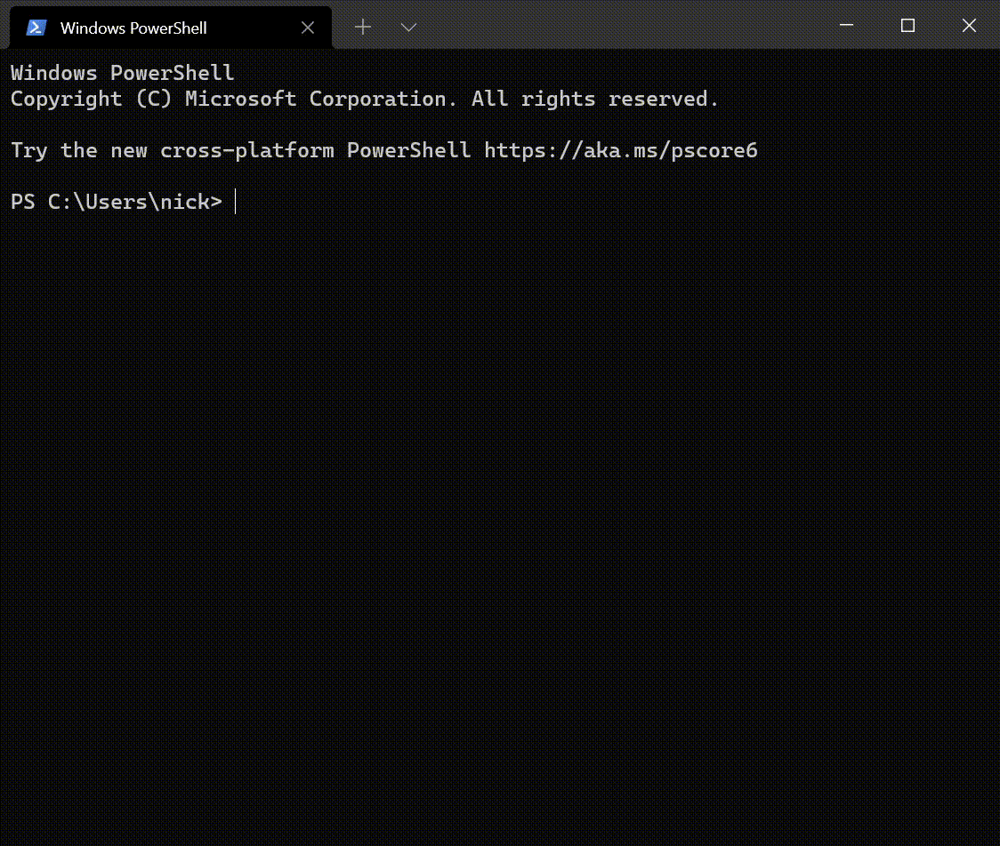

---
categories:
    - Programming
date: 2021-04-15
---

# Python Package Management on Windows

## **Update 17/11/21**

I now use [WSL2 containers in VSCode](2021-11-17-developing-in-wsl-containers.md). Additionally, I use `requirements.txt` files generated with:

`pip list --format freeze --not-required`

[`--not-required`][--not-required] ensures only top-level packages are printed.

In addition, I use `== X.Y.*` (aka [compatible version specifiers][compatible-version-specifiers]) to pin the major and minor version of packages, while allowing for patch versions to be updated automatically each time the container is rebuilt. This prevents surprises during deployment (e.g. missing functionality in minor versions) while allowing bugfix versions to automatically be upgraded without hassle.

<!-- more -->

## The State of Python Package Management

Python does not have [good](https://www.reddit.com/r/webdev/comments/46w7gt/is_it_just_me_or_is_package_management_with/) [package](https://news.ycombinator.com/item?id=19985802) [management](https://news.ycombinator.com/item?id=21781604).

Recently I was trying to update one of my Conda environments. After running `conda update --all` however, the environment crashed.

This is not the only problem I have with Conda.

-   Many python packages aren't available on Conda. For example, `broadlink`
-   Conda sometimes hosts outdated versions of packages vs pip, such as `pdfminer` (that was a real headache)
-   Search is slow. Very slow.
-   `conda update --all` doesn't update pip packages...



That being said, Conda allows you to specify and manage Python itself as a dependency, which is great on Windows, as it prevents you from polluting the working environment.

I started looking for alternatives. There's [virtualenv](https://virtualenv.pypa.io/en/latest/), [poetry](https://python-poetry.org/), [pyenv-win](https://github.com/pyenv-win/pyenv-win) among others.

I was previously using `pipenv`, but the dependency resolution wasn't perfect and I kept getting errors about unsatisfiable dependencies.

So what's the best solution?

## Poetry + Chocolatey to the rescue!


My setup:

-   Chocolatey with `--sidebyside` to manage Python versions
-   Poetry to manage Python packages under a specified Python version

I decided to use Chocolatey to manage python versions, because I don't want to have to keep installing Python 3.8.9 or whatever again and again, just because PyTorch or OpenCV some library doesn't support 3.9.

I set up a Python environment with Poetry using `poetry new <project-name>`.

By default, the system python version is used (the one present in the `PATH`). However if you want to use another version, you can either do `poetry env use /full/path/to/python` or edit the `pyproject.toml` as follows, then run `poetry update` after:

```toml hl_lines="8"
[tool.poetry]
name = "poetry-demo"
version = "0.1.0"
description = ""
authors = ["Sébastien Eustace <sebastien@eustace.io>"]

[tool.poetry.dependencies]
python = "3.8"

[tool.poetry.dev-dependencies]
pytest = "^3.4"
```

You can activate the poetry shell with `poetry shell`. Otherwise, some IDEs e.g. PyCharm do this for you automatically.

You can add new packages with `poetry add <package>`.

I know Chocolatey executes administrator-level code on your computer, but it works. I'll have to move to Linux one day, seeing as so many Python packages can't be built on Windows.

## Automatic Dependency Generation

Sometimes you might have a Python project with another dependency management framework, e.g. Conda or Pip.

One day, you realize you need to distribute your project to your friend, but you don't have a list of dependencies.

You could do `pip freeze`, but it's usually full of packages your project doesn't even use.

Here's where automatic dependency generation comes in. Packages like `pipreqs` and `pigar` are able to analyze the source code of your project, and produce a `requirements.txt` automatically.

As to which is the best, `pipreqs` or `pigar`, I've tried both, and `pipreqs` is better than `pigar` for automatically generating the requirements for your project.

[--not-required]: https://pip.pypa.io/en/stable/cli/pip_list/#cmdoption-not-required
[compatible-version-specifiers]: https://www.python.org/dev/peps/pep-0440/#compatible-release
