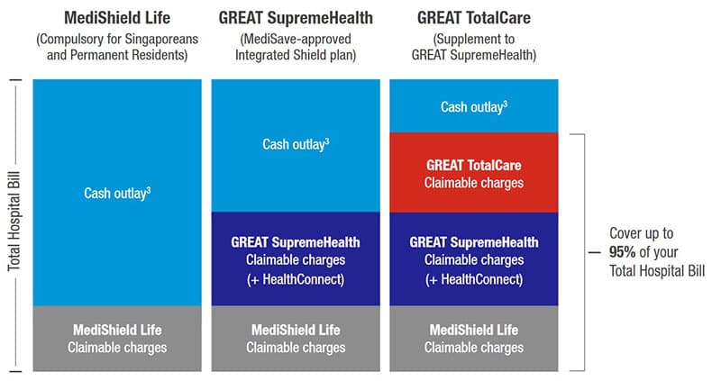
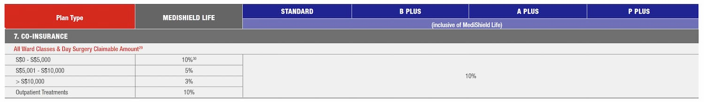
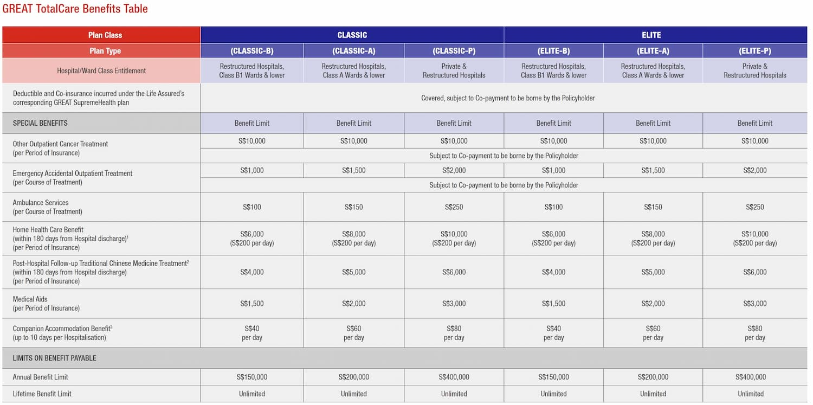
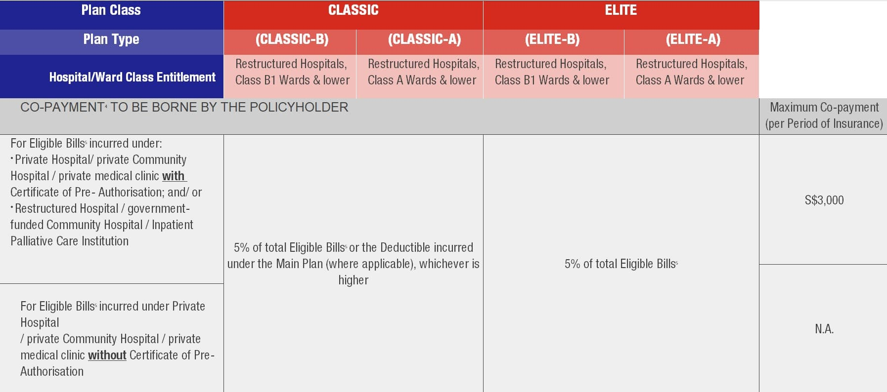
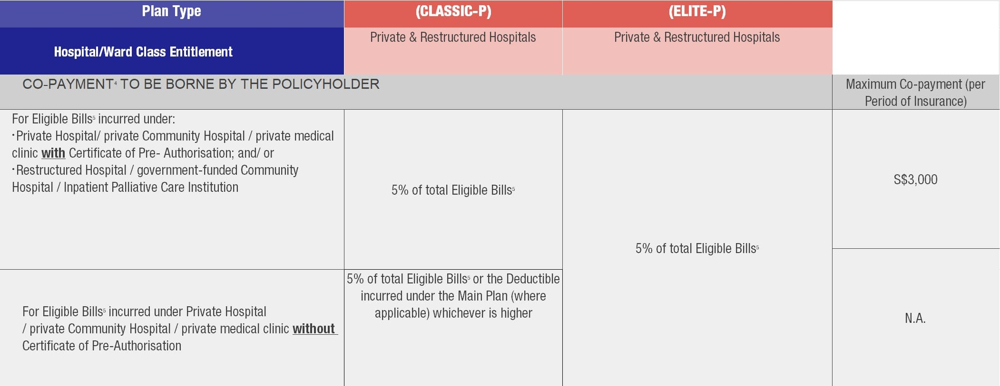
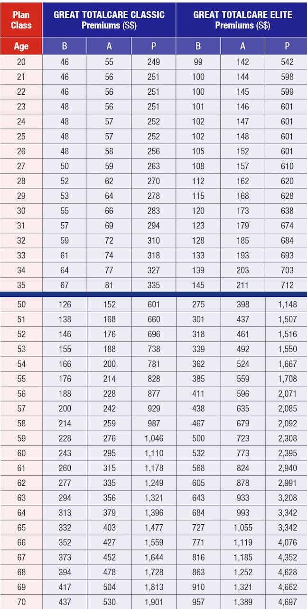

---
categories:
    - Insurance
date: 2021-06-18
---

# A comparison between Great Eastern's TotalCare Classic and Elite riders

On 2 Apr 2021, MOH [announced](https://www.asiaone.com/money/integrated-shield-plan-riders-now-require-co-payment-what-you-need-know) that all new and existing Integrated Shield Plans (ISPs) would need to integrate a 5% co-payment feature. In other words, there will no longer be any riders covering 100% of your hospital bills. Part of the blame was laid upon increasing healthcare expenses and ['buffet syndrome'](https://www.todayonline.com/singapore/5-co-payment-required-all-new-integrated-shield-plans-full-riders-moh), but that is also [debatable](https://lifefinance.com.sg/greedy-doctors-overpaid-agents-or-kiasu-patients/).

With this in mind, I decided to look at the Great Eastern's (GE) [new riders](https://www.greateasternlife.com/content/dam/great-eastern/sg/homepage/personal-insurance/our-products/health-insurance/great-supremehealth/gsh-gtc-benefit-schedule-and-premium-rates.pdf).

Great Eastern offers 2 classes of riders on top of their base shield plan (GREAT SupremeHealth). These are called GREAT TotalCare **Classic** and **Elite**. They are available for all classes of the base shield plan, from B1 wards all the way to private hospitals[^riders].

## Medishield Life

ISPs and Medishield Life, the compulsory national health insurance we all have, require one to co-pay part of the bill, depending on the size.

This is known as 'co-insurance'.

There is also a minimum amount you must pay on the base plan. This is the **deductible**[^deductible], and is independent of the bill size[^deductible-by-age].

The main purpose of GE's riders is to cover the co-insurance amount **and** the deductible. Before 2 Apr, riders could cover 100% of this amount. Now, consumers must co-pay at least 5% of the total bill.

## How do they differ?

Let's start by looking at the similarities.

In terms of the special benefits such as ambulance services, home health care benefit and limits on payable benefit, they are **identical** across their classes. There is no difference here - a TotalCare **Classic-P** and an **Elite-P** plan have the exact same special benefits.

So what's the difference? It's in how much co-payment they cover.

### B1 and A rider comparison

These plans cover B1 to A class wards in restructured hospitals.

The Classic-A and B plans (the lower tier ones) require you to pay the greater of $3000[^cap] or 5% of the total bill.

In contrast, the Elite-A and B plans require you to pay only 5% of the total bill, regardless of the size.

| Bill Size (B1 to A) | $10,000 | $60,000 | $100,000 |
| ------------------- | ------- | ------- | -------- |
| TotalCare Classic   | $3,000  | $3,000  | $5,000   |
| TotalCare Elite     | $500    | $3,000  | $5,000   |

For a large bill[^indifference-b1], you'll pay the same amount. For smaller bills however, you'll co-pay less with the Elite plan.

### Private rider comparison

The situation is slightly different for the private riders.

Here, you'll fall into one of the two groups[^groups]:

-   Group 1: Restructured hospitals and private hospitals **with** a certificate of pre-authorization[^pre-authorization] (only applicable for panel doctors)
-   Group 2: Private hospitals **without** a certificate of pre-authorization

If you fall into the first group, the Classic-P and Elite-P plans are **identical** - you only pay 5% of the total bill.

Things are different if you are in the second group (without pre-authorization).

On the Classic-P plan, you'd have to pay the greater of 5% of the total bill, or the deductible from the base plan (currently $3,500 for people younger than 80 years).

On the Elite-P plan however, you only pay 5% of the total bill again.

| Bill Size (Private) | $10,000 | $70,000 | $100,000 |
| ------------------- | ------- | ------- | -------- |
| TotalCare Classic   | $3,000  | $3,500  | $5,000   |
| TotalCare Elite     | $500    | $3,500  | $5,000   |

Again, for a large bill[^indifference-private], you'll pay the same amount, while for smaller bills, the Elite plan covers more.

So should we get the Elite plan, since the coverage is more?

Let's compare the prices of these plans.

## Cost comparison

Extra coverage must come at a price.

We can make some observations:

-   The P- (or private) class of either plan is markedly more expensive than the A- or B- ones.
-   The Elite plan is markedly more expensive than the Classic plan
    -   For example, at 35 years, you'd be paying $377 more or 2.1x
    -   At 70 years, you'd be paying $2,796 more or 2.5x

We can also look at the total premiums one would pay for different lengths of time:

| Total Premiums Paid | Classic-P | Elite-P  | Difference  |
| ------------------- | --------- | -------- | ----------- |
| 20 to 50 years      | $11,420   | $24,982  | **$13,562** |
| 20 to 74 years      | $43,872   | $103,420 | **$59,548** |

One might ask how often must each individual be hospitalized, to receive benefits exceeding the premium paid, over the period of 30 years?

This is not easy to calculate. We would need to take the average hospital bill size, as well as the [hospitalization rates](https://www.moh.gov.sg/resources-statistics/healthcare-institution-statistics/hospital-admission-rates-by-age-and-sex/hospital-admission-rates-by-age-and-sex-2020) for an individual, and then run them through a spreadsheet. (Work in progress)

Note also, that GE has introduced a [claims-based pricing](https://www.greateasternlife.com/sg/en/personal-insurance/our-products/health-insurance/great-supremehealth/cap.html) mechanic. I won't go into detail here, but suffice to say, your premiums increase the more times you are admitted, up to 2.5x the standard amount.

## Which plan is better?

This question is subjective, since people have different needs.

For the Classic plan:

-   You pay less premiums overall
-   For private hospitals, if you get a certificate of pre-authorization (i.e. a panel doctor), you pay the same as someone on the Elite plan
-   However, for B1 to A wards, you have to pay the greater of 5% or the deductible (~$3,500)
-   And for private hospitals, if you don't have a certificate of pre-authorization, you'll have to pay the greater of 5% or the deductible

The Elite plan:

-   You pay only 5% of the total bill regardless of pre-authorization or ward class
-   However, the total premium paid is much higher than the Classic (up to [$60,000](#private-rider-comparison))

I feel that the real question is - would you pay $60,000 extra, to always pay only 5% of the total bill, regardless of the size?

My opinion is that the Elite plan will in a sense 'pay-off' if you get warded frequently in private hospitals. Otherwise, you would be better off using the $60,000 that you would have saved, to pay for the excesses under the Classic plan. Even if you end up co-paying $3000 each admission, you'd have to be warded 20 times from 20 to 74 years of age to end up paying more than what someone with the Elite plan would have paid. Which, based on [statistics](https://www.moh.gov.sg/resources-statistics/healthcare-institution-statistics/hospital-admission-rates-by-age-and-sex/hospital-admission-rates-by-age-and-sex-2020), is unlikely.

Therefore, the Classic plan looks like the winner here.

As always, I'm open to comments and feedback!

Written on 18/6/21 by [Nicholas](https://nicholaslyz.com)

[^deductible]: The deductible for GREAT SupremeHealth, for a private ward, is currently $3,500. This means that you'll have to pay the first $3,500 of your hospital bill (plus co-insurance), before any coverage happens.
[^deductible-by-age]: It does change by age and ward class, however. For example, a 50 year old in a private ward has a deductible of $3,500, but an 86 year old in a private ward has a deductible of $5,250.
[^riders]: The TotalCare rider plan class must match the base SupremeHealth plan class, i.e. if you have a SupremeHealth A Plus plan, you can only buy the TotalCare Classic-A or Elite-A rider plans.
[^cap]: Of course, if your total bill is less than $3000, then that's what you'd pay!
[^indifference-b1]: $60,000 is the point of indifference between the two riders for the B1 to A plans - at this amount, you'll pay the same for both plans and so no reason to favour one over the other.
[^indifference-private]: $70,000 is the amount, above which, you'll pay the same for both riders.
[^groups]: This segregation exists because insurance companies think that non-panel doctors charge more, and hence are not eligible for pre-authorization. Whether this is true or not is a subject of intense [debate](https://hobbitsma.blog/2021/04/04/the-hobbits-guide-to-the-highlights-of-lias-position-paper-and-industry-responses-on-ips/).
[^pre-authorization]: This is a certificate from the insurance company stating that they have reviewed your application to be warded at a private hospital at a higher coverage, only if you've chosen a panel doctor. It takes a few working days, so it's not applicable if say, you have an emergency and get warded at a private hospital - there'd be no way for you to get the certificate in time.
