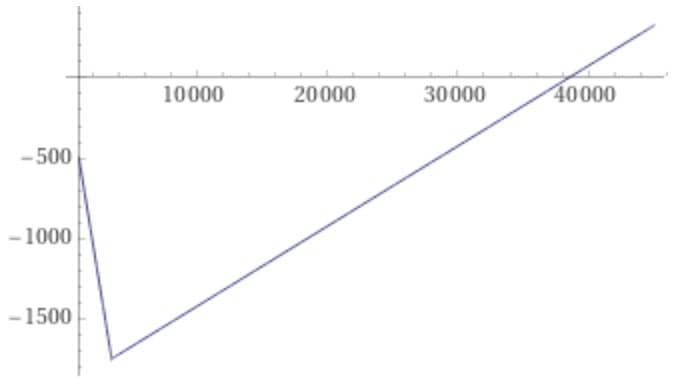
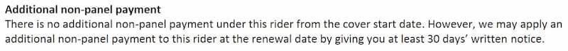

---
categories:
    - Insurance
date: 2021-06-19
---

# A comparison of shield plan riders (NTUC, GE, Prudential)

_This is a reply to an [analysis](https://docs.google.com/document/d/1HCFqQPU0IJ3eWEiHL97Gyosdp5yiksLX4o9FBA7ckFU/edit) by Yuan Jing._

I agree with your suggestion that one should choose maximum coverage[^maximum-coverage] while they're young and can afford the premiums. Later, when premiums get more expensive, switch to the lower tier riders[^lower-tier-riders].

<!-- more -->

I also agree with your paradigm:

> It is the author’s recommendation to adopt the following paradigm:
>
> -   Highest tier, and highest coverage while young.
> -   Downgrade as necessary, when necessary, at a later age.

Here, I argue specifically that you should keep a private hospital plan, plus a deluxe rider plan, when young. When you're older, downgrade the deluxe rider plan to a classic.

Some caveats:

-   I'm only going to compare **private hospital** coverage. Personally, I want the option to go to a private hospital, since queues at public hospitals can be [unpredictable](https://www.straitstimes.com/singapore/sgh-and-skh-report-many-patients-at-ae-skh-wards-operating-at-full-capacity). Also, I want maximum coverage early on in life as I've stated above.

-   I'm not going to comment on when the best age is to downgrade coverage, because that depends on a whole host of factors[^factors] which I might cover on another article.

-   I'm not going to take into account cost differences between riders at the same level (e.g. NTUC's vs GE's deluxe riders). That difference is much less than between the classic and deluxe level for any company's riders (e.g., $60,000 in GE's [case](2021-06-18-ge-totalcare-comparison.md#cost-comparison)).

## Why have a deluxe rider when you're young?

When you're young, you're working. You have a stream of income. You can pay for that $600 GE Elite-P rider.

If you get sick, you deserve the best. You don't want to have to pay a deductible of $3,500 each year when you get hospitalized, when you can just pay 5% of the total bill with riders.

Things are different when you're older. Premiums are much, much [higher](2021-06-18-ge-totalcare-comparison.md#cost-comparison). It might not make sense to pay a $10,000 premium just to save on a $3,500 deductible yearly.

The cost difference between the deluxe and classic riders is less significant when you're younger (on the average of $400/year). When you're older though, it jumps to $1,000 and can reach $2,700 (GE Elite-P vs Classic-P at 70 years).

And as you mentioned, you can't upgrade the rider if you develop a pre-existing condition. You can, however, downgrade the rider anytime.

So, keep the deluxe rider when you're young. You don't pay much more than the classic, and the benefits are nice.

Let's compare the classic-level riders next.

## Which is the best classic-level rider?

First out, let me say NTUC's Classic Care Rider is the worst of the three.

This is because:

-   the additional $2,000 non-panel penalty is significant
-   10% co-pay is effectively **double** what both NTUC or GE's riders offer

So, it's between GE or Prudential.

|           | GE's TotalCare Classic                                 | PRUExtra Premier Lite CoPay          | Any cap?        |
| --------- | ------------------------------------------------------ | ------------------------------------ | --------------- |
| Panel     | 5% of total bill                                       | 5% of total bill + 50% of deductible | Yes, $3000/year |
| Non-Panel | Greater of deductible[^deductible] or 5% of total bill | 5% of total bill + 50% of deductible | No              |

Just purely based on the math (see the note below):

-   If you're seeing panel doctors - GE wins. It's just a flat 5% of the total bill, nothing else.
-   If you're seeing non-panel doctors, and the bill is less than $38,500, Prudential wins. Otherwise, GE wins.

I agree that PRUExtra Premier Lite CoPay has a slightly longer non-panel pre- and post-hospitalization coverage, at 180 and 365 days respectively, versus that of GE's TotalCare Classic (120 and 180 days respectively).

I also agree that Prudential pays as-charged for community hospital stays, while GE has daily limits (of around $200).

GE has a nice 'home health care' benefit which can be used for home palliative care services (up to $10,000 or $200/day).

PRUExtra Premier Lite Copay does not have [claims-based pricing](https://www.prudential.com.sg/products/medical/claims-based-pricing), while GE's TotalCare Classic [has](https://www.greateasternlife.com/sg/en/personal-insurance/our-products/health-insurance/great-supremehealth/cap.html).

GE's TotalCare Classic, however, has a 20% discount on premiums if no claim is made.

These factors, combined, favour Prudential somewhat.

Personally, it's a toss-up between both. **I'd go with either.**

Now, we move on to the deluxe-level riders.

??? note "The math behind the $38,500 figure"

    Let $T$ be the total hospital bill size and $D_{max}$ be the maximum advertised deductible.

    The actual deductible paid is given as

    \begin{equation}
    min(T, D_{max})
    \end{equation}

    For GE TotalCare Classic, the amount one would co-pay if they saw a non-panel doctor is the greater of the maximum deductible or 5% of the total bill, or:

    \begin{equation} \label{copay_ge}
    Copay_{GE} = max(min(T, D_{max}), 0.05\cdot T)
    \end{equation}

    For PRUExtra Premier Lite CoPay, one pays 50% of the deductible, followed by 50% of the coinsurance (10% of the amount remaining after the maximum deductible is subtracted).

    \begin{equation} \label{deductible}
    \text{50% of deductible} = 0.5\cdot min(T, D_{max})
    \end{equation}

    \begin{equation} \label{coinsurance}
    \text{50% of coinsurance} = 0.05\cdot max(T - D_{max}, 0)
    \end{equation}

    since there is no co-insurance to pay if the total bill is less than the maximum deductible.

    By adding eqn. $\ref{deductible}$ and $\ref{coinsurance}$ we obtain:

    \begin{equation} \label{copay_pru}
    Copay_{Prudential} = 0.5\cdot min(T, D_{max}) + 0.05\cdot max(T - D_{max}, 0)
    \end{equation}

    Subtracting eqn. $\ref{copay_ge}$ from $\ref{copay_pru}$, we obtain $\Delta_{Prudential - GE}$, or the extra amount one would pay with Prudential versus GE:

    \begin{equation} \label{delta}
    \begin{split}
    \Delta_{Prudential - GE} &= Copay_{Prudential} - Copay_{GE} \nonumber \\
                             &= 0.5\cdot min(T, D_{max}) + 0.05\cdot max(T - D_{max}, 0) \\
                             &\quad- max(min(T, D_{max}), 0.05\cdot T)
    \end{split}
    \end{equation}

    If $\Delta_{Prudential - GE} \geq 0$, one would pay more for the Prudential plan, given a total bill size $T$.

    We simplify eqn. $\ref{delta}$ as follows:

    \begin{equation} \label{cases}
        \Delta_{Prudential - GE}=
    \begin{cases}
        -0.5\cdot T,& \text{if } T \leq D_{max} \\
        0.05\cdot T - 0.55\cdot D_{max}, & \text{if } T \gt D_{max} \text{ and } T \lt 20\cdot D_{max} \\
        0.45\cdot D_{max} & \text{if } T \geq 20\cdot D_{max}
    \end{cases}
    \end{equation}

    Note that for the second case:

    \begin{equation}
        0.05\cdot T - 0.55\cdot D_{max} \gt 0 \text{ when } T \gt 11\cdot D_{max}
    \end{equation}

    We can conclude that one would pay more for the Prudential plan when $T \gt 11\cdot D_{max}$. When $T \lt 11\cdot D_{max}$, one would pay less with the Prudential plan.

    Finally, for our case $D_{max} = 3500$, we obtain:

    \begin{equation} \label{cases-3500}
        \Delta_{Prudential - GE}=
    \begin{cases}
        -0.5\cdot T,& \text{if } T \leq 3500 \\
        0.05\cdot T - 1925, & \text{if } T \gt 3500 \text{ and } T \lt 70000 \\
        1575 & \text{if } T \geq 20\cdot D_{max}
    \end{cases}
    \end{equation}

    Visually, Eqn. $\ref{cases-3500}$ can be plotted as follows:
    

## Which is the best deluxe-level rider?

All 3 insurers here offer 5% co-payment riders here (although Prudential's PRUExtra Premier has an additional 5% of deductible).

Of note, only NTUC does not explictly mention claims-based pricing.

However, there is an 'additional non-panel payment' which is [unspecified](https://www.income.com.sg/kcassets/a1efbbbf-27cc-4c7f-beb1-f42951819219/Website-Product-Information-Deluxe-Care-Classic-Care-Rider-EIS.pdf).

I consider this a form of claims-based pricing. The actual penalty is unknown, and for this reason NTUC is out of the picture again.

Prudential's claims-based pricing penalty is the most severe, with a [3x premium penalty](https://www.prudential.com.sg/products/medical/claims-based-pricing) if you claim more than $5000 from a non-panel provider.

GE's penalty is [1.5x the premium as penalty](https://www.greateasternlife.com/sg/en/personal-insurance/our-products/health-insurance/great-supremehealth/cap.html) if you claim more than $2000 for the first time. It increases up to 2.5x the premium subsequently.

We now look at other factors.

Of the three, Prudential has the longest pre- and post- hospitalization coverage of 180 and 365 days respectively. This is longer than GE's 120/180 days.

GE has a nice 'home health care' benefit which I've mentioned [above](2021-06-19-comparison-of-isp-riders.md#which-is-the-best-classic-level-rider).

I'd favour **Prudential** somewhat here, since the idea is to get as much coverage as possible for the deluxe-level rider.

# Conclusion

It's a bit of a surprise to me (as I'm on a GE plan currently). The **Prudential riders** (specifically the PRUExtra Premier Lite and Premier) stand out above the rest, if only lightly.

If you already have one of these deluxe riders and you're young, keep it - the differences aren't enough to justify switching and going through another 90-day no-claim period.

If you're looking on the market for a rider - you might want to check out the Prudential riders.

Written on 19/6/21 by [Nicholas](https://nicholaslyz.com)

[^maximum-coverage]: Aka deluxe level riders, such as GE's TotalCare Elite, or NTUC's Deluxe Rider.
[^lower-tier-riders]: Aka classic level riders, such as GE's TotalCare Classic or PRUExtra Premier Lite.
[^factors]: One might try to calculate the optimum age to downgrade.

    -   For example, you might take the probability of hospitalization at each year of life, multiply that by the median hospital bill size, and sum till different ages. The age at which the total costs of the deluxe-level rider begins to exceed the sum of the hospital bills is where one might decide to downgrade.
    -   This however, ignores the fact that the probability of hospitalization each year is not independent. Being hospitalized once a year, consecutively for 5 years in a row, might mean you have some condition necessitating much more frequent hospitalizations than the base probabilities suggest.
    -   Another factor is whether one has sufficient financial reserves to continue paying the rider.

[^deductible]: This is a fixed amount you must pay before the insurance company pays any benefits. This is $3,500 for Prudential and GE, and will increase if you're above a certain age (85 in the case for Prudential).
