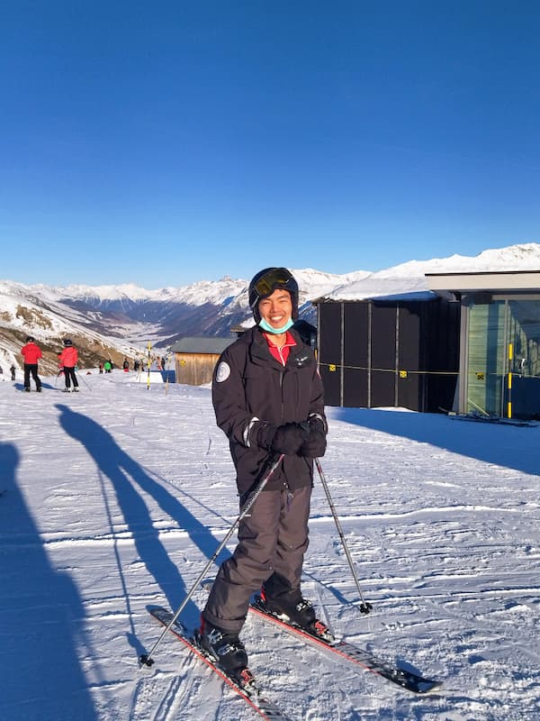

# Skiing in St Moritz, Switzerland

<figure>
  
  <figcaption>Club Med St. Moritz</figcaption>
</figure>

I went here during December, 2021, on the VTL lane. We stayed at [Club Med St. Moritz][club-med-st-moritz]. It was full-board and inclusive of ski passes, lessons and rental (of the ski, helmet, boots and poles), which made planning convenient. They also had two-way airport pickup.

<!-- more -->

<figure>
  
  <figcaption>View from the room</figcaption>
</figure>

The accomodation was somewhat spartan but otherwise all the facilities expected of a 4/5-star hotel including a radiator. The food was Club Med buffet-style from breakfast to dinner, and one of the days there was an opportunity to try cheese and chocolate fondue. As we were there over Christmas there was also a special Christmas buffet dinner which included swordfish sashimi, whole scallops, foie gras and deer meat stew. I did not have any gastrointestinal distress throughout this trip.

Of note there was also a bar with free flow drinks all day. While the wine selection was limited (either plain red or white), cocktails and my personal favourite Bailey's Irish Cream were available.

Now, about the skiing. We started at the nursery slope at the back of our hotel for the first day, and then on the afternoon of the second day we went up to Corviglia.

<figure>
  
  <figcaption>Map of Corviglia region</figcaption>
</figure>

Unfortunately, I cannot remember the exact location of the slopes we did on this map, nor which cablecar we took. I will update this post when I have the information.

I had some prior ski experience, having previously tried skiing in Norway alone without a teacher. We joined the beginner group (group 1). I managed to pick up the snow plough turn on the second day of class, and by the fourth day I was quite confident of my parallel turning (better on turning left than right). I was happy by the end of my trip I managed to overcome the paranoia/semi-PTSD I had previously from going down steep slopes at high speed and not being able to stop.

Some of the main pointers I felt were helpful:

-   Leaning forward; if not, the skis will not turn easily
-   Putting one's weight on the outside ski when turning
-   [Youtube][parallel-skiing] has lots of helpful videos

The guide left us alone quite a lot of the time as there were some students who needed a lot of guidance. Most of the slopes here at St Moritz were blue (intermediate), with only one nursery slope just beside our hotel and another on the mountain. This meant most of us were thrown on a blue slope pretty early on, and we all fell a lot (fortunately no serious injuries).

<figure>
  
  <figcaption>Some scenery on the way up</figcaption>
</figure>

<figure>
  
  <figcaption>Nursery slope</figcaption>
</figure>

<figure>
  
  <figcaption>A blue (intermediate) slope</figcaption>
</figure>

Regarding the topic of safety, I did not at any time feel my life was in danger, even during periods where I was out of the instructor's sight. While there were some obvious dropoffs, there were too far off from the main slopes to pose any real danger. My main worry was getting an [ACL tear][acl-tear][^acl-tear]; fortunately this did not happen and the worst injury I got was a right toenail avulsion, likely due to not tightening the top half of the skiing boot sufficiently. It should be tight enough such that leaning with knees forward does not allow the toe to come into contact with the front of the boot.

The VTL flight back was rather uneventful and my ART was checked at the departure airport, who knew about the process.

Overall, I found the facilities and skiing to be enjoyable. I plan to attempt skiing somewhere closer to home next - perhaps in Japan[^japan], when flights resume.

<iframe width="560" height="315" src="https://www.youtube-nocookie.com/embed/jf9H_3SalP0" title="YouTube video player" frameborder="0" allow="accelerometer; autoplay; clipboard-write; encrypted-media; gyroscope; picture-in-picture" allowfullscreen></iframe>

<iframe width="560" height="315" src="https://www.youtube-nocookie.com/embed/_pkFf-GW4pY" title="YouTube video player" frameborder="0" allow="accelerometer; autoplay; clipboard-write; encrypted-media; gyroscope; picture-in-picture" allowfullscreen></iframe>

[^acl-tear]: While modern ski bindings have drastically reduced the rates of long bone fractures, ligament injuries have increased, probably as the ski binding is [not designed][ski-binding] to release in response to torsional forces.
[^japan]: Skiing, followed by a hot onsen bath, yakitori and sushi.

[acl-tear]: https://journals.sagepub.com/pb-assets/cmscontent/ojs/OJS-ACL-Skiing-Jan-Feb15-1471881258227.pdf
[club-med-st-moritz]: https://www.clubmed.com.sg/r/saint-moritz-roi-soleil/y
[parallel-skiing]: https://www.youtube.com/watch?v=tyB7Wu_aCq8
[ski-binding]: https://skimo.co/tech-binding-release-testing
