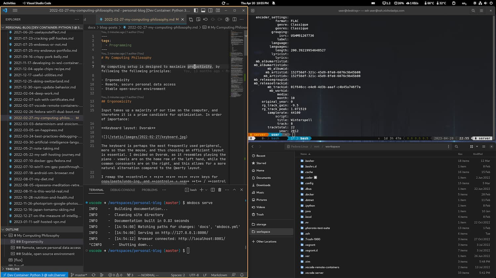
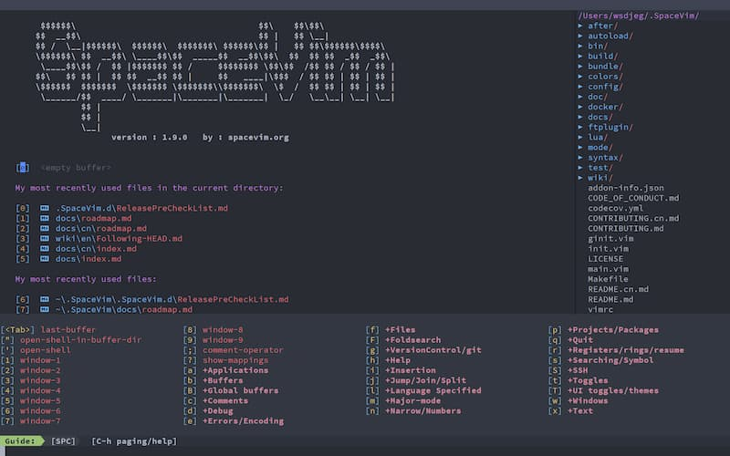

---
categories:
    - Programming
date: 2022-02-27
---

# My Computing Philosophy

My computing setup is designed to maximize the state of flow, by reducing distractions and other associated cognitive overheads.

<!-- more -->

## Ergonomicity

Input takes up a majority of our time on the computer, and therefore it is a prime candidate for optimization. In order of importance:

### Keyboard layout: Dvorak

The keyboard is perhaps the most frequently used peripheral, more so than the mouse, and thus choosing an efficient layout is essential. I decided on Dvorak, as it resembles playing the piano - vowels are on the home row of the left hand, while the common consonants are on the right, and this allows for a more natural alternation compared to the Qwerty layout.

I remap the ++control++ + ++z++ ++x++ ++c++ ++v++ keys (using [keyd]) for copy/paste/undo-ing, and ++control++ + ++w++ ++t++ / ++control+shift+t++ for browsing, as their Qwerty locations are more convenient than their Dvorak equivalents. I also remap the ++caps-lock++ key to ++backspace++.

### Window Manager

A tiling window manager (e.g. [i3], [sway]) arranges windows in a non-overlapping, grid-like pattern. This allows for more efficient use of screen space, as well as less mouse-keyboard switching.

I was previously using [Pop!\_OS Shell][pop-shell], which is a GNOME extension.

I plan to move to [Hyprland], a dynamic tiling window manager, in the future.

### Text Editor: Vim/Vim-like

The program I use most frequently is the text editor, be it for programming or writing documents. Being able to type with just the keyboard, and not having to switch to the mouse for navigation allows me to focus more on what I am typing, and not having to think of reaching for my mouse. As a bonus, learning the Vim keybindings transfers naturally to other programs, such as Vim in Firefox, or the terminal file managers such as `ranger` and `nnn`, both of which feature Vim keybindings.

Besides vanilla Vim, there are also other spin-off projects like [Neovim][neovim] and [SpaceVim][spacevim].

[Here][vim-tutorial] is a great tutorial I have used to learn Vim.

I use VSCode with a Vim plugin for coding (rather than Vim or Neovim). The reason is that the plethora of features available in VSCode is hard to replicate in Neovim, at least not without extensive configuration changes, and I don't want to have another configuration file which I have to maintain when Vim/Neovim packages change.

### Blue Light Filter

Blue light is a major disruptor of our circadian rhythms and as such this is one of the settings I quickly adjust on devices I use. [Flux][flux] is a tool I use on Windows, and for Linux, Gnome already has a night light feature in-built.

## Self hosted applications and files

Being able to access the contents of your computer anywhere you go is really handy, and it allows for things like remote file management, sharing files with friends and working on your projects anywhere in the world, on any computer.

[SSH access][ssh] is one way to achieve secure access to another computer, and it is a method I currently use in conjunction with text editors such as VSCode and Vim. Additionally, I also deploy a web server with a [web frontend][^cloud-privacy], to manage my tasks, book lists and potentially other loose non-file pieces of content.

Having a web server and the associated frontend allows me to customize how data is displayed in one place, which then looks the same on all my other client devices.

This saves money, as well as time spent configuring new devices (since everything is really being done on the server). As a bonus, since processing is [offloaded to the server][vscode-remote-containers] (for programming tasks), battery life of the device is prolonged.

## Declarative Environment

I currently use [NixOS]. You can see my configuration [here][nixos-config].

In the past, Windows was my desktop. I have since changed to Linux after encountering a myriad of frustrations.

??? note

    -   Too many issues with WSL (no `systemd`, constantly changing IP address, poor Docker volume mount performance)
    -   Potential windows spyware concerns, e.g. Edge requesting for more and more tracking
    -   Updates keep breaking things and resetting preferences (e.g. Edge homepage, system color theme)
    -   Updates force you to restart
    -   Even in 2022, Windows still lacks a decent package manager[^package-manager], making application updates a pain
    -   Powershell, while improving, is still behind Linux shells and utilities

The reasons for using Windows have also dwindled.

??? note

    -   Gaming: It is possible to [play on a Windows VM (with GPU passthrough) over the internet](2022-07-10-win11-vm-gpu-passthrough.md).
    -   Really obscure, closed source, Windows-only tools: Again, running them in a VM is possible.
    -   Missing/substandard Linux device drivers[^linux-device-drivers]. Potentially a problem for some laptops, but as time passes most hardware is already supported.

With Linux, I have a package manager, open-source software which doesn't track me, and complete control over my computer's behavior.

With Nix, my system configuration is maintained in a version controlled repository. I can maintain complex configurations and preferences for both the system and applications, and confidently deploy it on multiple systems with perfect reproducibility.

[^cloud-privacy]: Why not just store everything in the cloud? Because I don't trust Google (or Microsoft) with keeping the privacy of my data intact.
[^package-manager]: [Chocolatey](https://chocolatey.org/) is a good try, however.
[^linux-device-drivers]: E.g., my laptop's fingerprint reader couldn't be used for login, while it worked fine in Windows 11. Blame it on hardware vendors.

[flux]: https://justgetflux.com/
[keyd]: https://github.com/rvaiya/keyd
[neovim]: https://neovim.io/
[spacevim]: https://spacevim.org/
[ssh]: 2022-02-07-ssh-with-certificates.md
[vim-tutorial]: https://github.com/iggredible/Learn-Vim
[vscode-remote-containers]: 2022-02-07-vscode-remote-containers-over-ssh.md
[web frontend]: https://github.com/extrange/web-app
[pop-shell]: https://github.com/pop-os/shell
[i3]: https://i3wm.org/
[Sway]: https://swaywm.org/
[NixOS]: https://nixos.org/
[Hyprland]: https://hyprland.org/
[nixos-config]: https://github.com/extrange/nixos-config
