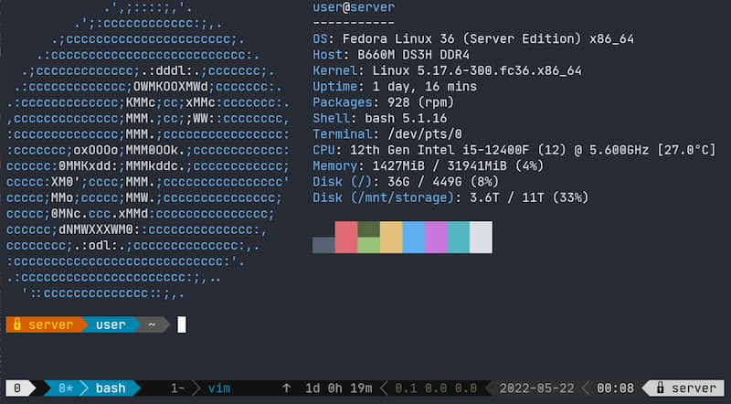
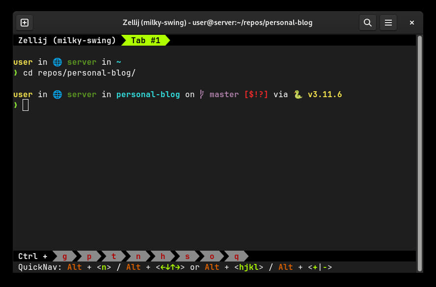

---
categories:
  - Programming
date: 2022-05-22
---

# My Self-Hosting Journey

Self-hosting your own services has been catching up in popularity: the [selfhosted subreddit][selfhosted] has over 180K members as of 21/5/22, and the number of self-hosted solutions has been growing exponentially (see a huge [list][awesome-selfhosted] here).

<!-- more -->

Self-hosting frees you from vendor lock-in. By using open-source alternatives, you gain portability for your data, and you are free to change to another solution anytime. In addition, there is the benefit of learning about server management and the command-line, which in my opinion are portable skills which can be used in any environment, unlike GUIs which are specific for an application.

In addition, I have been getting increasingly frustrated with Windows due to various [issues](2022-02-27-my-computing-philosophy.md#declarative-environment), and switching to Linux offers one a much needed breath of freedom, customizability and fresh air. Finally, I wanted something which I could keep running 24/7 and not have to pay recurring subscriptions.

It was with those considerations in mind that I decided to go ahead with self hosting.

## Specifications



- **CPU**: Intel i5-12400F (6 cores, 12 threads, 18M Cache, up to 4.40Ghz)
- **Memory**: Crucial 64GB DDR4 3200Mhz (with 32GB of `zram` as swap)
- **Motherboard**: Gigabyte B660M DS3H DDR4
- **Boot Drive**: Samsung 500GB 980 NVME M.2
- **OS**: Fedora Linux (Server Edition)

Total cost of the above was SGD $830.

In addition, I have ~ [30TB of storage](#storage-and-backup) in a RAID1 configuration assembled from various drives.

## Hosted Services

<figure>
  
  <figcaption>My homepage</figcaption>
</figure>

I use [Homepage][homepage] to view all the web services (approx ~27) hosted on my server.

All hosted services are in Docker containers with limited permissions to reduce the possible attack surface.

Logs are aggregated with Vector and sent to Loki, and viewed on Grafana.

## Uptime Monitoring

Uptime monitoring is hosted on an offsite VPS with [Uptime Kuma][uptime-kuma], on a separate [site](https://uptime.icybat.com), with notifications via Telegram. This is to allow for redundancy in case my server goes down.

## Storage and Backup

As of 2024 Aug, I have 32TB of raw storage, consisting of 2x WDC WD120EMFZ-11A6JA0 12TB drives plus a 8TB ATA WDC WD80EAZZ-00B8TB (all non-SMR drives[^smr]) in a (software) BtrFS RAID-1 configuration, corresponding to approximately 16TB of usable storage.

I use SSHFS to access my storage remotely. This storage is accessible locally in my LAN via [NFS][nfs], which Windows also supports[^nfs-issues].

I chose BtrFS over `dmraid` + ext4 as BtrFS:

- allows for online subvolume resizing/deletion/modification
- supports file checksums in RAID modes[^bit-rot]
- allows for **arbitrary drives to be added/removed** from the RAID configuration, and [balance the resulting filesystem automatically][btrfs-adding-new-devices]
- supports lightweight snapshots and sending these snapshots to other devices for backup

BtrFS also allows for RAID-1 with any number of devices, of all different sizes. The resulting available storage is usually [half the total storage available][btrfs-storage]. This is made possible as the filesystem [allocates data in chunks][btrfs-data-allocation], with each chunk on a RAID-1 setup being duplicated to 2 different drives.

**Snapshots**

[`btrbk`][btrbk] is a great utility which I utilize for backups. It allows for automatic snapshot creation, backups to multiple destinations (including SSH), incrementals backups as well as utilities to calculate accurate snapshot space usage.

I use `btrbk` together with [`systemd.timer`][systemd.timer] to make hourly rolling snapshots, preserving snapshots:

- every hour for the last 24 hours
- every day for the past 7 days
- every week for the past 4 weeks
- every month for the past 12 months
- every year for the past 3 years

This allows me to fallback to any state in the past.

I manually run the `archive` command[^btrbk-issue] to send snapshots over to an external drive every 6 months.

The backup drive is encrypted with AES-256 (via [`cryptsetup`][cryptsetup][^cryptsetup-partition]).

??? note "Backup commands previously used"

    Prior to `btrbk`, here were the backup commands I used.

    ```bash
    # Create a subvolume snapshot of /mnt/storage
    # Note: 'snapshots' and 'subvolumes' are synonymous in BtrFS: A snapshot is a copy of a subvolume
    btrfs subvolume snapshot -r /mnt/storage/ /mnt/storage/snapshot.$(date +%Y-%m-%d)

    # Send that snapshot to the backup device /mnt/sdc1
    btrfs send /mnt/storage/snapshot.2022-05-18/ | btrfs receive /mnt/sdc1

    # To instead send an incremental snapshot:
    # Note: the parent snapshot must exist on the receiving drive
    btrfs send -p <path to parent snapshot on sending drive> <subvol> | btrfs receive /mnt/sdc1
    ```


    The UUID of the parent subvolume (in the sending drive) must be in one of the receiving drive subvolume's 'Received UUID', in order for the incremental `send` operation to work. See below for an example:

    Target volume with 2 snapshots, `server-2022-05-18` followed by `snapshot.test`:

    ```hl_lines="3"
    [root@server sdc1]# btrfs su show /mnt/system-root/server-2022-05-18/server-2022-05-18
        Name:                   server-2022-05-18
        UUID:                   2b33e415-046b-a746-a35f-50cdef411a9f
        Parent UUID:            c8a82094-4270-274b-bd08-77aea3dc0896
        Received UUID:          -

    [root@server sdc1]# btrfs su show /mnt/system-root/snapshot.test/snapshot.test
        Name:                   snapshot.test
        UUID:                   8a42b8d1-d145-9249-9e76-e7748dc4aeb5
        Parent UUID:            c8a82094-4270-274b-bd08-77aea3dc0896
        Received UUID:          -
    ```

    Note on the backup drive that the `Received UUID` of the original snapshot is the same as the target volume's original snapshot `server-2022-05-18`.

    ```hl_lines="5"
    [root@server sdc1]# btrfs su show /mnt/sdc1/server-2022-05-18/server-2022-05-18
        Name:                   server-2022-05-18
        UUID:                   5ed89436-7a3b-5744-9460-cf79ced43e2c
        Parent UUID:            -
        Received UUID:          2b33e415-046b-a746-a35f-50cdef411a9f

    [root@server sdc1]# btrfs su show /mnt/sdc1/snapshot.test/snapshot.test
        Name:                   snapshot.test
        UUID:                   7fcd7d87-b2a2-eb46-a636-ca62dfd4029f
        Parent UUID:            5ed89436-7a3b-5744-9460-cf79ced43e2c
        Received UUID:          8a42b8d1-d145-9249-9e76-e7748dc4aeb5
    ```

    Note: The `Received UUID` **does not change** when a snapshot is snapshot-ed again.

**Maintenance**

I run [`btrfs scrub`][btrfs-scrub] monthly via a `systemd.timer`.

## SSH Access

SSH access to my server is available via public keys and password access with 2FA (provided via [Google Authenticator PAM][google-authenticator-pam][^pam-issues]).

I previously used [SSH with certificates](./2022-02-07-ssh-with-certificates.md), however it does not allow me to revoke access as easily as public keys.

I run [Endlessh], an SSH tarpit, on port `22` to waste attackers' time and keep my `journald` logs cleaner, while my `sshd` is configured to listen on another port.

### Mobile

Mobile SSH access is via [Termux][termux], a terminal emulator for Android which features [Mosh][mosh][^mosh] pre-installed.

### Terminal UI



I use [Zellij], a terminal multiplexer, which allows me to keep terminal sessions running on the server on connection close (even if by accident), and resume them from another computer.

??? note "`.bashrc` Configuration"

    ```bash
    # Only run in interactive shells, and not in VSCode
    if [[ $- == *i* ]] && [[ -z $VSCODE_INJECTION ]]; then
     eval "$(zellij setup --generate-auto-start bash)"
    fi
    ```

For my shell prompt, I use [Starship], a minimalist prompt which shows directory paths, container environment indicators and current `git` branches by default.

_I was previously using [tmux] and [Powerline]._

[^smr]: SMR drives have a much greater [write penalty][smr] compared to CMR/PMR drives.
[^bit-rot]: If some bits in one of the drives were to fail (e.g. due to [bit rot](https://en.wikipedia.org/wiki/Bit_rot)), `dmraid` would not know which drive contains the correct data as it operates below the filesystem layer.
[^btrbk-issue]: There is an issue with [`btrbk` not sending snapshots without direct parent-child uuid link when using `resume`][btrbk-issue]. To get around this, I use `archive` initially to copy snapshots over to the external drive.
[^cryptsetup-partition]: The reason I do not use `cryptsetup` (or `dmcrypt`) directly on the disk is that Windows/other software might accidentally wipe the partition table (and the LUKS header), rendering the disk unlockable.
[^nfs-issues]: Windows sets the UID/GID to -2 for some reason, preventing you from writing to files by default. This is the [fix](https://unix.stackexchange.com/questions/276292/need-permission-for-windows-client-to-access-linux-nfs).
[^pam-issues]: By default, SELinux [blocks](https://github.com/google/google-authenticator-libpam/issues/101) `sshd` from reading the `.google_authenticator` file in the home directory. One [workaround] is to place the file in the `.ssh` directory instead.
[^mosh]: Mosh allows for SSH access over unreliable/mobile connections, including scenarios like changing IP addresses (which can happen as the mobile device moves out of Wifi range).

[awesome-selfhosted]: https://github.com/awesome-selfhosted/awesome-selfhosted
[btrbk-issue]: https://github.com/digint/btrbk/issues/339#issuecomment-1332137961
[btrbk]: https://github.com/digint/btrbk
[btrfs-adding-new-devices]: https://btrfs.wiki.kernel.org/index.php/Using_Btrfs_with_Multiple_Devices#Adding_new_devices
[btrfs-data-allocation]: https://btrfs.wiki.kernel.org/index.php/SysadminGuide#Data_usage_and_allocation
[btrfs-scrub]: https://btrfs.readthedocs.io/en/latest/btrfs-scrub.html
[btrfs-storage]: https://btrfs.wiki.kernel.org/index.php/FAQ#How_much_space_do_I_get_with_unequal_devices_in_RAID-1_mode.3F
[cryptsetup]: https://gitlab.com/cryptsetup/cryptsetup/-/wikis/FrequentlyAskedQuestions
[homepage]: https://gethomepage.dev
[google-authenticator-pam]: https://github.com/google/google-authenticator-libpam
[mosh]: https://mosh.org/
[nfs]: https://en.wikipedia.org/wiki/Network_File_System
[Powerline]: https://github.com/powerline/powerline
[selfhosted]: https://www.reddit.com/r/selfhosted/
[smr]: https://www.reddit.com/r/DataHoarder/comments/o5bmcu/comment/h2nfiwq/
[systemd.timer]: https://opensource.com/article/20/7/systemd-timers
[termux]: https://termux.com/
[tmux]: https://github.com/tmux/tmux/wiki
[uptime-kuma]: https://github.com/louislam/uptime-kuma
[workaround]: https://www.digitalocean.com/community/tutorials/how-to-set-up-multi-factor-authentication-for-ssh-on-centos-8#step-1-installing-google-s-pam
[Zellij]: https://zellij.dev/
[Starship]: https://starship.rs/
[Endlessh]: https://github.com/skeeto/endlessh
