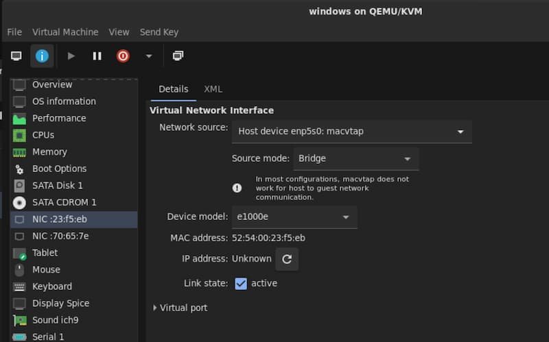
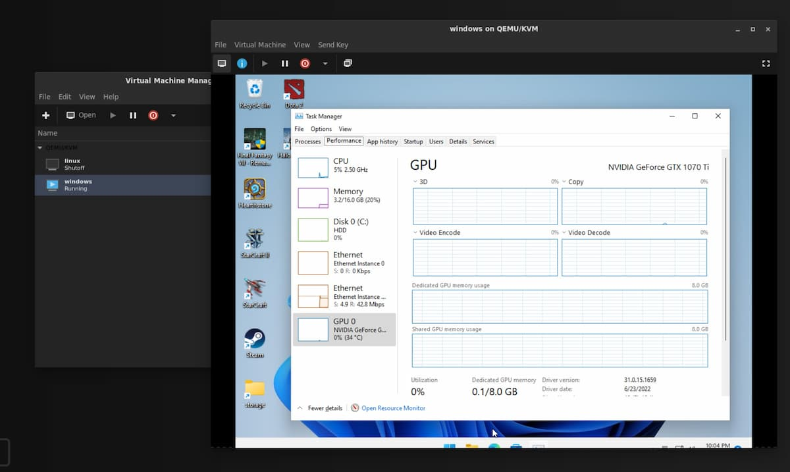
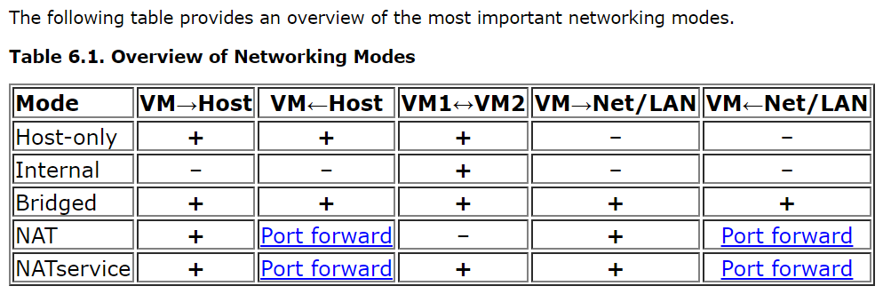

---
categories:
  - Programming
date: 2022-07-10
---

# Windows Gaming VM with GPU Passthrough on Linux

<figure>
  
  <figcaption>Gaming on a laptop remotely with Nvidia Gamestream using mobile data</figcaption>
</figure>

After completing this guide, you will have a Windows **headless** virtual machine that can be accessed via [Moonlight][moonlight] for high performance gaming, with the [Sunshine] game stream host.

<!-- more -->

## Prerequisites:

- CPU with I/O virtualization support so we can passthrough PCIe devices (e.g. [`VT-d`][vt-d] for Intel)
- Any GPU

The instructions in this guide are for NixOS, but I've also included Fedora-specific commands where relevant.

## 1. GPU Passthrough

Ensure that I/O virtualization support has been enabled in your BIOS.

Follow [this guide][nixos-vfio] to enable IOMMU in the kernel, as well as the VFIO kernel modules.

??? note "For Fedora"

    First, obtain the PCI vendor and device IDs of your GPU and its audio device (later referenced as `xxxx:xxxx` and `yyyy:yyyy` respectively):

    ```
    ❯ lspci -nn | grep -i vga -A2
    03:00.0 VGA compatible controller [0300]: Advanced Micro Devices, Inc. [AMD/ATI] Navi 48 [Radeon RX 9070/9070 XT/9070 GRE] [1002:7550] (rev c0)
    03:00.1 Audio device [0403]: Advanced Micro Devices, Inc. [AMD/ATI] Navi 48 HDMI/DP Audio Controller [1002:ab40]
    ```

    Append `intel_iommu=on vfio-pci.ids=xxxx:xxxx,yyyy:yyyy` to your [kernel parameters].

    _Note: if you are using an Nvidia GPU, it may be necessary to blacklist the Nouveau driver, by appending `rd.driver.blacklist=nouveau modprobe.blacklist=nouveau`._

    Add the drivers to the initramfs:

    ```bash
    # in /etc/dracut.conf.d/10-vfio.conf
    add_drivers+=" vfio_pci vfio vfio_iommu_type1 "

    # Then, rebuild the ramdisk
    dracut -fv
    ```

    Verify that the generated ramdisk contains the VFIO drivers:

    ```
    # lsinitrd | grep -i vfio
    -rw-r--r--   1 root     root           31 Mar 30 16:53 etc/modprobe.d/vfio.conf
    -rw-r--r--   1 root     root            9 Mar 30 16:53 etc/modules-load.d/vfio-pci.conf
    drwxr-xr-x   1 root     root            0 Mar 30 16:53 usr/lib/modules/5.18.18-200.fc36.x86_64/kernel/drivers/vfio
    <truncated>
    ```

    Install libvirt:

    ```sh
    dnf install @virtualization
    ```

Reboot, and verify that IOMMU is working:

```shell hl_lines="4 8 9 10 11 12"
$ dmesg | grep -i iommu
[    0.000000] Command line: BOOT_IMAGE=(hd4,gpt4)/vmlinuz-5.18.10-200.fc36.x86_64 root=UUID=2a1d4d2a-7016-4f91-aa55-92d1b284668d ro rootflags=subvol=root resume=UUID=16671cec-3bb8-46bb-b931-083c93082763 rhgb quiet intel_iommu=on
[    0.133682] Kernel command line: BOOT_IMAGE=(hd4,gpt4)/vmlinuz-5.18.10-200.fc36.x86_64 root=UUID=2a1d4d2a-7016-4f91-aa55-92d1b284668d ro rootflags=subvol=root resume=UUID=16671cec-3bb8-46bb-b931-083c93082763 rhgb quiet intel_iommu=on
[    0.133749] DMAR: IOMMU enabled
[    0.224446] DMAR-IR: IOAPIC id 2 under DRHD base  0xfed91000 IOMMU 0
[    1.516533] iommu: Default domain type: Translated
[    1.516533] iommu: DMA domain TLB invalidation policy: lazy mode
[    1.560968] pci 0000:00:00.0: Adding to iommu group 0
[    1.560977] pci 0000:00:01.0: Adding to iommu group 1
[    1.560985] pci 0000:00:06.0: Adding to iommu group 2
[    1.560991] pci 0000:00:0a.0: Adding to iommu group 3
[    1.561003] pci 0000:00:14.0: Adding to iommu group 4
```

Verify that VFIO drivers have been loaded:

```sh hl_lines="4"
❯ lspci -knn | grep -A5 -i vga
03:00.0 VGA compatible controller [0300]: Advanced Micro Devices, Inc. [AMD/ATI] Navi 48 [Radeon RX 9070/9070 XT/9070 GRE] [1002:7550] (rev c0)
        Subsystem: Tul Corporation / PowerColor Reaper Radeon RX 9070 XT 16GB GDDR6 (RX9070XT 16G-A) [148c:2435]
        Kernel driver in use: vfio-pci
        Kernel modules: amdgpu
```

## 2. Setup the Windows VM

??? note "Boot and auxilliary drives"

    The boot drive of the VM should be installed on an SSD. Having a COW filesystem (e.g. BtrFS) is a plus, since NTFS doesn't have checksumming. If a COW filesystem is used on the host, a raw image (not QCOW2) should be used to avoid COW-on-COW write amplification.

    If a HDD is used, ZFS (with the zvol passed through) should be used for [maximum performance][zfs]. This zvol should be created as sparse (`-s` on `zfs create`) so snapshots can continue to be created using unallocated space from the pool. You can keep the zvol size ~200GB smaller than the HDD.

    Redundancy via RAID can optionally be setup as well.

    _Note: Snapshotting is not done for the boot drive because it tends to bloat very quickly._

In order:

- Ensure that an emulated TPM has been added (e.g. [swtpm])
- Boot disk: Ensure SATA is set as the driver first. You can switch to VirtIO later after the drivers have been installed for performance.
- Install Tailscale, Sunshine, VirtIO drivers

Some additional performance tweaks:

- Enable [CPU isolation] via systemd (avoid assiging CPU 0 to the VM, as it handles other kernel interrupts)
- Enable [CPU pinning] (make sure to pin CPUs sharing the same L1/L2/L3 caches togther - check with `lscpu -e`)
- Ensure that NTFS on the guest uses the same `volblocksize` (usually 16K) as the host zvol.

After the OS has been installed, reboot the VM and passthrough your GPUs (including the audio device) in `Add Hardware > PCI Host Device`.

Install the GPU drivers as necessary.

??? note "(optional) Giving the VM an IP address on the LAN"

    If you would like your VM also have its own IP address on the LAN (e.g. to play multiplayer games with peers on the same subnet), you can add a [`macvtap`][macvtap] interface now, in addition to the standard bridge network between guest and host.

    To do this, add another `NIC` and ensure `Host device enpXsX: macvtap` is selected.

    

    If you just want to be able to access the VM over the internet, you can use a peer-to-peer VPN as shown [below](#5-setup-overlay-mesh-network-aka-peer-to-peer-vpn).

The GPU should now be visible in the guest.



## 3. (Optional) Share a Filesystem between host and guest

There are several options, with [VirtioFS] being the fastest, followed by [SAMBA], then Network File System (NFS).

**Note**: If you are using only a `macvtap` interface, it is [not possible][macvtap-issues] to connect to the host due to how `macvtap` works. You will need to create a bridge (e.g. `Virtual Network 'Default' : NAT`) to connect to the host.

??? note "VirtioFS"

    This is the fastest option for sharing a folder on the host to the guest if they are on the same device.

    Follow the [instructions][virtiofs-instructions] to set it up.

??? note "SAMBA"

    [SAMBA][samba] is much faster than NFS for Windows guests. It is also suitable for sharing folders on different devices across a network.

    For NixOS, you can reference the following configuration:

    ```nix
    # Samba
    networking.firewall.allowPing = true;
    services.samba-wsdd = {
      # make shares visible for windows 10 clients
      enable = true;
      openFirewall = true;
    };
    services.samba = {
      enable = true;
      openFirewall = true;
      settings = {
        software = {
          path = "/home/user/software";
          browseable = "yes";
          "read only" = "no";
          "guest ok" = "yes";
          "acl allow execute always" = "yes";
          "force user" = "user"; # This is the most important line
        };
        global = {
          workgroup = "WORKGROUP";
          "server string" = "family-server";
          "netbios name" = "family-server";
          security = "user";
          "map to guest" = "bad user";
        };
      };
    };
    ```

    For Fedora:

    1.  Install Samba on Linux:

        ```bash
        sudo dnf install samba samba-common
        ```

    2.  Set the correct SELinux contexts/[booleans] for the directories you wish to share (in this example `/mnt/storage`):

        ```bash
        # Allow samba to share any file/directory read/write:
        sudo setsebool -P samba_export_all_rw 1

        # Alternatively, if you want to restrict permissions to a directory:
        sudo chcon -R -t samba_share_t /mnt/storage
        ```

        ??? warning "SSH and SELinux"

            If you are executing the `chcon` command above on your `home` directory, be careful to restore SELinux contexts for the `.ssh` directory:

            ```bash
            sudo restorecon -r .ssh
            ```

            Otherwise, `sshd` will be **denied access** to `authorized_keys` and you will lose login via SSH!

    3.  Add the following to `/etc/samba/smb.conf`:

        ```config
        [storage]
            path = /mnt/storage
            public = yes
            guest ok = yes
            writable = yes
            browseable = yes
            acl allow execute always = yes
        ```

        This will create a share named `storage`, accessible without login or passwords. **Only do this on a secure LAN!**

    4.  (For Fedora) Open the required ports in the `libvirt` zone (for the Windows guest), and in the `Public` zone for other computers on the network:
        - TCP `139`, `445`
        - UDP `137`, `138`

    5.  Restart the `smb` and `nmb` daemons:

      ```bash
      sudo systemctl enable --now smb nmb
      ```

??? note "NFS (not recommended)"

    For sharing files with Windows clients, SAMBA is the better option (much less delay on opening compared to NFS).

    Windows does not come with NFS support by default - you must enable it. In an elevated PowerShell window, run:

    ```powershell
    Enable-WindowsOptionalFeature -FeatureName ServicesForNFS-ClientOnly, ClientForNFS-Infrastructure -Online -NoRestart
    ```

    This [fix][slow-nfs-fix] _may_ speed up NFS access on Windows (although I strongly recommend using SAMBA).

    _Note for Fedora: You must also open the NFS ports (TCP/UDP `111`, `2049` and `20048`) in the `Libvirt` zone._

And that's it! You now have a fully featured cloud gaming machine, accessible anywhere in the world.

## Known Issues/Notes/Fixes

### Slow FPS on Desktop

[Moonlight][moonlight] runs at 30fps or less when displaying the remote desktop (when not in a game). I suspect this is probably because the desktop is not rendered using the GPU and natively running at a lower FPS. Moonlight is transferring this output when the GPU is not being utilized, for example with the desktop or certain 2D games.

To fix this, download and install the [Windows Virtual Display Driver]. This sets up a dummy monitor which will be rendered by the GPU.

To remove the 'extra' desktop (added by libvirt), set the Video Device to None in Virtual Macihne Manager.

_Note that without the video device, Virtual Machine Manager will not show any video, however the VM can still be accessed over Moonlight._

### AMD GPU Reset/Reboot Issue

There is a [known issue][amd-reset-issue] with AMD GPUs locking up the host when the guest VM is rebooted.

Some [workarounds] have been discussed, however in my case, the solution that works is to unsure that the **guest is never rebooted**. Instead, allow the guest to shut down, and then start it again manually.

I think this works because once the guest is shut down, the `amdgpu` driver binds back to the VM, and this somefixes fixes the state of the card.

### Disabling VFIO

At times you may want to disable VFIO or GPU passthrough, for example when you want to [use the GPU in the host](2022-07-10-docker-gpu-fedora.md).

To disable GPU passthrough, simply remove `vfio-pci.ids=xxxx:xxxx,yyyy:yyyy` from your [kernel parameters] (or `boot.kernelParams` in NixOS) then reboot.

_Note: For AMD GPUs, this might not be necessary, as the `amdgpu` driver automatically rebinds itself once the VM is shutdown._

### Moonlight-specific Issues

- Moonlight requires that the server machine (whether VM or physical) be **unlocked**, and that there are **no Remote Desktop Connections** ongoing.
  - After an RDP session, the main desktop is locked. To fix this, create a batch file with the following content, and run it **with administrator rights** to disconnect the RDP and unlock the main desktop:

    ```
    Powershell -Command "tscon rdp-tcp#0 /DEST:console"
    ```

- The streaming resolution of Moonlight is **not** what is set in the GUI of Moonlight or in the game, but rather, it is capped at the resolution of the virtual machine's desktop. So, if you want to stream in 4K, ensure you change the virtual machine's desktop resolution to 4K prior to launching the game.

- Some useful shortcuts:
  - Quit moonlight: ++ctrl+alt+shift+q++
  - Minimize window: ++ctrl+alt+shift+d++
  - Show stats overlay: ++ctrl+alt+shift+s++
  - Paste text from host: ++ctrl+alt+shift+v++
  - Toggle mouse and keyboard capture: ++ctrl+alt+shift+z++

- Moonlight not filling screen:
  - [Use the Nvidia control panel to change the screen resolution.][moonlight-fix]

- Intermittent black screen: [Disable hardware-accelerated GPU scheduling][gpu-scheduling]

### QEMU/`virt-manager`

- Snapshotting the VM is not possible while a PCI device is being passed-through. However, if you are using BtrFS, you can make snapshots of the storage volume.

- VM hangs/pauses, and in `dmesg` you see `[ 6044.433981] vfio-pci 0000:07:00.0: BAR 0: can't reserve [mem 0xe0000000-0xefffffff 64bit pref]` and similar errors:
  - Ensure that the [`initcall_blacklist=sysfb_init`][gpu-fix] kernel parameter has been added to `grub.cfg`.

- `virt-manager`/QEMU supports sharing the VM display via an embedded VNC server. For Apache Guacamole to connect to this however, the embedded viewer (in `virt-manager`) must first be closed.

- Windows XP only: In `virt-manager`, the NIC device model must be `rtl8139`, and the sound card model as `AC97` in order for drivers to be installed.

- Nvidia Geforce Experience says 'Unsupported CPU':
  - Change the CPU model in `virt-manager` (in the XML) to `host-model` ([preferred][cpu-model]) or `host-passthrough`.

- Passthrough-ed USB devices, when disconnected, prevent the VM from booting
  - Add [`startupPolicy="optional"`][usb-devices] to the `<source>` tag in the XML for the passthrough-ed USB device

- Low FPS when display is set to 'Duplicate these displays':
  - Change display settings to 'Extend these displays' instead. I suspect when displays are duplicated, the GPU works extra to render frames on both monitors, causing the FPS drop.

- [Useful VM performance tuning options][vm-tuning]
  - For example, setting multiple sockets with each having 1 CPU and 1 core is more efficient.

- Types of VM network connections compared:
  

For more information on the `libvirt` domain XML, check out the [documentation][libvirt-xml].

### Apache Guacamole

- For RDP, 'Support audio in console' must be **unchecked** for sound to work.

### Tailscale latency issues

At times, Tailscale may not be able to achieve a direct connection (e.g. due to a [hard NAT]), and will fallback to using a relay. This can be seen with `tailscale status`. This is sometimes annoying, and made complicated by the fact that when running the VM behind the same NAT as the host (e.g. behind the same network), you can only forward port `41641` (used for the Wireguard connection) to one device (either the host, or the VM's `macvtap` adapter). I've tried [changing the listen port] to `41640` for the VM, and despite being able to achieve connectivity via `nc`, Tailscale still intermittently refuses to use that port.

[^default-network]: The default network (which you can view with `sudo virsh net-dumpxml default`) is configured with [`forward mode='nat'`][libvirt-network-connectivity], which allows outbound communication for guests, but not inbound communications (unless you configure computers on the LAN to use your host as a NAT).

[vt-d]: https://www.thomas-krenn.com/en/wiki/Overview_of_the_Intel_VT_Virtualization_Features
[moonlight]: https://moonlight-stream.org/
[macvtap-issues]: https://access.redhat.com/documentation/en-us/red_hat_enterprise_linux/6/html/virtualization_host_configuration_and_guest_installation_guide/app_macvtap
[slow-nfs-fix]: https://docs.oracle.com/en-us/iaas/Content/File/Troubleshooting/winNFSerror53.htm
[gpu-fix]: https://forum.proxmox.com/threads/problem-with-gpu-passthrough.55918/post-478351
[moonlight-fix]: https://github.com/moonlight-stream/moonlight-android/issues/588
[usb-devices]: https://access.redhat.com/documentation/en-us/red_hat_enterprise_linux/7/html/virtualization_deployment_and_administration_guide/sect-manipulating_the_domain_xml-devices#sect-Host_physical_machine_device_assignment-USB_PCI_devices
[chcon]: https://fedoraproject.org/wiki/SELinux/samba
[vm-tuning]: https://access.redhat.com/documentation/en-us/red_hat_enterprise_linux/7/html-single/virtualization_tuning_and_optimization_guide/index
[libvirt-xml]: https://libvirt.org/formatdomain.html
[samba]: https://www.samba.org/
[nat]: https://en.wikipedia.org/wiki/Network_address_translation
[tailscale]: https://tailscale.com/
[nat-traversal]: https://tailscale.com/blog/how-nat-traversal-works/
[macvtap]: https://virt.kernelnewbies.org/MacVTap
[cpu-model]: https://libvirt.org/formatdomain.html#cpu-model-and-topology
[default-network]: https://libvirt.org/formatnetwork.html#nat-based-network
[libvirt-network-connectivity]: https://libvirt.org/formatnetwork.html#connectivity
[gpu-scheduling]: https://github.com/moonlight-stream/nvidia-gamestream-issues/issues/27
[booleans]: https://linux.die.net/man/8/samba_selinux
[hard NAT]: https://tailscale.com/blog/how-nat-traversal-works/
[changing the listen port]: https://github.com/tailscale/tailscale/issues/5114#issuecomment-1402806749
[Sunshine]: https://app.lizardbyte.dev/Sunshine/?lng=en
[VirtioFS]: https://virtio-fs.gitlab.io/
[virtiofs-instructions]: https://virtio-fs.gitlab.io/howto-windows.html
[nixos-vfio]: https://wiki.nixos.org/wiki/PCI_passthrough
[zfs]: ./2025-06-07-btrfs-zfs-performance.md
[CPU isolation]: https://wiki.archlinux.org/title/PCI_passthrough_via_OVMF#Example_with_systemd
[CPU pinning]: https://wiki.archlinux.org/title/PCI_passthrough_via_OVMF#CPU_pinning
[swtpm]: https://github.com/stefanberger/swtpm
[kernel parameters]: https://wiki.archlinux.org/title/Kernel_parameters
[Windows Virtual Display Driver]: https://github.com/VirtualDrivers/Virtual-Display-Driver
[amd-reset-issue]: https://forum.level1techs.com/t/the-state-of-amd-rx-7000-series-vfio-passthrough-april-2024/210242
[workarounds]: https://forum.level1techs.com/t/vfio-pass-through-working-on-9070xt/227194
