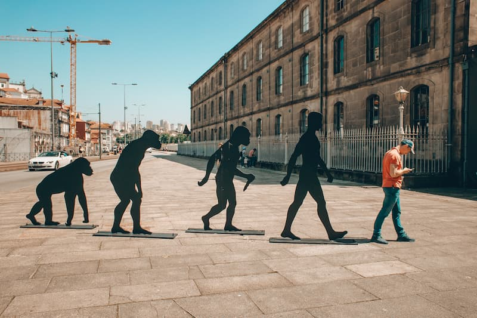
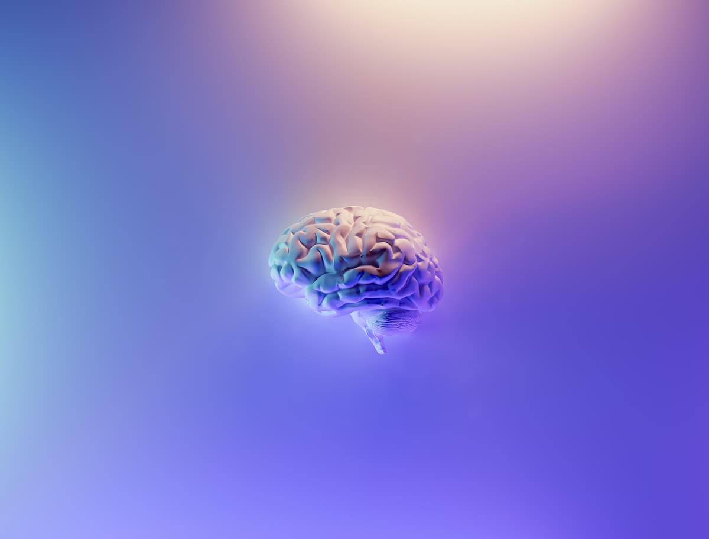
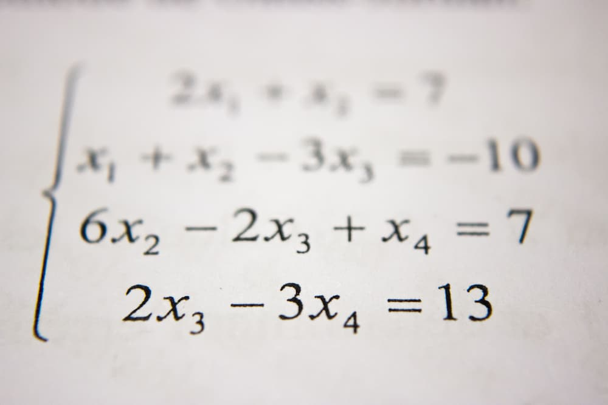

---
categories:
    - Philosophy
date: 2022-08-11
---

# Is This World Real? On Realism

I recently watched a [discussion][discussion] involving Donald Huffman, in which he argues that the world as we perceive it is not its true form - our senses are heavily colored by evolutionary adaptations to ensure our survival and reproduction. The analogy he provides is that what we perceive is akin to the icons on a computer desktop, bearing no resemblance to the actual forms which are magnetic charges on a spinning disk. This is similar to the argument he puts forth in his book, [_The Case Against Reality_][book], as well as a [summary][summary] online.

<!-- more -->

He then goes on to suggest a form of [constitutive panpsychism][panpsychism] - that our consciousness is made up of other, hierchically lower consciousnesses, and that the other 'objects' we perceive in the world are intrinsically conscious, although their experiences could be totally different from ours and perhaps unimaginable (take for example, the conscious experience of an electron - traveling at the speed of light, no time passes for it - what could it experience?). He suggests further that when and if we create artificial intelligence, what we are actually doing is creating a sort of 'portal' for conscious agents (of which he says there are an infinitude) to enter. There are several philosophical issues with constitutive panpsychism, the most glaring being that of the [subject summing problem][issues] (how exactly do lesser conciousnesses combine to form a larger consciousness?), and for that, I am less inclined to accept it.

I am, however, more interested in the implications resulting from the idea that our perception is unreliable and/or biased toward evolutionary drives. There are several instances in reality which point to this - we find bright light glaring, extremes of temperature unbearable, a sunrise pretty, ripe fruits more attractive than unripe fruits and so on, despite the fact that all these examples are purely arbitrary patterns and intensities of light and heat.

This extends to our raw perception (_qualia_) itself. The experience of seeing blue as blue, for example, is _completely arbitrary_ - why doesn't blue look green? Or take temperature as an example - why does ice feel cold? More broadly, why are our eyes biased to an [extremely narrow portion][visible-spectrum] of the electromagnetic spectrum, or why can't we see infrared? Bats are able to echolocate their prey via sonar, but it is not something that we can readily imagine, let alone experience[^nagel]. Electric eels are able to locate prey via sensing changes in the electrical gradient, and again we cannot imagine how this must feel like for the eel.

Huffman's argument further posits that there is **no objective reality**. Chairs, tables, rocks etcetera do not really exist - our perceptions lie to us, manipulate reality in ways such that we act to survive and reproduce. To put it simply, over years of evolution, it is easier for us to perceive a tiger as how we currently see it, large and fear-inducing, so that we make the appropriate action for our survival (by running away), rather actually seeing the tiger as it is. There may not even be three dimensions in the world we live in - our senses could have filtered out the extra dimensions, because from the evolutionary point of view, there is no added [fitness][fitness] to perceiving them.

To go even further out, **our thoughts can be viewed as a form of perception, namely mental perception, and therefore also susceptible to distortion**. We already see this from our desires - we generally find others of the opposite gender attractive, and this preference is not free for us to decide, having been [programmed by our genes][selfish-gene] from the get-go. This distortion could potentially apply to our thoughts on moral and ethical issues, our likes and dislikes, what we perceive as good or bad, and so on. In light of this, are our thoughts even ours?

## The Impasse and Resolution

The consequence of this theory is that objective reality and thought, our once formidable anchors to this world, have now been rudely removed from under our feet, leaving us, having discarded thought as unreliable, blankly staring at whatever remains of reality, unsure of the existence of anything. Is there really no solid, immutable, eternal anchor on which we can at least be sure really exists?

I believe that there is one such anchor remaining, and this anchor will continue to exist, even as everything else is swept under the current of nothingness and illusion.

This final anchor is **logic**.

By logic, I am referring to our deductive ability, our capabilities to reason, weigh, evaluate and theorize. This is most evident in mathematics, where we are able to manipulate symbols to yet more symbols, and discover facts about these symbols which were not known previously to us.

Our mental manipulations of the world of logic maintain their consistency across observers, and it is hard to imagine a possible world in which reason and/or mathematics are not consistent (is it possible to imagine a world where 1 + 1 = 3?). While I will leave the question of whether numbers and other mathematical constructs exist or are discovered to [philosophers][philosophy-math], I am compelled to suspect that regardless of whether we perceive the physical and mental world as it is or not, the world of logic and reason is immune to any sort of manipulation by our sense organs, brains, or in some other form by evolution.

There is a nice fictional example of how logic is used to discern dream from reality. In Stanislaw Lem's [_Solaris_][solaris], the main character experiences a series of bizarre events and begins to suspect he is dreaming. He conducts the following test: He asks a supercomputer for the answer to a difficult math question and keeps the answer. He then calculates the answer himself manually, and then compares the two. If they are equal, he surmises he is not dreaming, since there is no way his brain could have calculated the answer as fast as the supercomputer[^solaris].

Logic is what allows us to theorize that our senses are deceiving us in the first place. Even if, say, an evil demon were manipulating all of our reality, with logic, we can break free from its grasp (as Descartes did with his [_cogito, ergo sum_][cogito]).

How did we obtain logic? Dawkins has an [answer][selfish-gene]. As evolution progressed, we initially gained the ability to form mental models about the world to escape from predators and find food. Later, we gained memory and the ability to learn. The [ego][ego] developed later[^ego-death], and represented the ability of the organism to include itself into its mental model of the world, instead of merely reacting passively. Intellect and with it, logic, must then have developed, culminating in Homo sapiens becoming the dominant species on this planet.

Logic may be more real than anything we can perceive in this world.

## Notes and Additional Reading

There are several critiques of Hoffman's theory - you can read one of them [here][critique].

Another interesting argument I read online arguing for objective reality goes as follows: In nature, we see less poisonous animals [mimicking][mimicry] more poisonous ones (snakes, toads, and so on). This mimicry is only possible if there is an objective reality to mimic.

[This][obscurantism] is a humorous critique of oft-abused terms (think _quantumly connected_, _non-locality_) in the psychological field of consciousness.

[^nagel]: This is covered in his 1974 paper, [_What Is It Like to be a Bat_?](https://warwick.ac.uk/fac/cross_fac/iatl/study/ugmodules/humananimalstudies/lectures/32/nagel_bat.pdf)
[^solaris]: This procedure assumes that 1. his memory is reliable, 2. his conscious thought processes run at the same speed as his unconscious, and 3. he was free to decide the question he asks the supercomputer.
[^ego-death]: Ironically, with logic and the realization that the ego exists, certain [meditation techniques][zen] and [drugs][drugs] have been utilized with the intent of [dissolving it][ego-death].

[book]: https://www.goodreads.com/book/show/41817484-the-case-against-reality
[cogito]: https://en.wikipedia.org/wiki/Cogito,_ergo_sum
[critique]: https://www.psychologyinaction.org/psychology-in-action-1/2016/04/26/the-case-for-reality
[discussion]: https://www.youtube.com/watch?v=dd6CQCbk2ro
[drugs]: https://www.goodreads.com/book/show/8791.LSD
[ego-death]: https://en.wikipedia.org/wiki/Ego_death
[ego]: https://en.wikipedia.org/w/index.php?title=Id,_ego_and_super-ego#Ego
[fitness]: https://en.wikipedia.org/wiki/Fitness_(biology)
[issues]: https://plato.stanford.edu/entries/panpsychism/#SubjSummProb
[mimicry]: https://en.wikipedia.org/wiki/Batesian_mimicry
[obscurantism]: https://psychology-inaction.squarespace.com/psychology-in-action-1/2014/11/09/obscurantism-lame-explanations-to-the-lame-questions
[panpsychism]: https://plato.stanford.edu/entries/panpsychism/#ConsVersEmerPanp
[philosophy-math]: https://plato.stanford.edu/entries/philosophy-mathematics/
[selfish-gene]: https://www.youtube.com/watch?v=_9c--umcSrQ
[summary]: https://www.scientificamerican.com/article/did-humans-evolve-to-see-things-as-they-really-are/
[visible-spectrum]: https://en.wikipedia.org/wiki/Visible_spectrum
[zen]: https://www.sotozen.com/eng/practice/zazen/advice/fukanzanzeng.html
[solaris]: https://www.goodreads.com/book/show/95558.Solaris
