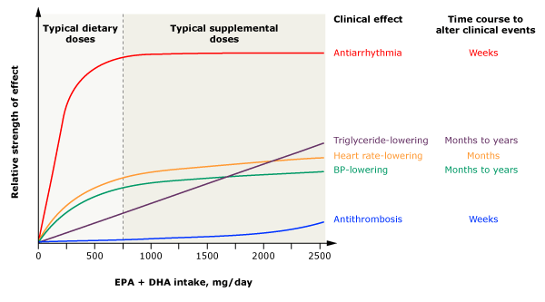

---
categories:
    - Cooking
date: 2022-10-28
---

# Nutrition and Health

I have been interested in nutrition from young, seeing as it affects not only weight, but clarity of thought, longevity and sleep among other things. Over here I have collated some of the research I have done over the years, which I have incorporated into [my diet][my-diet].

This page is continually updated as more studies and information develop.

<!-- more -->

## General

> _The optimal diet consists of grains, legumes, vegetables, and fruit, with <10%-15% of its calories coming from fat._   [Resolving the Coronary Artery Disease Epidemic through Plant-Based Nutrition, Preventive Cardiology, 2001][resolving-cade]

An LDL (bad cholesterol) level of less than 1.55mmol/L [reverses atherosclerosis][ldl]. Eating a very-low calorie diet (600-800kcal a day), such as in the [Newcastle Diet][newcastle-diet-paper] \[PDF\], can also potentially [reverse diabetes][newcastle-diet].

### Timing/Intermittent Fasting

It is thought that not just the total intake, but the _timing_ of consumed calories, plays an important role in weight loss and metabolic health.

[This NEJM review article][nejm-if] ([fulltext][nejm-if-fulltext]), published in 2019, showed that intermittent fasting, defined as either time-restricted eating (TRE), alternate day fasting (ADF) or 5:2 intermittent fasting, has broad spectrum benefits including glucose regulation, stress resistance and inflammation suppression, independent from weight loss. Some purported benefits went even beyond metabolism, such as increased neuroplasticity and longevity. Muscle mass was shown to be retained despite fasting daily for 16 hours while undergoing resistance training.

[This study][morning-loaded-calories] found that while there was no difference in weight loss/daily energy expenditure between morning-loaded and evening-loaded diets, there was less subjective hunger in the morning-loaded diet, which could contribute to weight loss in the long term via appetite suppression.

A [review article][if-comparison] comparing the various types of fasting (ADF, TRE, and the 5:2 diet) showed that ADF and the 5:2 diet had better weight loss and cholesterol lowering effects than TRE.

This [article from 2018][if-timing] found that an earlier eating window (i.e. 6 hour eating window, with dinner before 3pm) had better cardiometabolic beneficts as compared to a later eating window.

However, in 2022, an [NEJM article][nejm-if2] comparing weight loss and metabolic risk factors between time-restricted eating and plain old caloric restriction, showed no significant difference in both groups. Another study showed that [eating one meal a day was associated with increased all-cause mortality][one-meal-a-day]. Until the evidence is more conclusive, however, I still believe the benefits of IF outweigh the negatives.

The key principles appear to be:

-   Keeping the eating window short (6 hours is ideal)
-   An earlier window is better than a later one
-   ADF and 5:2 fasting _may_ be more effective for weight loss than TRE

### Cooking Methods

Boiling vegetables [causes some degree of water-soluble nutrient loss][boiling-nutrients] as compared to other methods like steaming or stir-frying.

However, boiling is much faster, especially with a pressure cooker. To compensate for the loss, you can drink the water the vegetables are cooked in (especially so with a pressure cooker, where much less water is used than with boiling).

Soaking beans beforehand can reduce the amount of [lectins][lectins], an antinutrient which interferes with the absorption of minerals. However, it turns out [soaking beans isn't really necessary][soaking-beans] when it comes to flatulence, taste or nutrition (in fact, unsoaked beans taste better).

Of note: food in contact with the water in the pressure cooker appears to cook faster, than food simply exposed to the steam.

### Improving Palatability, Umami

Adding ingredients with [umami][umami] (the fifth taste, that of savoriness) vastly improves the taste of the overall meal. [Sources][umami-sources] include kombu seaweed, dried shiitake mushroom, parmesian cheese, marmite, soy sauce, tomatoes, garlic and chicken, in descending amounts.

### Satiety Index

Satiety, or how full a food makes you feel, can help when deciding what to eat, especially when snacking. [This article][satiety-index] provides a satiety chart for common foods, and further analyzes reasons for a food's satiety.

Generally, foods with high satiety indices are low in energy density and high in fibre and protein.

Interestingly, **potatoes** are the most satieting (despite being very high in GI), followed by fish, porridge and oranges in that order.

## Carbohydrates

I prefer complex grains and legumes/lentils over processed alternatives like white rice, and avoid added sugar.

There is some ongoing [research][sweeteners] which suggests that artificial sweeteners such as sucralose, aspartame and acesulfame-K may adversely affect gut microbiota, metabolic health and sweetness preferences.

Legumes/lentils are a great source of complex carbohydrates as well as protein and other minerals.

Resources:

-   [Glycemic Index for 100+ foods][gi-table2]
-   [Glycemic Indices for even more foods][gi-table]
-   [Nutritional comparison of various legumes][legumes-chart]
-   [Beans soaking/pressure cooking time chart][beans-chart]
-   [Lentils and their Hindi names][lentils]

## Protein

[Consuming more protein as a percentage of caloric intake][physiqnomics-fat-loss] may result in more weight loss and [muscle retention][diet-and-body-composition].

Protein supplementation beyond total protein intakes of 1.62 g/kg/day appears to provide little to no gain ([_Morton et al., 2018_][morton-2018]).

An intake of red meat above 500g/week is associated with an [increased risk][red-meat-crc] of CRC.

[Fish and eggs][satiety-healthline] appear to be more filling compared to chicken protein.

Whey protein is a great source, however there are concerns about [contamination][protein-contamination] with heavy metals, and so I limit my total intake from this source.

Note also that different proteins have different [digestability scores].

The key principles are:

-   Consume more protein as a total percentage of caloric intake.
-   Aim for a total intake of ~1.6/kg bodyweight/day.
-   Great sources of protein include chicken, fish, eggs, beans and whey.
-   Limit red meat intake to less than 500g/week.

### Protein Source Comparison

Meat is assumed to have ~20% protein (of raw weight). Whey protein isolates/concentrates are assumed to be 90% protein. Tau Kwa is assumed to have 13.1% of protein by weight.

Tofu (tau kwa), whey protein and frozen chicken breasts are among the most value-for-money sources.

| Date       | Type                                           | Cost                                    | Cost/100g protein |
| ---------- | ---------------------------------------------- | --------------------------------------- | ----------------- |
| 2023-06-14 | Sadia frozen chicken breasts                   | \$15.90/2kg                             | \$3.98            |
| 2022-08-18 | Baiye Tofu (pressed tofu)                      | \$2.50/250g                             | \$4.14            |
| 2022-07-12 | Pan Royal Frozen Saba Fillet                   | \$9.50/750g                             | \$6.33            |
| 2022-07-12 | Pan Royal Frozen Toman Slices                  | \$7/500g                                | \$7.00            |
| 2022-03-07 | Sadia frozen chicken breasts                   | \$7.95/kg                               | \$4.00            |
| 2022-03-07 | Tau Kwa                                        | \$1.15/450g                             | \$1.95            |
| 2022-06-11 | Market fresh pork tenderloin                   | \$14/kg                                 | \$7.00            |
| 2022-06-11 | Market chicken breasts                         | \$45 for ~3.3kg                         | \$6.82            |
| 2022-04-03 | Cold Storage chicken breasts                   | \$31.6 for 3.5kg (\$7.90 for 4 breasts) | \$4.50            |
| 2022-03-22 | Market chicken breasts                         | \$33 for 3.6-4.8kg (\$11 for 4)         | \$3.43 - \$4.58   |
| 2022-01-29 | MyProtein whey **isolate**                     | 5kg for \$204                           | \$4.50            |
| 2022-01-29 | MyProtein whey **concentrate**                 | 5kg for \$142                           | \$3.50            |
| 2020-05-10 | MyProtein whey **isolate**                     | 5kg for \$144                           | \$3.20            |
| 2020-05-10 | MyProtein whey **isolate** matcha latte flavor | 1kg for \$44                            | \$4.89            |

## Fibre

The [recommended intake][fibre-intake] for fiber is around 25-38 grams a day.

Sources include root/leafy vegetables, whole grains, legumes (13-25% fibre), **psyllium husk** (almost completely fibre, note: powder form seems to work better) and chia seeds (34% fibre).

## Fat

I avoid saturated fat, and consume monounsaturated/polyunsaturated fat preferentially.

I also eat oily fish (such as mackerel and salmon, especially salmon belly), and take fish oil supplements (see below).

## Others

### Vitamin D

While a causal connection between vitamin D and extraskeletal health remains unestablished, some [observational studies][vitamin-d-mortality] suggest an inverse correlation with serum vitamin D levels and all-cause mortality.

In light of this evidence, and the fact that most of the population does not get sufficient sun exposure, supplementation may be beneficial to reach the recommended daily intake of 600IU.

### Omega 3

Omega-3 fatty acids obtained from marine or algae sources (i.e. EPA/DHA) are associated with triglyceride lowering, BP lowering and antiarrhymthmic/antithrombosis effects. Plant based omega-3 fatty acids (ALA) on the other hand, are [poorly converted][plant-ala] to EPA/DHA.

Sources of EPA/DHA include oily fish like salmon or mackerel.

Mackerel is overall the best option for price and amount of omega 3.

#### Notes

-   Saba = Japanese Mackerel
-   Batang = Spanish Mackerel
-   Pangasius (cream dory, vietnamese catfish) may be a [safe option][pangasius].
-   Barramundi, pan fried, is quite tasty

### Creatine

Creatine has been shown to [improve exercise performance][creatine] together with other benefits, and has been shown to be safe. Physiqnomics [recommends][physiqnomics-creatine] a daily intake of 5g (in the monohydrate form).

### Tea

**Health Effects**

Green tea has been shown to lower cholesterol to an extent.

However, there is some [concern][green-tea-catechins] that excessive consumption of catechins, such as in matcha powder, could cause liver damage (elevated serum transaminases).

**Caffeine content**

All values per cup.

-   White tea: 13mg
-   Green tea: 35mg
-   Oolong tea: 40mg
-   Black tea: 55mg
-   Matcha tea: 80mg

In comparison, coffee contains 100-200mg of caffeine. In general, the more the tea leaves are roasted/fermented/processed, the higher the caffeine content.

### L-Theanine

[L-Theanine][theanine] is a naturally occuring amino acid, found in tea leaves (in particular, those grown in shade, such as the [gyokuro][gyokuro] variety).

This compound is psychoactive and its effects range from [improving sleep][toolkit-for-sleep] to [inducing relaxation and learning ability][theanine-relaxation]. It is not a sedative and does not [cause drowsiness][theanine-examine].

[Studies][theanine-studies] appear to show some cognitive benefit, although the evidence is not conclusive. Some users find it helps with meditation ([reddit][theanine-meditation-reddit]), while others have mixed results ([1][theanine-reddit-mixed], [2][theanine-reddit-mixed2], [3][theanine-reddit-mixed3]) and even [withdrawal][theanine-withdrawal].

L-Theanine appears to be [safe][theanine-safety] even at high doses and does not appear to be carcinogenic.

L-Theanine content is higher in unfermented teas, although a [study][theanine-tea-content] examining L-theanine content in various teas found a large variability in levels amongst different processing methods (white, green, oolong and black). In general, levels in tea range from 2-25mg/cup.

L-Theanine is also available in supplement form (commonly at 100 and 200mg doses).

I have yet to examine the effects of L-theanine, but it is a promising nootropic for improving sleep, relaxation and possibly focus.

### Comparison of various nutrients across major staple foods

[Here][staple-food-comparison] is a useful table comparing nutrients across major staple foods, such as beans, corn and rice.

Soybeans (and hence beans) rank the highest in most categories, such as protein, fibre and iron. However, they are deficient in other nutrients, which can be supplemented as follows:

| Vitamin/Nutrient    | Source of Vitamin/Nutrient |
| ------------------- | -------------------------- |
| Vitamin B5          | Sweet Potatoes             |
| Vitamin B6          | Potatoes                   |
| Vitamin E           | Sweet Potatoes, Yam        |
| Vitamin K1          | Potatoes                   |
| Beta-carotene       | Sweet Potatoes             |
| Lutein + Zeaxanthin | Corn                       |

A balanced diet of nutrients can be therefore constructed with beans as the base, and supplemented with sweet potatoes, potatoes and corn.

[beans-chart]: https://missvickie.com/pressure-cooking-dried-bean-time-chart/
[boiling-nutrients]: https://www.healthline.com/nutrition/cooking-nutrient-content
[creatine]: https://cdn.mdedge.com/files/s3fs-public/Document/September-2017/5801JFP_Article2.pdf
[diet-and-body-composition]: https://pubmed.ncbi.nlm.nih.gov/28630601/
[fibre-intake]: https://www.healthline.com/health/food-nutrition/how-much-fiber-per-day
[gi-table]: ../../static/images/2022-10-28/gi-table-normal.pdf
[gi-table2]: https://extension.oregonstate.edu/sites/default/files/documents/1/glycemicindex.pdf
[green-tea-catechins]: https://pubmed.ncbi.nlm.nih.gov/32625874/
[if-comparison]: https://www.annualreviews.org/doi/abs/10.1146/annurev-nutr-052020-041327
[if-timing]: https://www.ncbi.nlm.nih.gov/pmc/articles/PMC5990470/
[ldl]: https://www.medscape.com/viewarticle/973872
[legumes-chart]: ../../static/images/2022-10-28/beans-comparison-chart.pdf
[morton-2018]: https://doi.org/10.1136/bjsports-2017-097608
[nejm-if-fulltext]: https://www.studioapolimeni.com/editorcms/nejmra1905136_pdf.pdf
[nejm-if]: https://www.nejm.org/doi/full/10.1056/nejmra1905136
[nejm-if2]: https://www.nejm.org/doi/10.1056/NEJMoa2114833
[pangasius]: https://www.youtube.com/watch?v=-7ff7fbZO5Q
[physiqnomics-creatine]: https://physiqonomics.com/creatine-illustrated/
[physiqnomics-fat-loss]: https://physiqonomics.com/fat-loss/
[plant-ala]: https://www.healthline.com/nutrition/3-types-of-omega-3#TOC_TITLE_HDR_3
[red-meat-crc]: https://www.ncbi.nlm.nih.gov/pmc/articles/PMC4698595/
[resolving-cade]: http://www.dresselstyn.com/resolving_cade.htm
[satiety-healthline]: https://www.healthline.com/nutrition/15-incredibly-filling-foods
[satiety-index]: https://optimisingnutrition.com/satiety-index/
[umami-sources]: https://www.umamiinfo.com/richfood/
[umami]: https://www.pccmarkets.com/sound-consumer/2015-04/understanding-umami/
[vitamin-d-mortality]: https://pubmed.ncbi.nlm.nih.gov/24690623/
[my-diet]: ../../daily-routine.md#diet
[lectins]: https://www.hsph.harvard.edu/nutritionsource/anti-nutrients/lectins/
[soaking-beans]: https://www.epicurious.com/expert-advice/soaking-salting-dried-bean-myths-article
[morning-loaded-calories]: https://www.sciencedirect.com/science/article/pii/S1550413122003448
[protein-contamination]: https://cleanlabelproject.org/blog-post/new-study-of-protein-powders-from-clean-label-project-finds-elevated-levels-of-heavy-metals-and-bpa-in-53-leading-brands/
[sweeteners]: https://www.theguardian.com/lifeandstyle/2022/dec/08/artificial-sweeteners-price-of-sugar-free-are-they-as-harmless-as-we-thought
[one-meal-a-day]: https://www.sciencedirect.com/science/article/abs/pii/S2212267222008747
[newcastle-diet-paper]: https://www.ncl.ac.uk/media/wwwnclacuk/newcastlemagneticresonancecentre/files/201809%20Sample%20Recipes%20&%20meal%20plans.pdf
[newcastle-diet]: https://www.diabetes.co.uk/news/2017/dec/newcastle-diet-achieves-type-2-diabetes-remission-after-one-year-of-direct-trial-98030767.html
[toolkit-for-sleep]: https://hubermanlab.com/toolkit-for-sleep/
[theanine]: https://en.wikipedia.org/wiki/Theanine
[gyokuro]: https://en.wikipedia.org/wiki/Gyokuro
[theanine-relaxation]: ../../static/images/2022-10-28/theanine-paper.pdf
[theanine-examine]: https://examine.com/supplements/theanine/
[theanine-studies]: https://examine.com/supplements/theanine/#examine-database
[theanine-meditation-reddit]: https://www.reddit.com/r/Meditation/comments/ah03nx/ltheanine_the_meditation_pill/
[theanine-reddit-mixed]: https://www.reddit.com/r/Supplements/comments/abp5f6/ltheanine_my_honest_review/
[theanine-reddit-mixed2]: https://www.reddit.com/r/Nootropics/comments/s4mzt6/what_can_and_cant_ltheanine_do/
[theanine-reddit-mixed3]: https://www.reddit.com/r/Nootropics/comments/1pzq7a/ltheanine_the_only_nootropic_i_have_faith_in/
[theanine-withdrawal]: https://www.reddit.com/r/StackAdvice/comments/w0napu/is_it_possible_to_have_withdrawals_from_ltheanine/
[theanine-safety]: https://examine.com/supplements/theanine/research/#LQVz3Qb-safety-and-toxicology
[theanine-tea-content]: https://www.ncbi.nlm.nih.gov/pmc/articles/PMC4787341/
[lentils]: https://www.myweekendkitchen.in/types-of-lentils-pulses-english-hindi/
[staple-food-comparison]: https://en.wikipedia.org/wiki/Template:Comparison_of_major_staple_foods
[digestability scores]: https://en.wikipedia.org/wiki/Protein_quality