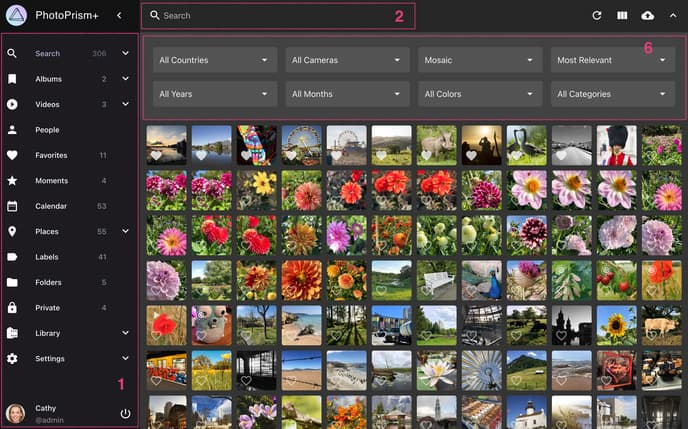
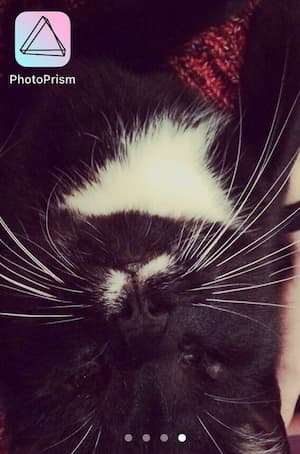

---
categories:
  - Programming
date: 2022-11-26
---

# Photoprism - A Google Photos Replacement

My Google Photos account ran out of storage recently (since 2021 June, Google has [stopped providing free storage for photos in High Quality][google-photos]), and I was looking for a self-hosted, open source replacement, with similar features to Google Photos (fast gallery view, facial recognition, object detection).

<!-- more -->



I found [PhotoPrism][photoprism], an open-source, self-hosted, web-based photo manager with features such as facial recognition, object tagging, automatic import and organization, and the ability to view photos with location information on a map. I was impressed, and deployed it on my [server][server].

You can try their demo [here][photoprism-demo]. To get started (via Docker Compose), see the guide [here][get-started].

PhotoPrism can also be installed on mobile devices as a [Progressive Web App][pwa], offering a near-native app experience.



## Mobile Sync

Photoprism suggests using [PhotoSync][photosync], an app available on Android and iOS. However, the WebDAV sync feature, essential to work with PhotoPrism, is a [paid][photosync-paid] feature.

[Syncthing][syncthing] is a free, open source continuous file synchronization program, with a reliable [conflict resolution algorithm][conflicts]. It offers [Android][syncthing-android] (via F-Droid) and iOS versions as well.

You can sync your phone's camera folder (sometimes called `DCIM`) to PhotoPrism's [`import` folder][photoprism-import] using Syncthing.

Then, you can use [this `docker compose.yml`][compose] to setup [Ofelia][ofelia], a job scheduler for Docker, to trigger the PhotoPrism import process (which adds photos to your library and organizes them).

This can be done with the following `config.ini` for Ofelia:

```ini
[job-exec "photoprism import"]
## See schedule syntax at https://pkg.go.dev/github.com/robfig/cron
schedule = @daily
container = photoprism
command =  photoprism import
no-overlap = true
```

By using the [Send & Receive Folder][send-receive-folder] type in Syncthing, whenever an import is performed by Photoprism, the imported photos in your phone are automatically deleted, freeing up space

[google-photos]: https://support.google.com/photos/answer/10100180?hl=en
[photoprism]: https://photoprism.app/
[photoprism-demo]: https://try.photoprism.app/
[server]: 2022-05-22-my-self-hosting-journey.md
[get-started]: https://docs.photoprism.app/getting-started/docker-compose/
[photosync]: https://www.photosync-app.com/home.html
[photosync-paid]: https://play.google.com/store/apps/details?id=com.touchbyte.photosync.fullfeatured&hl=en&gl=US
[foldersync]: https://www.tacit.dk/foldersync
[photoprism-import]: https://docs.photoprism.app/user-guide/sync/webdav/#connect-to-a-webdav-server
[move-files-target-folder]: https://foldersync.io/docs/help/folderpairsettings/#advanced-one-way-sync-options
[temp-file-scheme]: https://foldersync.io/docs/help/folderpairsettings/#advanced
[photoprism-webdav]: https://docs.photoprism.app/user-guide/sync/webdav
[pwa]: https://docs.photoprism.app/user-guide/pwa/
[syncthing]: https://syncthing.net/
[conflicts]: https://docs.syncthing.net/users/syncing.html?highlight=conflict#conflicting-changes
[syncthing-android]: https://f-droid.org/en/packages/com.github.catfriend1.syncthingfork/
[compose]: https://dl.photoprism.org/docker/scheduler/
[ofelia]: https://github.com/mcuadros/ofelia
[send-receive-folder]: https://docs.syncthing.net/v1.23.5/users/foldertypes#send-receive-folder
