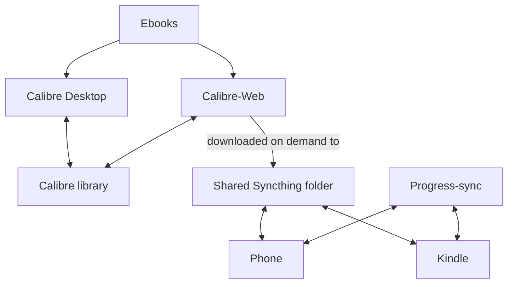

---
categories:
    - Programming
date: 2023-10-17
---

# Syncing my Kindle with calibre-web, KOReader and Syncthing

I own an Amazon Kindle [Paperwhite] (2nd generation). For the longest time, I was looking for a solution that would enable me to sync my reading progress between my phone and Kindle, as well as transfer books between all devices wirelessly.

I finally managed to accomplish this with [Syncthing], [KOReader] and [Calibre-Web].

<!-- more -->

[Syncthing] is a FOSS peer to peer decentralized file-sharing program. I have written about the network [topology] I use.

[KOReader] is an e-ink document viewer, which supports not only the Kindle, but Android, Linux and other platforms. Notably, it offers a [progress-sync] plugin, as well as support for downloading books from [OPDS] catalogs. Finally, there is also a [Wallabag] plugin, which lets me download and sync articles from my Wallabag server.

[Calibre-Web] is a web interface for Calibre (the best e-book organizer), and can also function as an [OPDS] server, from which devices with [KOReader] can download books from. There is a Docker container available as well.

## Workflow

After I obtain ebooks, I either use Calibre to upload the ebook my shared Calibre library (on my server), or upload it directly into Calibre-Web.

Then, on either my phone or Kindle, I download the ebook into a shared Syncthing folder. This synchronizes the ebook across all my devices.

Reading progress is also synced across my devices with the KOReader [progress-sync] plugin.

## Setting it up

1. Jailbreak and install KOReader on your Kindle by following this [guide].
2. Setup [Calibre-Web] in a method of your choice. I use this [Docker image].
3. Install Syncthing on your Kindle by following this [guide][syncthing-guide].
4. Configure a common folder for Syncthing on your devices to sync Ebooks to.
5. Add your Calibre-Web OPDS url to your devices ([guide][opds-guide]).
6. Setup [progress-sync] on your devices
7. Optionally, setup Wallabag support ([guide][wallabag-guide]).

Now, your ebooks should be syncing across your devices, as well as their reading progress.

[wallabag-guide]: https://github.com/koreader/koreader/wiki/Wallabag
[opds-guide]: https://github.com/koreader/koreader/wiki/OPDS-support
[syncthing-guide]: https://github.com/gutenye/syncthing-kindle
[Docker image]: https://docs.linuxserver.io/images/docker-calibre-web
[guide]: https://github.com/koreader/koreader/wiki/Installation-on-Kindle-devices
[Paperwhite]: https://en.wikipedia.org/wiki/Amazon_Kindle?oldformat=true#Kindle_Paperwhite_(second_iteration)
[Syncthing]: https://syncthing.net/
[KOReader]: https://github.com/koreader/koreader
[Calibre-Web]: https://github.com/janeczku/calibre-web
[topology]: 2023-10-17-syncthing-topology.md
[progress-sync]: https://github.com/koreader/koreader/wiki/Progress-sync
[OPDS]: https://en.wikipedia.org/wiki/Open_Publication_Distribution_System
[Wallabag]: https://wallabag.org
