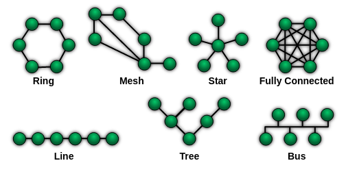

---
categories:
    - Programming
date: 2023-10-17
---
# Syncthing Topology

I use [Syncthing], a peer-to-peer filesharing program for my devices (most recently on my [Kindle] as well). There are a few network topologies possible in such a setup.

<!-- more -->

I decided to go with the **star** topology, with my [server] at the center. Some reasons are that my server is expected to always be online (and is periodically backed up), and that doing so reduces the amount of data transfer required between devices, as compared to a mesh topology (in which the number of links increases as $n^2$).

[Kindle]: 2023-10-17-kindle-sync.md
[Syncthing]: https://syncthing.net/
[server]: 2022-05-22-my-self-hosting-journey.md
