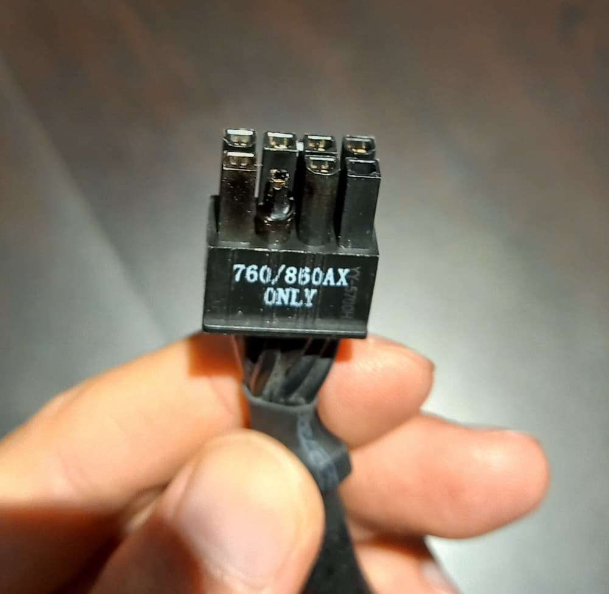

# GPU Power Crashes

For a few months, while running my [Windows 11 VM] with a GPU passthrough-ed, I was getting random reboots/screen hangs. There was a clear pattern - the reboots/hangs occured whenever I launched a resource-intensive application on the VM, such as a game.

In an effort to trace down the problem, I looked through `dmesg` (truncated for brevity) for various boots:

<!-- more -->

``` { .dmesg .blah }
Nov 07 15:39:12 server kernel: pcieport 0000:00:01.0: AER: Corrected error received: 0000:00:01.0
Nov 07 15:39:12 server kernel: pcieport 0000:00:01.0: PCIe Bus Error: severity=Corrected, type=Physical Layer, (Receiver ID)
Nov 07 15:39:12 server kernel: pcieport 0000:00:01.0:   device [8086:460d] error status/mask=00002001/00002000
Nov 07 15:39:12 server kernel: pcieport 0000:00:01.0:    [ 0] RxErr                  (First)
Nov 07 15:39:12 server kernel: vfio-pci 0000:01:00.0: vfio_bar_restore: reset recovery - restoring BARs
Nov 07 15:39:12 server kernel: vfio-pci 0000:01:00.0: vfio_bar_restore: reset recovery - restoring BARs
Nov 07 15:39:12 server kernel: vfio-pci 0000:01:00.0: vfio_bar_restore: reset recovery - restoring BARs
```

```
Nov 07 17:53:10 server kernel: pcieport 0000:00:01.0: AER: Multiple Corrected error received: 0000:01:00.0
Nov 07 17:53:10 server kernel: pcieport 0000:00:01.0: PCIe Bus Error: severity=Corrected, type=Physical Layer, (Receiver ID)
Nov 07 17:53:10 server kernel: pcieport 0000:00:01.0:   device [8086:460d] error status/mask=00002001/00002000
Nov 07 17:53:10 server kernel: pcieport 0000:00:01.0:    [ 0] RxErr                  (First)
Nov 07 17:53:10 server kernel: pcieport 0000:00:01.0: AER: Corrected error received: 0000:00:01.0
Nov 07 17:53:10 server kernel: pcieport 0000:00:01.0: AER: can't find device of ID0008
Nov 07 17:53:10 server kernel: vfio-pci 0000:01:00.0: vfio_bar_restore: reset recovery - restoring BARs
Nov 07 17:53:10 server kernel: vfio-pci 0000:01:00.0: vfio_bar_restore: reset recovery - restoring BARs
Nov 07 17:53:10 server kernel: vfio-pci 0000:01:00.0: vfio_bar_restore: reset recovery - restoring BARs
```

```
Nov 07 17:29:54 server kernel: vfio-pci 0000:01:00.1: Unable to change power state from D0 to D3hot, device inaccessible
Nov 07 17:29:54 server kernel: vfio-pci 0000:01:00.1: Unable to change power state from D3cold to D0, device inaccessible
Nov 07 17:29:54 server kernel: vfio-pci 0000:01:00.1: Unable to change power state from D3cold to D0, device inaccessible
```

At one point, the GPU _fell off the bus_:

```
Nov 07 18:17:15 server kernel: NVRM: Xid (PCI:0000:01:00): 79, pid='<unknown>', name=<unknown>, GPU has fallen off the bus.
Nov 07 18:17:15 server kernel: NVRM: GPU 0000:01:00.0: GPU has fallen off the bus.
Nov 07 18:17:15 server kernel: pcieport 0000:00:01.0: PCIe Bus Error: severity=Corrected, type=Physical Layer, (Receiver ID)
Nov 07 18:17:15 server kernel: pcieport 0000:00:01.0:   device [8086:460d] error status/mask=00002001/00002000
Nov 07 18:17:15 server kernel: pcieport 0000:00:01.0:    [ 0] RxErr                  (First)
Nov 07 18:17:15 server kernel: NVRM: Xid (PCI:0000:01:00): 44, pid=12348, name=tf_cnn_benchmar, Ch 00000008, intr 10000000
```

I tried changing various `libvirtd` settings to no avail.

Finally, I decided to check the power supply cable:



I changed the cable, and all the problems above that were plaguing me for a month, disappeared.

[Windows 11 VM]: 2022-07-10-win11-vm-gpu-passthrough.md