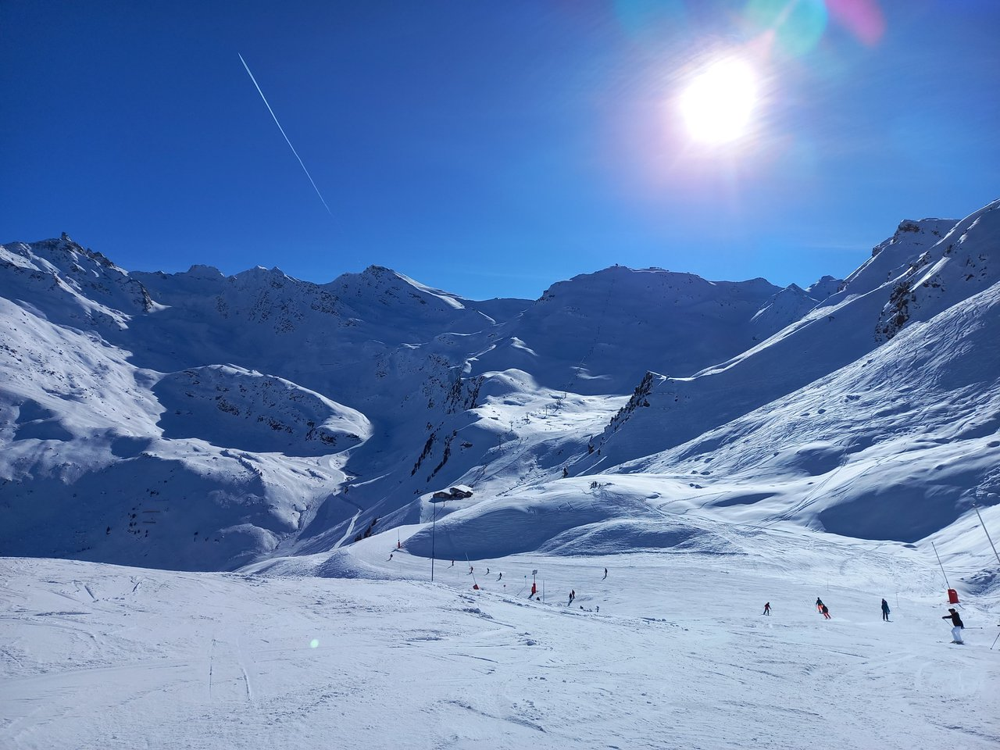

# 2023 Val Thorens, Club Med, France, Skiing

Went with Elizabeth, Benedict and Kimi from 23-31 Dec 2023. We finally skied down black slopes, and tried going over moguls, managing to explore most of the 3 valleys.

<!-- more -->

<figure>
  
  <figcaption>Les 3 Vallées Piste Map<figcaption/>
</figure>

<figure>
  
  <figcaption>Val Thorens Piste Map<figcaption/>
</figure>

## Slopes attempted

### 25/12 Monday

I can't remember - maybe Plein Sud?

### 26/12 Tuesday

Morning: VT27 > VT23 > VT24 > Lory > OR3 > Niveroille > Fond

<figure>
  
  <figcaption>At the beginning of the Lory slope: Club Med photographer attempts to take our photo.<figcaption/>
</figure>

Afternoon: VT2/3? > VT5 > Chardons > Corniche?

### 27/12 Wednesday

Morning: Pointe De La Masse > Bouquetin > Masse 1 > Doron > Mont De la Chambre > ? > VT13 > Tete ronde

In the afternoon, we skied with Tobias, a friendly, energetic Chinese Club Med receptionist with interesting stories.

<figure>
  
  <figcaption>Atop Cime Caron 3230m, one of the peaks in the 3 Valleys<figcaption/>
</figure>

Afternoon: VT32 Caron > VT33 Cime Caron > Col de l'audzin > Gentiane

<figure>
  
  <figcaption>Jellybeans we saw while exploring the Christmas market<figcaption/>
</figure>

### 28/12 Thursday

Today, we explored Maribel and Courchevel with our instructor Pierre.

Morning: VT3 Plein Sud > VT5 > Lac de la chambres > Plans des mains> Sitelle > Martre > Truite> Legends > Lievre? > Rhodos 1 > Rhodos 2 > Loze? > Col de la loze > Coqs? > Jardin Alpine > Biollay > Vizelle > Marcassin > Aigle > Plattiers> Cote brune > ?

In the afternoon (2+pm), me and Benedict explored a black slope ourselves.

<figure>
  
  <figcaption>Long, lone chairlift<figcaption/>
</figure>

Afternoon: VT32 Caron > VT33 Cime Caron > Combe de caron > VT33 Cime Caron > Cime > Fond > VT23 Portette > VT24 Thorens > Asters > Genepi

### 29/12 Friday

Morning: VT34 Moutiere > VT26 Grand Fond > Mauriennaise > OR4 Peyron > La croix d'Antide > OR3 Rosael > Chamois > Fond

Benedict and me explored a mogul filled black slope during lunchtime.

<figure>
  
  <figcaption>Moguls at the Combe rosael slope (people were going off-piste as it was easier)<figcaption/>
</figure>

Lunchtime: VT32 > VT33 > Combe de caron > VT33 > Combe rosael > OR3 Rosael > Chamois > Fond

Afternoon: VT32 Caron > VT33 Cime Caron > Cime > Fond > VT21 Moraine > Moraine

### 30/12 Saturday

<figure>
  
  <figcaption>Warning sign atop Mount Vallon<figcaption/>
</figure>

<figure>
  
  <figcaption>View beyond the warning sign<figcaption/>
</figure>

This day was to ourselves. We explored the following slopes:

-   Lac de la chambre
-   Campagnol
-   Combe du vallon
-   Ours
-   Goitschel (a black slope)
-   Lory
-   Bouchet
-   La croix d'Antide
-   Mauriennaise
-   Falaise

## Ski Routes to try in the future:

Down Pointe de la Masse 2804m: Bd cumin > Pointe De La Masse > Fred Covili (red)/Lac Noir (black) > Les enverses > Reberty > Bruyeres 1 > Bruyeres 2 >

-   Mont de la chambre > Plein sud
-   (traverse) Lac de la chambre > Plein sud

## Notes

Invaluable aids: [Fatmap] was invaluable in route planning and visualization, especially for the challenging slopes.

Ski tricks to practice:

-   Backward direction change
    -   While facing backward, turn the head and shoulders toward the direction you wish to head toward, letting the ski on the same leg slide back as well.
-   Backward turn
-   Jumps
-   180 jump

[Fatmap]: https://fatmap.com/
