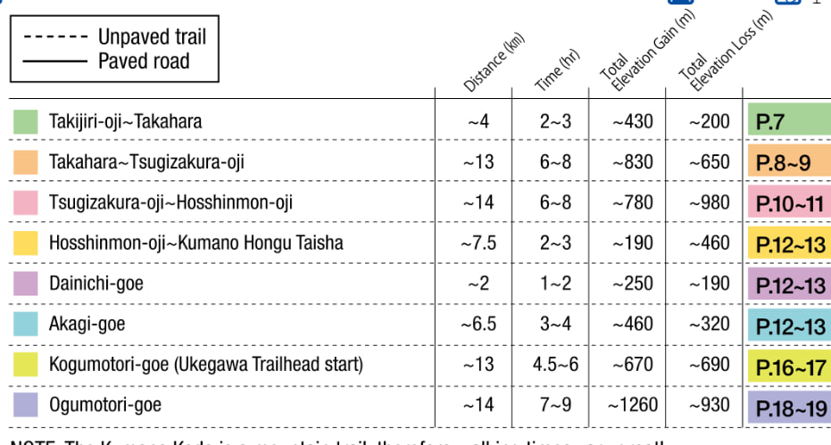

# 2024 Kumano Kodo Hiking Trip with Cousins

We hiked the Nakahechi Main Route (38.5km), with some of us extending and hiking the Kogumotori-goe and Ogumotori-goe extensions (30.5km), with some bus routes taken due to time constraints (refer to [route map][Kumano Kodo Maps])

Information regarding flights, itinerary, accomodation and general advice is consolidated here. To make any changes, submit a PR.

Attendees:

-   Benjamin
-   Chanel
-   Elizabeth
-   Jessica
-   Koon Aik
-   Koon Hian
-   Koon Hwee
-   Nicholas
-   Zhi Qi

<!-- more -->

## Itinerary

**Refer [here](https://tasks.nicholaslyz.com/#b0863a73-5ed7-486e-b073-ff311e61561f) for the actual itinerary.**

## Notes

-   Remember to buy travel insurance
-   Expected temperature is 14° / 5°, so wear appropriately. Wool is a good choice for base layers.
-   Bag: At least 45L, with rain cover.
-   Shoes: High cut hiking boots prevent ankle sprains.
-   Download GPX maps of trail
-   Buy SIM data plan in advance

## Resources

-   [Kumano Kodo Bus Routes]
-   [Kumano Kodo Maps]

[Kumano Kodo Maps]: https://www.tb-kumano.jp/en/kumano-kodo/maps/
[Kumano Kodo Bus Routes]: https://downloads.ctfassets.net/23rhb4p68w2r/1cDmkzRrByo2swmKICIoIE/1e587865a0fd27e79b50e1fca7e0e744/Kumano-Kodo-Nakahechi-Access-Map_EN.pdf
[SEN.RETREAT TAKAHARA]: https://www.booking.com/hotel/jp/sen-retreat-takahara.html?aid=304142&label=gen173nr-1FCAEoggI46AdIM1gEaMkBiAEBmAExuAEZyAEP2AEB6AEB-AECiAIBqAIDuALa_ourBsACAdICJDNkNjNmZjUxLTJiMzMtNDcwNi1iZjJiLTI1NTNlYTFlODI0MNgCBeACAQ&sid=f634309bdae467551669d8e4798dbb75&all_sr_blocks=912679401_380574020_7_17_0;checkin=2024-03-28;checkout=2024-03-29;dest_id=-245436;dest_type=city;dist=0;group_adults=7;group_children=0;hapos=1;highlighted_blocks=912679401_380574020_7_17_0;hpos=1;matching_block_id=912679401_380574020_7_17_0;no_rooms=1;req_adults=7;req_children=0;room1=A%2CA%2CA%2CA%2CA%2CA%2CA;sb_price_type=total;sr_order=popularity;sr_pri_blocks=912679401_380574020_7_17_0__11700000;srepoch=1700987901;srpvid=f3ab3cba87230094;type=total;ucfs=1&#hotelTmpl
[Happiness Chikatsuyu]: https://www.kumano-travel.com/en/accommodations/happiness-chikatsuyu
[chikatsuyu-bus]: http://www2.tb-kumano.jp/en/transport/pdf/Tanabe-Shirahama-to-Hongu-bus.pdf
[Doyukawa to Kumano Hongu Taisha]: https://www.tb-kumano.jp/en/kumano-kodo/nakahechi/tsugizakura-oji-to-kumano-hongu-taisha/doyukawa-bashi-bus-stop-to-kumano-hongu-taisha/
[hongu-taisha-bus]: http://www2.tb-kumano.jp/en/transport/pdf/Hongu-Kawayu-Yunomine-bus.pdf
[J-Hoppers Kumano]: https://www.kumano-travel.com/en/accommodations/j-hoppers-kumano-yunomine-guesthouse
[nachisan-bus]: http://www2.tb-kumano.jp/en/transport/pdf/Nachi-Kii-Katsuura-bus.pdf
[wakayama-cycling]: https://en.japantravel.com/wakayama/cycling-in-southern-wakayama/69351
[apartment-hotel-osaka]: https://www.booking.com/hotel/jp/zhu-yi-dao-dun-ku-2hao-dian-osaka.en-gb.html
[Sunrise Katsuura]: https://www.booking.com/hotel/jp/sunrise-katsuura.html
[Takata Green Land Kumotori Onsen]: https://www.kumano-travel.com/en/accommodations/takata-green-land-kumotori-onsen
