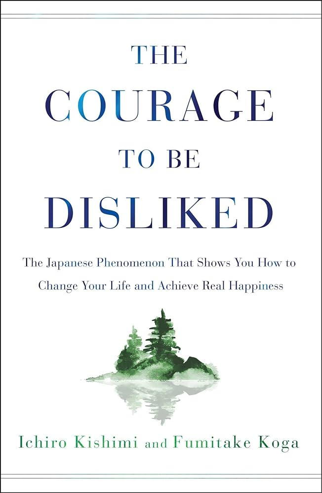

# Book Summary: The Courage to be Disliked

I listened to the audiobook version of this several times and here is my summary of it.

My biggest takeaways are:

-   We lack the courage to be disliked, to be normal, to try, and so on. Instead, we manufacture 'life lies' (if only I could stop blushing, if only I did not have a traumatic childhood, etc.)
-   Being disliked by others is necessary to achieve freedom
-   Separation of tasks: do not interfere, or care about, other people's tasks
-   Happiness is the feeling of contribution to the community

<!-- more -->

## Trauma Does Not Exist

-   Adlerian psychology looks at trauma from a teleological standpoint (goal oriented), as compared to Freudian psychology which is etiological (cause and effect).
-   We create reasons for ourselves to remain in unhappy situations.
-   The past influences our decisions, but it does not determine how we can decide to act here and now.

## On Recognition

-   Recognition should be avoided.
-   Most people suffer because they are trying to live up to the expectations of others. People who are obsessed with a desire for recognition are actually self centered, because they are only concerned with how they themselves appear to other people.
-   It is not necessary to satisfy other people's expectations.
-   Other people are not living to satisfy your expectations.
-   If you are not living your life for yourself, then who is going to live it for you?
-   People lost in the desire for recognition have their interpersonal relationship cards in the hands of others.
-   Children do not grow up to become what their parents want them to be.

## On Competition

-   Life is not a competition.
-   A healthy feeling of inferiority is not something that comes from comparing oneself to others; it comes from one’s comparison with one’s ideal self.

## On Power Struggles

-   Power struggles should be avoided.
-   Admitting mistakes is not defeat.
-   Most people get trapped in whether the other person is right or wrong, rather than whether the argument is settled or not.
-   The rightness of one's assertions has nothing to do with winning or losing.
-   If you think you are right, then regardless of other people's assertions, the matter should be closed then and there.

## Separation of Tasks

-   Separation of tasks is the solution to getting the courage to being disliked.
-   Avoid other people's tasks (getting their contentment, satisfying them, etc)
-   **Freedom is being disliked by other people. In fact, it is a sign of being free. The cost of freedom is being disliked by other people.**

## Do Not Praise or Rebuke

-   Praise is an expression of subordination and used for manipulation.
-   Instead, offer encouragement.

## Vertical and Horizontal Relationships

-   All relationships should be horizontal, including parent child
-   Having just one vertical relationship will result in all your relationships becoming vertical

## Happiness and Community Feeling

-   The chief cause of unhappiness is not being able to accept oneself.
-   The solution proposed by Adler is the feeling of being beneficial to the community, or of use to someone.
-   Greater community, or community feeling refers to the entirety of the universe in the past and future.
-   When one feels excluded from the current community they are in (school, university, etc), one should remember the global community, and look at their situation in the lenses of person in this global community.
-   That contribution does not need to be material. It is just the feeling of it that matters.
-   **Happiness is the feeling of contribution to the community.**
-   The desire to get recognition is a means to get community feeling but it results in being dependent on satisfying the expectations of others.

## The Courage to be Normal

-   We lack the courage to be normal.
-   Being normal is not being abnormal. Attempting to be special, e.g. good, when it fails, one tries to be extremely bad.

## Live an Energial Life

-   The aim of life is in the dancing of it.
-   Live an energial life, seeing life as a dance where every moment is to be enjoyed, versus a kinetic life, which aims to reach a certain destination.
-   The life ahead of you is blank.
-   There are no tracks to follow.
-   It follows that we can only live in the present.
-   The greatest life lie is to not live in the present.
