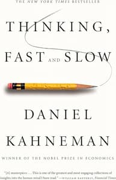

# Thinking Fast and Slow summary

This is my summary of the book [Thinking, Fast and Slow] by Daniel Kahneman, which I read in March 2024.

I mainly describe the cognitive heuristics, biases and fallacies with examples here.

<!-- more -->

## Representiveness Heuristic

We categorize things based on how similar they appear to stereotypes of that category, for example judging a person reading a poetry book as more likely to be a poet than an accountant.

This results in the following fallacies:

### Conjunction Fallacy

We falsely judge the probability of an event and its associated event both occuring higher than that of the initial event.

!!! note "The Linda Problem"

    Linda is 31 years old, single, outspoken, and very bright. She majored in philosophy. As a student, she was deeply concerned with issues of discrimination and social justice, and also participated in anti-nuclear demonstrations.

    Which is more probable?

    - Linda is a bank teller.
    - Linda is a bank teller and is active in the feminist movement.

Most people, view Linda more likely to be a bank teller who is active in the feminist movement, rather than just a bank teller, even though the latter is a subset of the former and must therefore be equal or smaller than it.

### Disjunction Fallacy

We false judge the probability of an event higher than the probability of either the event or another event happening.

!!! note ""

    Mr Pius goes to Church and has visited the Vatican. Which is more likely:

    - Mr Pius is a Christian.
    - Mr Pius is either a Muslim or a Christian.

### Base Rate Fallacy

We tend to ignore the prevailing base rates for an event when estimating its probability, given other information.

For example, in the false positive paradox, where a test for a disease which has 99% sensitivity and specificity is actually only truly positively correct 50% of the time, in a population in which the disease is prevalent in only 1% of the population. Or, given a caricature of a student who is introverted, we think it more likely for them to be in computer science than social work, even though the latter has much more students.

### Regression Fallacy

We assume that a measurement has returned to normal, because of corrective actions taken, ignoring random, normal fluctuations.

For example, golf scores are influenced by talent and luck. If a golfer scores lower than the average initially, it is more likely that they will score higher than their previous score (assuming no other variables change).

This can lead to the 'Post hoc fallacy', in which we attribute an event happening prior to another event as its cause, when in reality there may have been no link.

For example, pilot teachers who come to the conclusion that scolding poor-performing pilots increases their performance: as poor performance is below the average, it is likely that even without the scolding, their performance would have improved.

### Framing

We decide between options based on whether their connotations are positive or negative, even if they are actually equal.

!!! note ""

    Which treatment is more effective?

    - Treatment A: Kills 66% of those affected with the disease
    - Treatment B: Saves 33% of those affected with the disease

    Most participants chose treatment B, despite their equality.

Additionally, we passively accept decision problems as they are framed (positively or negatively).

!!! note "Equivalent Gambles"

    -   Would you accept a gamble that offers a 10% chance to win $95 and a 90% chance to lose $5? (_Most people would say no_)
    -   Would you pay $5 to participate in a lottery that offers a 10% chance to win $100 and a 90% chance to win nothing? (_Most people would say yes_)

The two choices are, in fact, identical. A bad outcome is much more acceptable if it is framed as a cost, versus a loss (System 1 thinking).

Another example:

!!! note "The Asian disease problem"

    Imagine that the United States is preparing for the outbreak of an unusual Asian disease, which is expected to kill 600 people. Two alternative programs to combat the disease have been proposed. Assume that the exact scientific estimates of the consequences of the programs are as follows:

    - If program A is adopted, 200 people will be saved.
    - If program B is adopted, there is a one-third probability that 600 people will be saved and a two-thirds probability that no people will be saved.

Yet another, which shows people readily make logically incompatible choices:

!!! note "Tax Reliefs for the Poor vs Rich"

    Supposing the amount of exemption is independent of the taxpayer's income.

    _Should the child exemption be larger for the rich than for the poor?_

    The tax law could have been written differently, framing the exemption as a surcharge instead. Now, in the alternative formulation, families with fewer than the default number of children would pay a surcharge.

    _Should the childless poor pay as large a surcharge as the childless rich?_

    Answering 'No' to both questions is logically inconsistent (think about it).

    ---

    Note: I have been challenged by friends who claim that the second scenario is not equivalent to the first, because there is a larger decrease in marginal utility for the poor as compared to the rich. However, this can be rectified by rewording the second scenario as follows:

    _All families receive $X. Families with fewer than the default number of children would pay a surcharge of $X._

    Now, there is no change in marginal utility for the rich vs the poor.

## Anchoring

An individual's judgements or decisions are influenced by a reference point or "anchor" which can be completely irrelevant, and can include numeric/non-numeric items.

For example, individuals given higher random numbers (obtained via the last 2 digits of their social security numbers) were more likely to donate more to charity in an experimental study. An anchoring index can also be calculated to determine the effect.

## Availability heuristic

We judge the probability of an event based on how easily examples come to our mind. For example, we overestimate the probability of dying in a dramatic event, such as a terrorist attack, over common and more mundane events like diabetes or stroke.

#### Hindsight bias

The tendency for us to perceive past events as having been more predictable than they were.

For example, with regards to the 9/11 incident, the CIA obtained information that al-Qaeda might be planning a major attack on the US, and brought the information not to the President, but to the National Security Adviser. After the incident, an editor of the Washing Post declared that it should have been obvious that the information should have gone to the President.

## The Law of Small Numbers

In small populations, extreme outcomes (both high and low) are more likely, causing us to jump to invalid conclusions. For example, the incidence rates of kidney cancer are likely to be both higher and lower in smaller towns than in larger cities because the sample size is smaller.

## Preference reversal

People make different choices when presented with the choices in isolation, versus when they are given simultaneously and available for direct comparison.

|                     | Dictionary A |          Dictionary B          |
| :-----------------: | :----------: | :----------------------------: |
| Year of publication |     1993     |              1993              |
|  Number of entries  |    10,000    |             20,000             |
|      Condition      |   Like new   | Cover torn, otherwise like new |

In single evaluations, Dictionary A is valued more highly, whereas in joint evaluations Dictionary B is more preferred.

Additionally, our evaluations are particularly inconsistent when comparison is across categories. For example:

!!! note ""

    -   Which do you like more, apples or peaches?
    -   Which do you like more, steak or stew?
    -   Which do you like more, apples or steak?

There appears to be no stable answer for the third question compared to the other questions (possibly, no total order exists).

## Decision vs Experienced Utility

Our _remembering self_ judges experiences only on their peaks and ending, compared to our _experiencing self_ which judges experiences as the average of the experience. However, it is our _remembering self_ which makes decisions for us, which can appear controversial.

!!! note "Cold Hand Experiment"

    Participants were asked to hold their hand up to the wrist in painfully cold water until they were invited to remove it and offered a warm towel, recording their experience frequently over the episode.

    Each participant endured two cold-hand episodes:

    The **short** episode consisted of 60 seconds of immersion in water at 14° Celsius, which is experienced as painfully cold, but not intolerable. At the end of the 60 seconds, the experimenter instructed the participant to remove his hand from the water and offered a warm towel.

    The **long** episode lasted 90 seconds. Its first 60 seconds were identical to the short episode. The experimenter said nothing at all at the end of the 60 seconds. Instead he opened a valve that allowed slightly warmer water to flow into the tub. During the additional 30 seconds, the temperature of the water rose by roughly 1°, just enough for most subjects to detect a slight decrease in the intensity of pain.

    Our participants were told that they would have three cold-hand trials, but in fact they experienced only the short and the long episodes, each with a different hand. The trials were separated by seven minutes. Seven minutes after the second trial, the participants were given a choice about the third trial. They were told that one of their experiences would be repeated exactly, and were free to choose whether to repeat the experience they had had with their left hand or with their right hand. Of course, half the participants had the short trial with the left hand, half with the right; half had the short trial first, half began with the long, etc. This was a carefully controlled experiment.

    80% of the participants who reported that their pain diminished during the final phase of the longer episode opted to repeat it, thereby declaring themselves willing to suffer 30 seconds of needless pain in the anticipated third trial.

## Experienced Well-Being

The satiation level beyong which experienced well-being no longer increases was a household income of about $75,000 in high-cost areas, with the average increase of experienced well-being associated with incomes beyond that level being precisely zero.

One explanation is that wealth is associated with a decreased ability to enjoy the small pleasures of life.

## Focusing illusion

_Nothing in life is as important as you think it is when you are thinking about it._

When you are asked "How much pleasure do you get from your car?", you immediately came up with an answer - you know how much you like your car.

However, if you were asked "When do you get pleasure from your car?", the answer is different - you get pleasure from your car when you _think_ about your car, which is probably not very often.

Our average happiness can be influenced by positive reminders of gratefulness towards the things, events and people in our life, since our _remembering self_ is the one determining whether we were happy on average, or not (and it is also subject to the [availability bias](#availability-heuristic)).

## Misc

-   **Ego depletion**: An effort of will or self-control is tiring - if you have had to force yourself to do something, you are less willing/able to exert self-control when the next challenge comes around.
-   The priming effect - e.g. reminders of money resulted in people being less willing to help another student who pretended to be confused about an experimental task. Or, reminding people of their mortality increases the appeal of authoritarian ideas.
-   The mental shotgun: We answer difficult questions by substituting them with easier ones. For example: 'How happy are you with your life these days?' becomes 'What is my mood right now?'.
-   How we react to gains and losses depends on how much we have currently (prospect theory).
-   We become risk seeking when all possible options are bad.
-   We are risk adverse (or loss adverse), in a roughly 2:1 ratio (i.e. we consider a 50% chance to lose $100 equal to a 50% chance to gain $200).

!!! note "Intelligent Women Dating Down"

    Suppose I told you that women of above average intelligence tend to date men who are less intelligent than them.

    You could probably produce a couple reasons as to why that might be true, and it is probably your natural inclination to do so. However, it's not particularly necessary.

    This can be answered with simple statistics; a woman of above average intelligence is in the 60-70th percentile, which would make her also more intelligent than 60-70% of men. In fact, if intelligence is a normal distribution then it would increase this number to about 80%. So the dating pool for a woman of above average intelligence includes 60-80% of individuals less intelligent than her.

[Thinking, Fast and Slow]: https://www.goodreads.com/en/book/show/11468377
