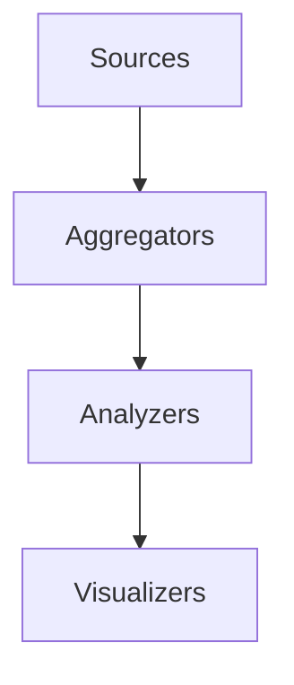
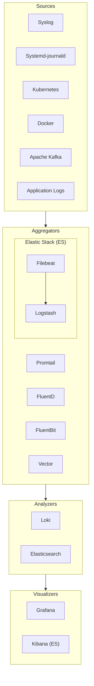

# Logging: Comparison of Frameworks

Logging is an often overlooked part of software development, and something I have been neglecting only up till recently. In this post, I compare several logging frameworks.

<!-- more -->

## What is a Logging Framework?

A logging framework (or stack) is a collection of software components which aggregate, analyze and display information collected from sources.

In simple terms, the stages are as follows:

_Note: Analyzers may also store the raw log data._

For each stage, there are several choices of software you can choose from. We can add this to the diagram:

The 3 most popular logging stacks (combinations) are:

PLG:

-   Promtail
-   Loki
-   Grafana

EFK/ELK

-   FluentD/Logstash
-   Elasticsearch
-   Kibana

## Aggregator Comparison TODO

## Analyzer Comparison TODO

## Visualizer Comparison TODO