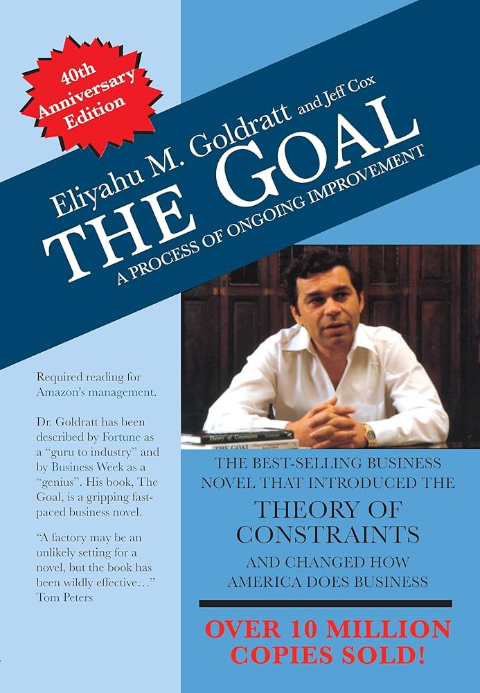

# Book Summary: The Goal

This is a book primarily about plant management/supply chain management, but the lessons and concepts translate well to other fields e.g. software development.

<!-- more -->

## Summary

The goal of production is not to reduce cost, but increase throughput.

Throughput is money coming in. Inventory is the money currently inside the system. And operational expense is the money we have to pay out to make throughput happen.

A system of local optimums is not an optimal system at all. Local efficincies misty be abolished. A plant in which everyone is working all the time is very inefficient.

Every plant should have bottlenecks, and a system can only increase productivity by increasing capacity at the bottleneck operations. Lost throughput at the bottleneck is lost throughput for the entire plant.

Prioritize items destined for the bottlenecks.

Determine release of materials for bottleneck and non bottleneck parts by working backward from throughput calculated by the bottleneck.

**The Five Step Process of Ongoing Improvement**

-   Step 1: Identify the system’s bottlenecks
-   Step 2: Decide how to exploit those bottlenecks
-   Step 3: Subordinate every other decision to 'step two decisions'
-   Step 4: Elevate the systems bottlenecks
-   Step 5: if, in a previous step, a bottleneck has been broken, go back to the beginning (Step 1).

The market can be a bottleneck (e.g. If you're shipping earlier than expected)

Priorities for items are decided by % of lead time they have been sitting there for. If they have been waiting for a long time, tag them as red.

Decrease time buffers when red items are < 5% of total items.
