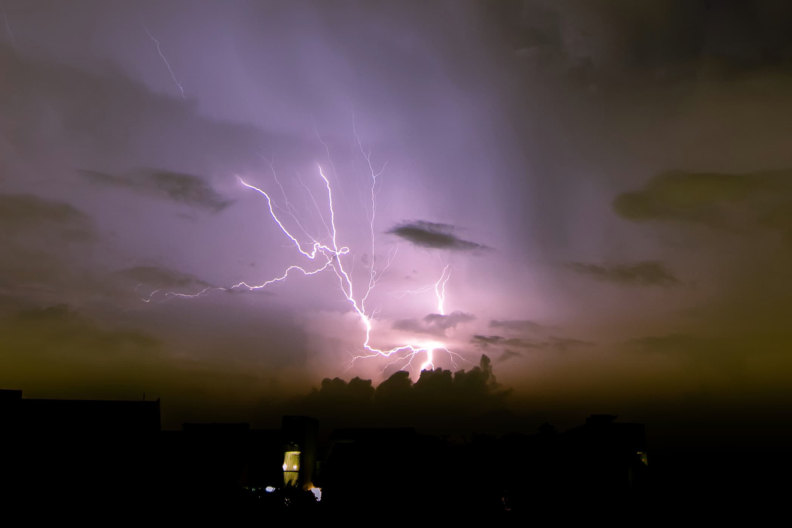
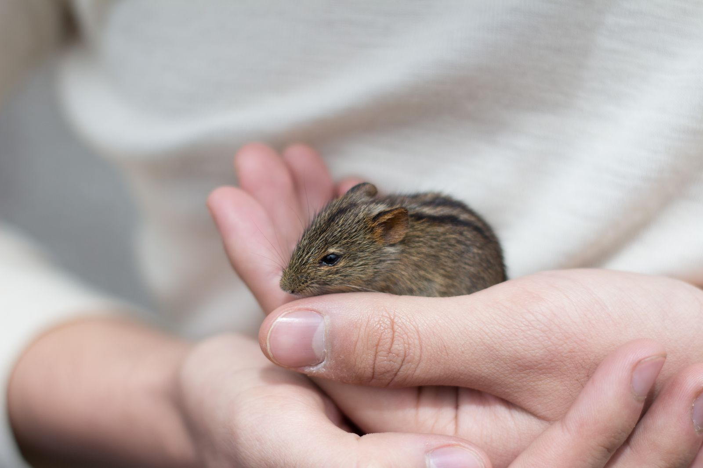
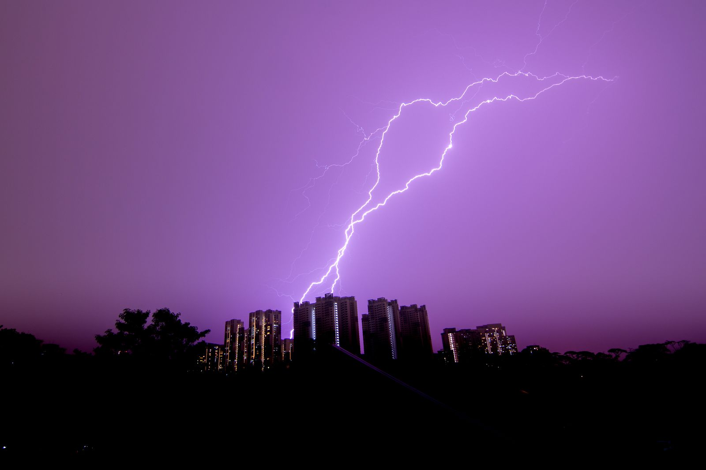
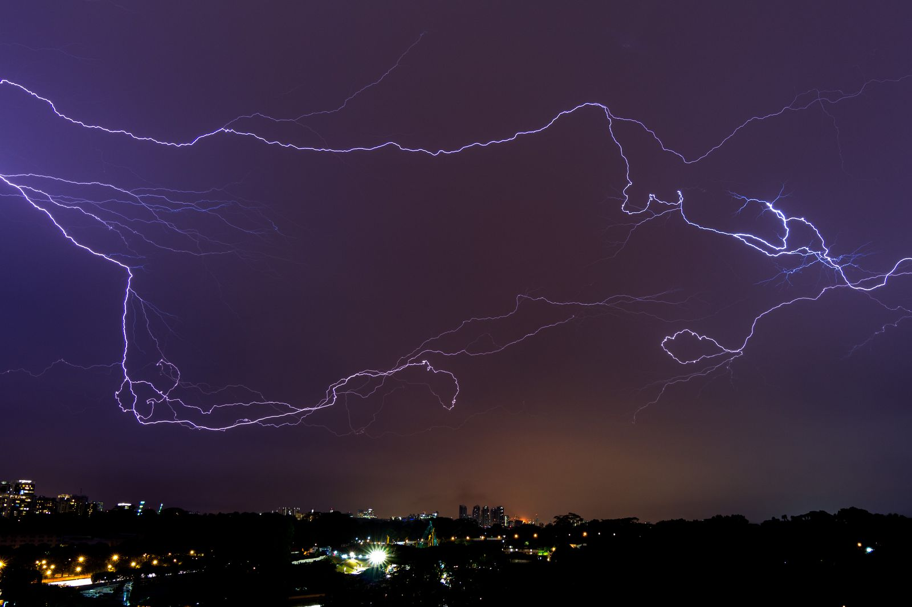
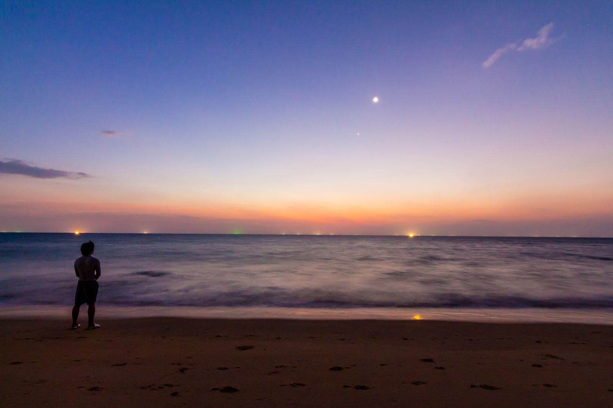
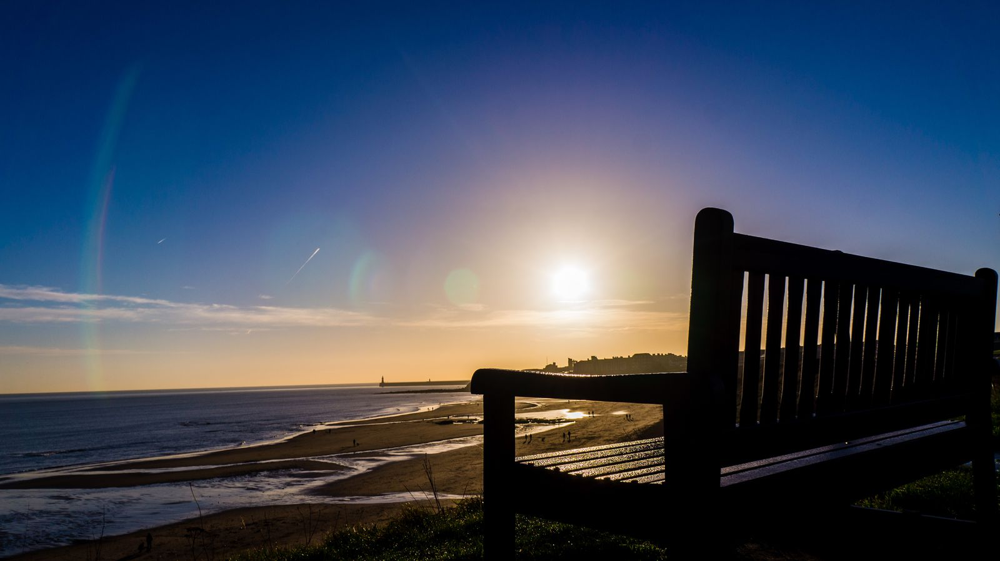
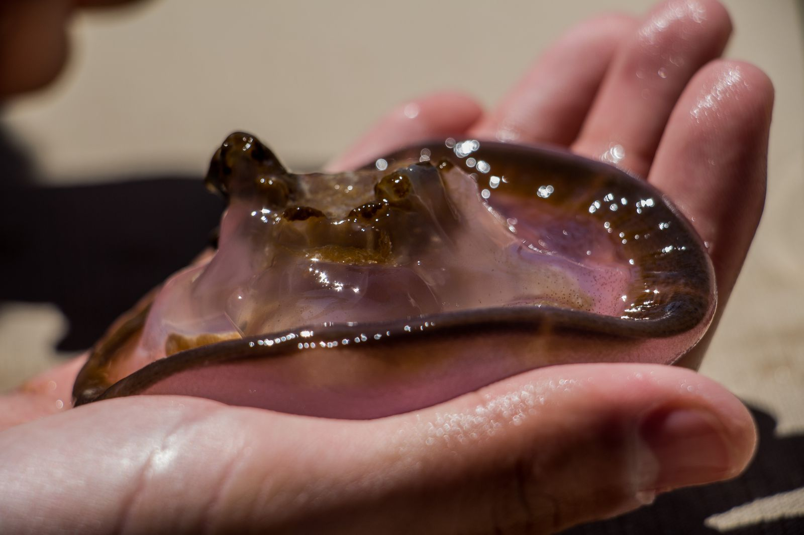
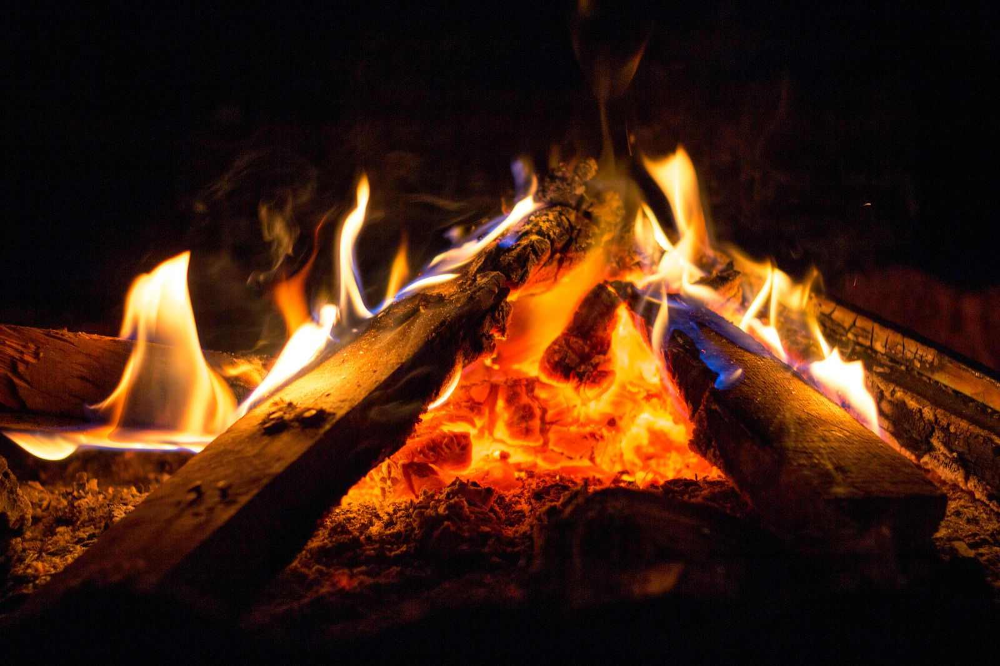
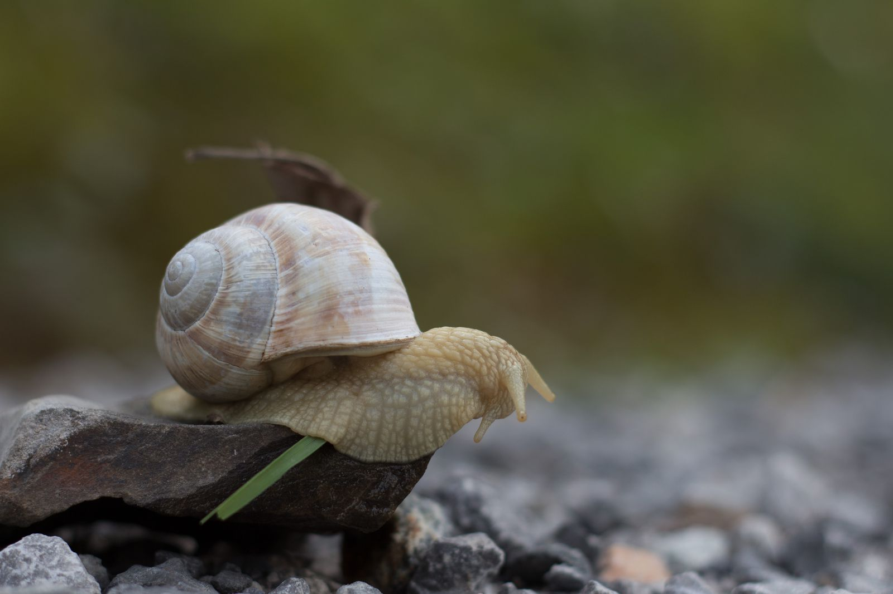
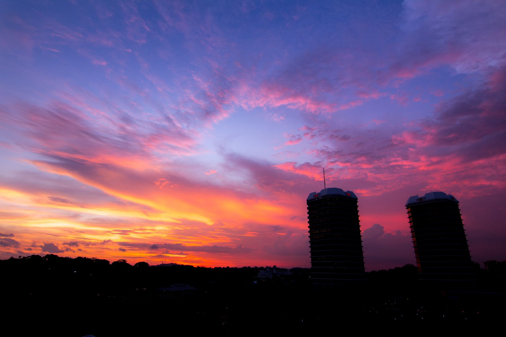

Most of these are taken on my Canon 700D with the [Tokina f/2.8 11-16mm lens](https://tokinalens.com/product/at_x_116_pro_dx_ii/). Post-processing is done in Lightroom and Photoshop.

<figure>
  
  <figcaption>Phuket, 2022<figcaption/>
</figure>

<figure>
  
  <figcaption>Qingjing Farm, Taiwan, 2019</figcaption>
</figure>

<figure>
  
  <figcaption>Qingjing Farm, Taiwan, 2019</figcaption>
</figure>

<figure>
  
  <figcaption>Egypt, 2018</figcaption>
</figure>

<figure>
  
  <figcaption>Mt Gokohara, Nagasaki, 2017</figcaption>
</figure>

<figure>
  
  <figcaption>Nagasaki, Japan, 2017</figcaption>
</figure>

<figure>
  
  <figcaption>Tromso, Norway, 2017</figcaption>
</figure>

<figure>
  
  <figcaption>Tromso, Norway, 2017</figcaption>
</figure>

<figure>
    
  <figcaption>Shiretoko Harbor, Hokkaido, 2016</figcaption>
</figure>

<figure>
    
  <figcaption>Tanzania, Africa, 2015</figcaption>
</figure>

<figure>
  
  <figcaption>Karanga Camp, Kilimanjaro, Africa, 2015</figcaption>
</figure>

<figure>
  
  <figcaption>Lauterbrunnen, Switzerland, 2015</figcaption>
</figure>

<figure>
  
  <figcaption>Poon Hill, Nepal, 2014</figcaption>
</figure>

{: loading=lazy}

{: loading=lazy }

{: loading=lazy }

{: loading=lazy }

{: loading=lazy }

{: loading=lazy }

{: loading=lazy }

{: loading=lazy }

{: loading=lazy }

{: loading=lazy }
